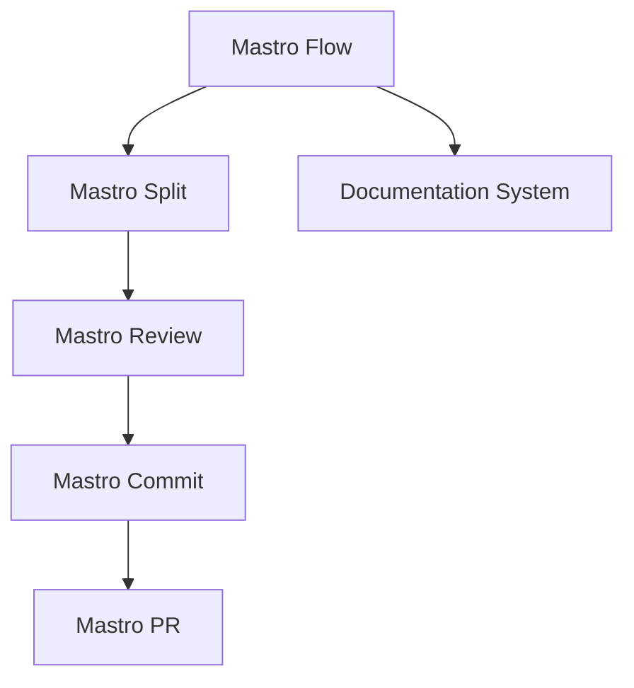
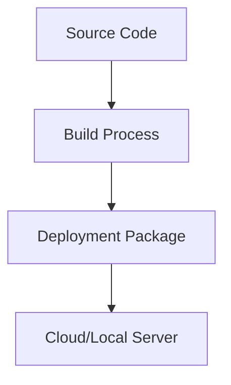

<!---
This file was automatically generated by Mastro CLI
Generated on: 2025-08-12T04:30:45.407Z
Document type: architecture
Title: Architecture Documentation
References: .claude/settings.local.json, .mastro/analytics.json, lib/commands/config.d.ts, lib/commands/config.d.ts.map, lib/commands/config.js, lib/commands/config.js.map, lib/commands/config/init.d.ts, lib/commands/config/init.d.ts.map, lib/commands/config/init.js, lib/commands/config/init.js.map, lib/commands/config/interactive.d.ts, lib/commands/config/interactive.d.ts.map, lib/commands/config/interactive.js, lib/commands/config/interactive.js.map, lib/lib/config.d.ts, lib/lib/config.d.ts.map, lib/lib/config.js, lib/lib/config.js.map, mastro-vscode/.eslintrc.json, mastro-vscode/package-lock.json, mastro-vscode/package.json, mastro-vscode/tsconfig.json, src/commands/config.ts, src/commands/config/init.ts, src/commands/config/interactive.ts, src/lib/config.ts, bin/run.js, lib/index.d.ts, lib/index.d.ts.map, lib/index.js, lib/index.js.map, lib/analyzers/change-detector.d.ts, lib/analyzers/change-detector.d.ts.map, lib/analyzers/change-detector.js, lib/analyzers/change-detector.js.map, lib/analyzers/impact-analyzer.d.ts

To prevent this file from being overwritten, add custom content
between the CUSTOM_START and CUSTOM_END markers below.
--->

# Mastro Architecture Documentation

## 1. High-Level System Architecture Overview

The Mastro project is designed as a Command Line Interface (CLI) tool that orchestrates workflows for software development, integrating AI-powered features for code review and commit management. The architecture is modular, allowing for easy extension and maintenance. The system is built using TypeScript and Node.js, ensuring type safety and asynchronous capabilities.

### Key Components:
- **Mastro Flow**: Orchestrates the complete workflow from splitting code changes to analytics.
- **Mastro Review**: Provides AI-driven code review functionalities.
- **Mastro Split**: Analyzes commit boundaries intelligently.
- **Mastro Commit**: Generates enhanced commit messages.
- **Mastro PR**: Manages pull requests efficiently.
- **Documentation System**: Generates multi-format documentation, including Mermaid diagrams.

## 2. Component Relationships and Data Flow

The components interact in a defined sequence to achieve the overall workflow:

1. **Mastro Flow** initiates the process.
2. **Mastro Split** analyzes the code changes and determines commit boundaries.
3. **Mastro Review** performs AI-powered code reviews on the identified changes.
4. **Mastro Commit** generates commit messages based on the review.
5. **Mastro PR** creates and manages pull requests based on the commits.
6. The **Documentation System** generates documentation throughout the process.

### Data Flow Diagram


## 3. Design Patterns and Architectural Decisions

### Design Patterns:
- **Command Pattern**: Used in the CLI commands to encapsulate all the details of an operation.
- **Observer Pattern**: Employed for event handling, allowing components to react to changes in state.
- **Factory Pattern**: Utilized for creating instances of various components based on user input.

### Architectural Decisions:
- **Modularity**: Each component is designed to be independent, promoting separation of concerns.
- **Asynchronous Processing**: Leveraging Node.js’s event-driven architecture for non-blocking operations.
- **AI Integration**: Incorporating AI capabilities for enhanced code review and validation.

## 4. Technology Stack and Rationale

- **TypeScript**: Provides type safety and improved developer experience.
- **Node.js**: Enables asynchronous I/O operations, suitable for CLI applications.
- **Oclif**: A framework for building CLI applications, providing built-in command parsing and help generation.
- **Chalk**: For styling terminal output, enhancing user experience.
- **dotenv**: For managing environment variables securely.

## 5. Directory Structure and Organization

The directory structure is organized to facilitate easy navigation and maintenance:

```
mastro/
├── .claude/                # Source code files
├── .mastro/                # Source code files
├── bin/                    # Executable files
├── docs/                   # Documentation files
│   └── diagrams/           # Mermaid diagrams
├── lib/                    # Library source code
│   ├── analyzers/          # Analysis modules
│   ├── base/               # Base classes and interfaces
│   ├── commands/           # Command implementations
│   │   ├── config/         # Configuration commands
│   │   ├── docs/           # Documentation commands
│   │   └── pr/             # Pull request commands
│   ├── core/               # Core functionalities
│   ├── lib/                # Utility functions
│   └── types/              # Type definitions
```

## 6. Module Dependencies and Interfaces

### Key Dependencies:
- **@anthropic-ai/sdk**: For AI functionalities.
- **@oclif/core**: Core CLI functionalities.
- **chalk**: For terminal styling.
- **dotenv**: For environment variable management.

### Interfaces:
Each module exposes a set of interfaces that define the expected behavior, ensuring that components can interact seamlessly.

## 7. Data Models and Storage Architecture

Data models are defined using TypeScript interfaces, ensuring type safety across the application. The storage architecture is primarily in-memory, with options for persistent storage if needed in future enhancements.

### Example Data Model:
```typescript
interface Commit {
    id: string;
    message: string;
    author: string;
    timestamp: Date;
}
```

## 8. Security Architecture and Considerations

- **Input Validation**: All user inputs are validated to prevent injection attacks.
- **Environment Variables**: Sensitive information is stored in environment variables, managed by dotenv.
- **Access Control**: Implement role-based access control for sensitive operations.

## 9. Performance and Scalability Design

- **Asynchronous Operations**: Leveraging Node.js’s non-blocking I/O for improved performance.
- **Caching**: Implement caching strategies for frequently accessed data to reduce latency.
- **Load Balancing**: Future scalability can be achieved through load balancing across multiple instances.

## 10. Deployment Architecture

The Mastro CLI can be deployed as a standalone application or integrated into CI/CD pipelines. The deployment process includes:

1. Building the application using TypeScript.
2. Packaging the application for distribution.
3. Deploying to a cloud environment or local servers.

### Deployment Diagram


## Conclusion

This architecture documentation provides a comprehensive overview of the Mastro project, detailing its components, relationships, and design decisions. It serves as a valuable resource for both new team members and experienced developers, facilitating informed modifications and extensions to the system.\n\n## System Architecture\n\nHigh-level system architecture overview\n\n```mermaid\nflowchart TD\n        A[Client Application] --> B[API Gateway]\n        B --> C[Business Logic Layer]\n        C --> D[Data Access Layer]\n        D --> E[Database]\n        F[nodejs] --> C\n```\n\n\n\n## Main User Journey Flow\n\nUser flow diagram for Main User Journey\n\n```mermaid\nflowchart TD\n        A[Load Application]\n        B[Navigate]\n        A --> B\n        C[Interact]\n        B --> C\n```\n\n

---

<!-- CUSTOM_START -->
<!-- Add your custom content here - it will be preserved during regeneration -->
<!-- CUSTOM_END -->

*Documentation generated by [Mastro CLI](https://github.com/your-org/mastro) on 8/12/2025*