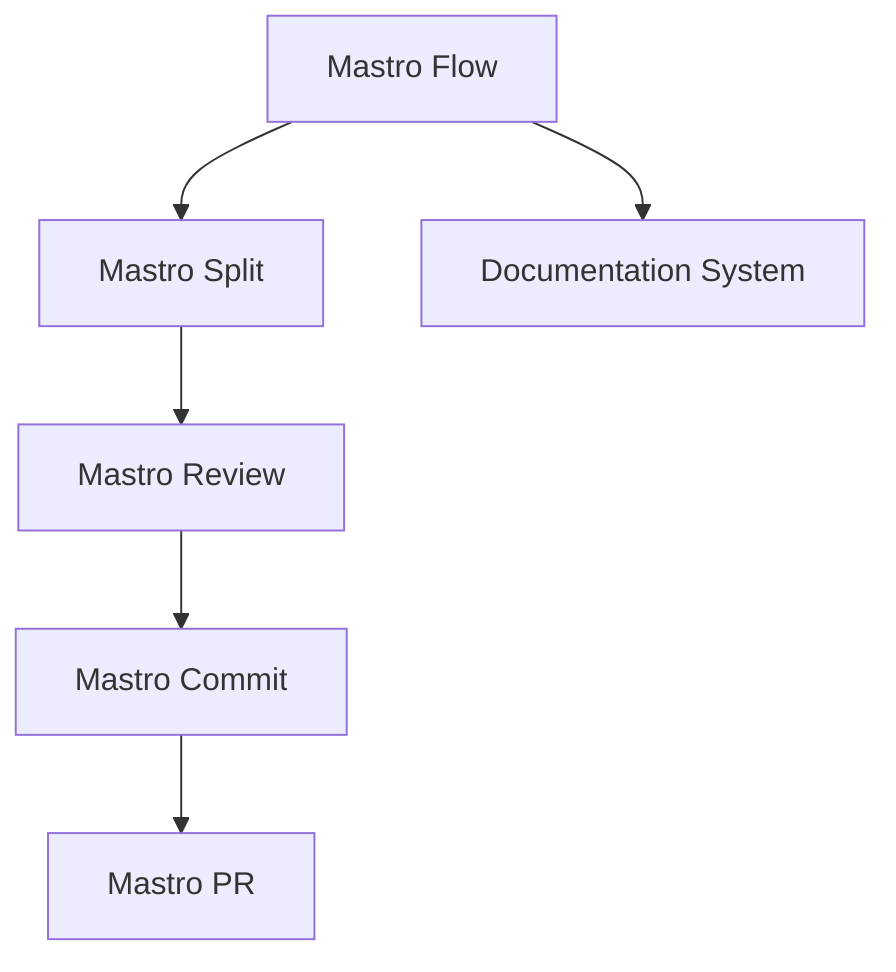
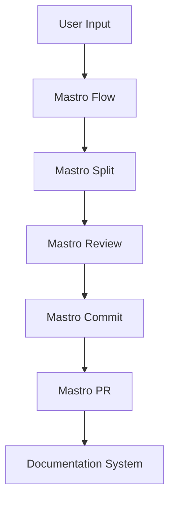

<!---
This file was automatically generated by Mastro CLI
Generated on: 2025-08-12T04:15:46.553Z
Document type: architecture
Title: Architecture Documentation
References: .claude/settings.local.json, .mastro/analytics.json, lib/commands/config.d.ts, lib/commands/config.d.ts.map, lib/commands/config.js, lib/commands/config.js.map, lib/commands/config/init.d.ts, lib/commands/config/init.d.ts.map, lib/commands/config/init.js, lib/commands/config/init.js.map, lib/commands/config/interactive.d.ts, lib/commands/config/interactive.d.ts.map, lib/commands/config/interactive.js, lib/commands/config/interactive.js.map, lib/lib/config.d.ts, lib/lib/config.d.ts.map, lib/lib/config.js, lib/lib/config.js.map, mastro-vscode/.eslintrc.json, mastro-vscode/package-lock.json, mastro-vscode/package.json, mastro-vscode/tsconfig.json, src/commands/config.ts, src/commands/config/init.ts, src/commands/config/interactive.ts, src/lib/config.ts, bin/run.js, lib/index.d.ts, lib/index.d.ts.map, lib/index.js, lib/index.js.map, lib/analyzers/change-detector.d.ts, lib/analyzers/change-detector.d.ts.map, lib/analyzers/change-detector.js, lib/analyzers/change-detector.js.map, lib/analyzers/impact-analyzer.d.ts

To prevent this file from being overwritten, add custom content
between the CUSTOM_START and CUSTOM_END markers below.
--->

# Mastro Architecture Documentation

## 1. High-Level System Architecture Overview

The Mastro CLI is designed as an enterprise-level workflow orchestration tool that integrates various components to facilitate code review, commit management, and documentation generation. The architecture is modular, allowing for easy extension and maintenance.

### Key Components:
- **Mastro Flow**: Orchestrates the complete workflow from code splitting to analytics.
- **Mastro Review**: Provides AI-driven code review capabilities.
- **Mastro Split**: Analyzes commit boundaries intelligently.
- **Mastro Commit**: Generates enhanced commit messages.
- **Mastro PR**: Manages pull requests efficiently.
- **Documentation System**: Generates multi-format documentation, including Mermaid diagrams.

## 2. Component Relationships and Data Flow

The components interact in a defined sequence to achieve the overall workflow:

1. **Mastro Flow** initiates the process.
2. **Mastro Split** analyzes the codebase and determines commit boundaries.
3. **Mastro Review** performs AI-powered code reviews on the identified changes.
4. **Mastro Commit** generates commit messages based on the review.
5. **Mastro PR** creates and manages pull requests.
6. **Documentation System** generates documentation throughout the workflow.



## 3. Design Patterns and Architectural Decisions

### Design Patterns:
- **Command Pattern**: Used for implementing CLI commands, allowing for extensibility and separation of concerns.
- **Observer Pattern**: Employed in the workflow orchestration to notify components of state changes.
- **Factory Pattern**: Utilized for creating instances of various components based on configuration.

### Architectural Decisions:
- Modular design to facilitate independent development and testing of components.
- Use of TypeScript for type safety and improved maintainability.
- Integration of AI capabilities for enhanced code review processes.

## 4. Technology Stack and Rationale

- **Node.js**: Chosen for its non-blocking I/O model, making it suitable for CLI applications.
- **TypeScript**: Provides static typing, enhancing code quality and maintainability.
- **Oclif**: A framework for building command-line tools, offering extensibility and plugin support.
- **Chalk**: For terminal string styling, improving user experience.
- **dotenv**: For environment variable management, ensuring configuration flexibility.

## 5. Directory Structure and Organization

The directory structure is organized to separate concerns and facilitate navigation:

```
mastro/
├── .claude/                # Source code files
├── .mastro/                # Source code files
├── bin/                    # Executable files
├── docs/                   # Documentation files
│   └── diagrams/           # Mermaid diagrams
├── lib/                    # Library source code
│   ├── analyzers/          # Analyzers for code review
│   ├── base/               # Base classes and interfaces
│   ├── commands/           # Command implementations
│   │   ├── config/         # Configuration commands
│   │   ├── docs/           # Documentation commands
│   │   └── pr/             # Pull request commands
│   ├── core/               # Core functionalities
│   ├── lib/                # Utility libraries
│   └── types/              # Type definitions
```

## 6. Module Dependencies and Interfaces

### Key Dependencies:
- **@anthropic-ai/sdk**: For AI functionalities in code review.
- **@oclif/core**: Core library for building CLI applications.
- **chalk**: For styling terminal output.
- **dotenv**: For managing environment variables.

### Interfaces:
Each component exposes a well-defined interface, allowing for loose coupling and easier testing. For example, the `MastroReview` interface defines methods for initiating reviews and retrieving results.

## 7. Data Models and Storage Architecture

Data models are designed to represent the various entities within the Mastro system:

- **Commit**: Represents a code commit with metadata such as author, message, and timestamp.
- **Review**: Contains information about the code review process, including comments and validation results.
- **Pull Request**: Represents a pull request with associated commits and review status.

Data is primarily stored in memory during execution, with options for persistent storage in future iterations.

## 8. Security Architecture and Considerations

Security is a critical aspect of the Mastro architecture:

- **Input Validation**: All user inputs are validated to prevent injection attacks.
- **Environment Variables**: Sensitive information is managed through environment variables using `dotenv`.
- **Access Control**: Future enhancements may include role-based access control for managing permissions.

## 9. Performance and Scalability Design

The architecture is designed to handle enterprise-level workloads:

- **Asynchronous Processing**: Leveraging Node.js's non-blocking I/O for efficient processing.
- **Modular Components**: Allows for horizontal scaling by deploying components independently.
- **Caching**: Future implementations may include caching mechanisms to improve performance.

## 10. Deployment Architecture

Mastro can be deployed in various environments, including:

- **Local Development**: Using Docker for containerization.
- **Cloud Deployment**: Deploying to platforms like AWS or Azure for scalability.
- **CI/CD Integration**: Integrating with CI/CD pipelines for automated testing and deployment.

## 11. Mermaid Diagrams for Visual Representation

### Component Interaction Diagram


### Data Flow Diagram



---

This documentation aims to provide a comprehensive understanding of the Mastro architecture, facilitating informed decision-making for both new and experienced developers. For further inquiries or contributions, please refer to the project's contribution guidelines.\n\n## System Architecture\n\nHigh-level system architecture overview\n\n```mermaid\nflowchart TD\n        A[Client Application] --> B[API Gateway]\n        B --> C[Business Logic Layer]\n        C --> D[Data Access Layer]\n        D --> E[Database]\n        F[nodejs] --> C\n```\n\n\n\n## Main User Journey Flow\n\nUser flow diagram for Main User Journey\n\n```mermaid\nflowchart TD\n        A[Load Application]\n        B[Navigate]\n        A --> B\n        C[Interact]\n        B --> C\n```\n\n

---

<!-- CUSTOM_START -->
<!-- Add your custom content here - it will be preserved during regeneration -->
<!-- CUSTOM_END -->

*Documentation generated by [Mastro CLI](https://github.com/your-org/mastro) on 8/12/2025*