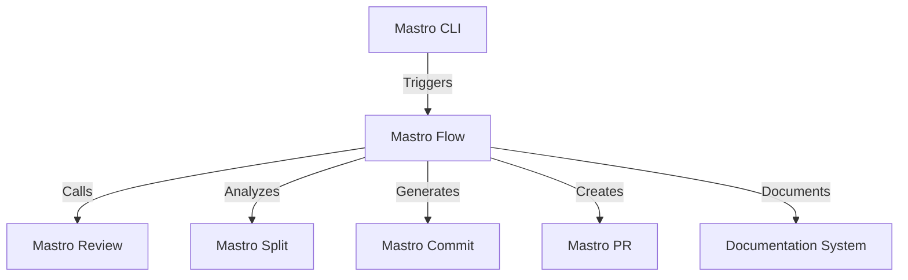
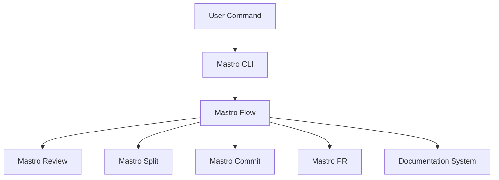

<!---
This file was automatically generated by Mastro CLI
Generated on: 2025-08-12T04:33:00.396Z
Document type: architecture
Title: Architecture Documentation
References: .claude/settings.local.json, .mastro/analytics.json, lib/commands/config.d.ts, lib/commands/config.d.ts.map, lib/commands/config.js, lib/commands/config.js.map, lib/commands/config/init.d.ts, lib/commands/config/init.d.ts.map, lib/commands/config/init.js, lib/commands/config/init.js.map, lib/commands/config/interactive.d.ts, lib/commands/config/interactive.d.ts.map, lib/commands/config/interactive.js, lib/commands/config/interactive.js.map, lib/lib/config.d.ts, lib/lib/config.d.ts.map, lib/lib/config.js, lib/lib/config.js.map, mastro-vscode/.eslintrc.json, mastro-vscode/package-lock.json, mastro-vscode/package.json, mastro-vscode/tsconfig.json, src/commands/config.ts, src/commands/config/init.ts, src/commands/config/interactive.ts, src/lib/config.ts, bin/run.js, lib/index.d.ts, lib/index.d.ts.map, lib/index.js, lib/index.js.map, lib/analyzers/change-detector.d.ts, lib/analyzers/change-detector.d.ts.map, lib/analyzers/change-detector.js, lib/analyzers/change-detector.js.map, lib/analyzers/impact-analyzer.d.ts

To prevent this file from being overwritten, add custom content
between the CUSTOM_START and CUSTOM_END markers below.
--->

# Mastro Architecture Documentation

## 1. High-Level System Architecture Overview

Mastro is an enterprise-level CLI tool designed for workflow orchestration, code review, intelligent commit analysis, and pull request management. The architecture is modular, allowing for easy extension and maintenance. The system is built using TypeScript and Node.js, leveraging various libraries to enhance functionality.

### Key Components:
- **Mastro Flow**: Orchestrates the complete workflow from splitting code to analytics.
- **Mastro Review**: Provides AI-powered code reviews with validation improvements.
- **Mastro Split**: Analyzes commit boundaries intelligently.
- **Mastro Commit**: Generates enhanced commit messages.
- **Mastro PR**: Manages pull request creation and workflows.
- **Documentation System**: Generates multi-format documentation, including Mermaid diagrams.

## 2. Component Relationships and Data Flow

The components interact through a series of defined interfaces and data flows. The following diagram illustrates the relationships:



### Data Flow:
1. The user initiates a command through the Mastro CLI.
2. Mastro Flow orchestrates the workflow, calling the necessary components based on the command.
3. Each component processes data and returns results to Mastro Flow, which manages the overall state and transitions.

## 3. Design Patterns and Architectural Decisions

### Design Patterns:
- **Command Pattern**: Used for implementing CLI commands, allowing for easy addition of new commands.
- **Observer Pattern**: Employed in the workflow orchestration to notify components of state changes.
- **Factory Pattern**: Utilized for creating instances of various components based on user input.

### Architectural Decisions:
- **Modular Architecture**: Each component is developed as a separate module to enhance maintainability and testability.
- **TypeScript**: Chosen for its strong typing and tooling support, which improves developer productivity and reduces runtime errors.

## 4. Technology Stack and Rationale

- **Node.js**: Provides a non-blocking I/O model, suitable for CLI applications.
- **TypeScript**: Enhances code quality and maintainability through static typing.
- **Oclif**: A framework for building CLI applications, providing plugins and command management.
- **Chalk**: For styling terminal output, enhancing user experience.
- **dotenv**: For environment variable management, ensuring configuration flexibility.

## 5. Directory Structure and Organization

The project is organized into several directories, each serving a specific purpose:

```
mastro/
├── .claude/                # Source code files
├── .mastro/                # Source code files
├── bin/                    # Executable files
├── docs/                   # Documentation files
│   └── diagrams/           # Mermaid diagrams
├── lib/                    # Library source code
│   ├── analyzers/          # Analysis logic
│   ├── base/               # Base classes and interfaces
│   ├── commands/           # Command implementations
│   │   ├── config/         # Configuration commands
│   │   ├── docs/           # Documentation commands
│   │   └── pr/             # Pull request commands
│   ├── core/               # Core logic
│   ├── lib/                # Utility functions
│   └── types/              # Type definitions
```

## 6. Module Dependencies and Interfaces

### Key Dependencies:
- **@anthropic-ai/sdk**: For AI functionalities in code review.
- **@oclif/core**: Core CLI functionalities.
- **chalk**: For terminal output styling.
- **dotenv**: For environment variable management.

### Interfaces:
Each module defines clear interfaces for interaction, ensuring loose coupling and high cohesion. For example, the `IReview` interface defines methods for code review operations, which can be implemented by various review strategies.

## 7. Data Models and Storage Architecture

Mastro primarily operates in-memory for performance, but it can be extended to support persistent storage if needed. The data models include:

- **WorkflowState**: Represents the current state of the workflow.
- **ReviewResult**: Contains results from the code review process.
- **CommitMessage**: Represents the structure of generated commit messages.

## 8. Security Architecture and Considerations

Security is a critical aspect of Mastro. Key considerations include:

- **Input Validation**: All user inputs are validated to prevent injection attacks.
- **Environment Variables**: Sensitive information is managed through environment variables, reducing exposure in the codebase.
- **Access Control**: Future enhancements may include user authentication and authorization for sensitive operations.

## 9. Performance and Scalability Design

Mastro is designed to handle enterprise-level workloads. Key performance considerations include:

- **Asynchronous Processing**: Leveraging Node.js's non-blocking I/O for handling multiple requests concurrently.
- **Caching**: Implementing caching strategies for frequently accessed data to reduce processing time.
- **Load Testing**: Regular load testing to identify bottlenecks and optimize performance.

## 10. Deployment Architecture

Mastro can be deployed as a standalone CLI tool or integrated into CI/CD pipelines. Deployment considerations include:

- **Containerization**: Using Docker for consistent deployment across environments.
- **Versioning**: Semantic versioning for managing releases and updates.
- **Continuous Integration**: Automated testing and deployment processes to ensure code quality.

## 11. Mermaid Diagrams for Visual Representation

### Component Interaction Diagram


### Data Flow Diagram



---

This documentation aims to provide both new team members and experienced developers with a comprehensive understanding of the Mastro architecture, enabling informed decisions about modifications or extensions to the system.\n\n## System Architecture\n\nHigh-level system architecture overview\n\n```mermaid\nflowchart TD\n        A[Client Application] --> B[API Gateway]\n        B --> C[Business Logic Layer]\n        C --> D[Data Access Layer]\n        D --> E[Database]\n        F[nodejs] --> C\n```\n\n\n\n## Main User Journey Flow\n\nUser flow diagram for Main User Journey\n\n```mermaid\nflowchart TD\n        A[Load Application]\n        B[Navigate]\n        A --> B\n        C[Interact]\n        B --> C\n```\n\n

---

<!-- CUSTOM_START -->
<!-- Add your custom content here - it will be preserved during regeneration -->
<!-- CUSTOM_END -->

*Documentation generated by [Mastro CLI](https://github.com/your-org/mastro) on 8/12/2025*