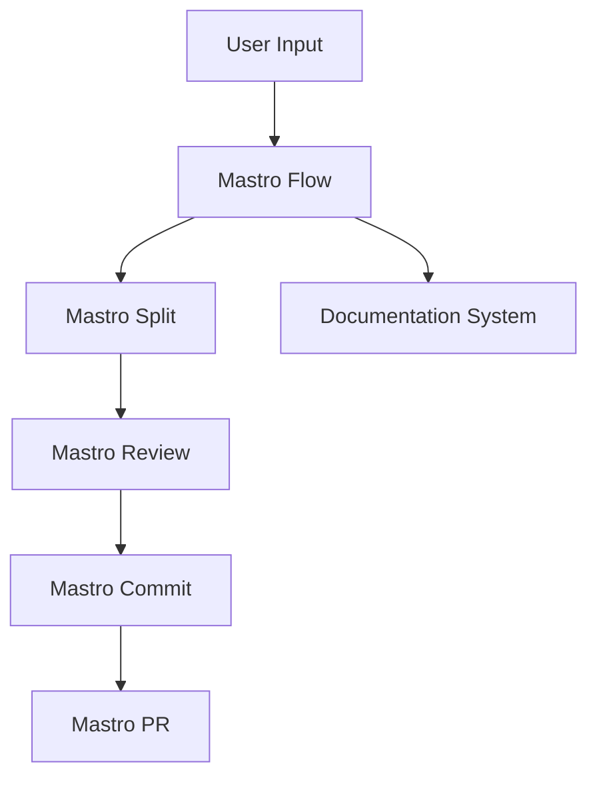
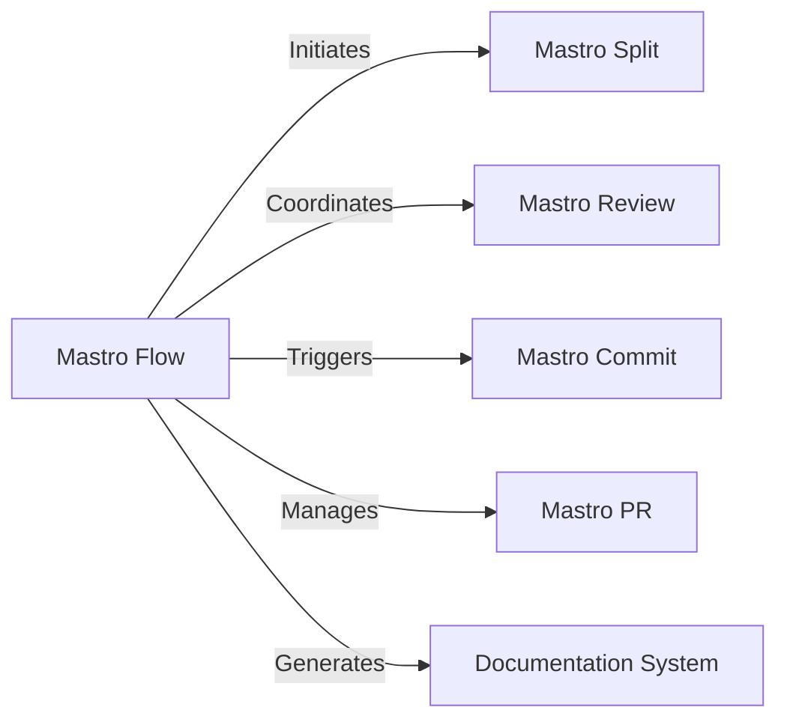

<!---
This file was automatically generated by Mastro CLI
Generated on: 2025-08-12T04:18:10.573Z
Document type: architecture
Title: Architecture Documentation
References: .claude/settings.local.json, .mastro/analytics.json, lib/commands/config.d.ts, lib/commands/config.d.ts.map, lib/commands/config.js, lib/commands/config.js.map, lib/commands/config/init.d.ts, lib/commands/config/init.d.ts.map, lib/commands/config/init.js, lib/commands/config/init.js.map, lib/commands/config/interactive.d.ts, lib/commands/config/interactive.d.ts.map, lib/commands/config/interactive.js, lib/commands/config/interactive.js.map, lib/lib/config.d.ts, lib/lib/config.d.ts.map, lib/lib/config.js, lib/lib/config.js.map, mastro-vscode/.eslintrc.json, mastro-vscode/package-lock.json, mastro-vscode/package.json, mastro-vscode/tsconfig.json, src/commands/config.ts, src/commands/config/init.ts, src/commands/config/interactive.ts, src/lib/config.ts, bin/run.js, lib/index.d.ts, lib/index.d.ts.map, lib/index.js, lib/index.js.map, lib/analyzers/change-detector.d.ts, lib/analyzers/change-detector.d.ts.map, lib/analyzers/change-detector.js, lib/analyzers/change-detector.js.map, lib/analyzers/impact-analyzer.d.ts

To prevent this file from being overwritten, add custom content
between the CUSTOM_START and CUSTOM_END markers below.
--->

# Mastro Architecture Documentation

## 1. High-Level System Architecture Overview

Mastro is a CLI-based workflow orchestration tool designed to streamline the software development lifecycle. It integrates multiple components to facilitate code review, commit management, and documentation generation. The architecture is modular, allowing for easy extension and maintenance.

### Key Components:
- **Mastro Flow**: Orchestrates the entire workflow from splitting code to analytics.
- **Mastro Review**: Provides AI-powered code review capabilities.
- **Mastro Split**: Analyzes commit boundaries intelligently.
- **Mastro Commit**: Generates enhanced commit messages.
- **Mastro PR**: Manages pull requests efficiently.
- **Documentation System**: Generates multi-format documentation with visual aids.

## 2. Component Relationships and Data Flow

The components interact through a series of well-defined interfaces. The data flow is as follows:

1. **User Input**: Commands are issued via the CLI.
2. **Mastro Flow**: Initiates the workflow, coordinating between components.
3. **Mastro Split**: Analyzes the codebase to determine commit boundaries.
4. **Mastro Review**: Validates code changes using AI.
5. **Mastro Commit**: Generates commit messages based on validated changes.
6. **Mastro PR**: Creates and manages pull requests.
7. **Documentation System**: Generates documentation based on the workflow and code structure.

### Data Flow Diagram


## 3. Design Patterns and Architectural Decisions

### Design Patterns:
- **Command Pattern**: Used for implementing CLI commands, allowing for easy addition of new commands.
- **Observer Pattern**: Employed in the workflow orchestration to notify components of state changes.
- **Factory Pattern**: Utilized for creating instances of various analyzers and validators.

### Architectural Decisions:
- Modular architecture to promote separation of concerns.
- Use of TypeScript for type safety and improved developer experience.
- AI integration for enhanced code review capabilities.

## 4. Technology Stack and Rationale

- **Node.js**: Chosen for its non-blocking I/O model, making it suitable for CLI applications.
- **TypeScript**: Provides static typing, enhancing code quality and maintainability.
- **Oclif**: A framework for building CLI applications, facilitating command management and plugin support.
- **Chalk**: For terminal string styling, improving user experience.
- **dotenv**: Manages environment variables securely.

## 5. Directory Structure and Organization

The project is organized into several directories, each serving a specific purpose:

```
mastro/
├── .claude/                  # Source code files
├── .mastro/                  # Source code files
├── bin/                      # CLI entry point
├── docs/                     # Documentation files
│   └── diagrams/             # Mermaid diagrams
├── lib/                      # Core library files
│   ├── analyzers/            # Code analysis modules
│   ├── base/                 # Base classes and interfaces
│   ├── commands/             # CLI command implementations
│   ├── core/                 # Core functionalities
│   └── types/                # Type definitions
```

## 6. Module Dependencies and Interfaces

### Key Dependencies:
- **@anthropic-ai/sdk**: For AI capabilities in code review.
- **@oclif/core**: Core CLI framework.
- **chalk**: For terminal output styling.
- **dotenv**: For environment variable management.

### Interfaces:
Each component exposes a set of interfaces that define how they interact with one another, ensuring loose coupling and high cohesion.

## 7. Data Models and Storage Architecture

Mastro primarily operates in-memory, but it can be extended to support persistent storage if needed. Data models include:

- **Commit**: Represents a code change with metadata.
- **Review**: Contains results from the AI-powered review process.
- **Workflow**: Tracks the state of the entire orchestration process.

## 8. Security Architecture and Considerations

- **Input Validation**: All user inputs are validated to prevent injection attacks.
- **Environment Variables**: Sensitive information is stored in environment variables using dotenv.
- **Access Control**: Future enhancements may include role-based access control for different CLI commands.

## 9. Performance and Scalability Design

- **Asynchronous Processing**: Leveraging Node.js's asynchronous capabilities to handle multiple requests efficiently.
- **Modular Components**: Each component can be scaled independently based on usage patterns.
- **Caching**: Future implementations may include caching mechanisms for frequently accessed data.

## 10. Deployment Architecture

Mastro can be deployed as a standalone CLI tool. The deployment process includes:

1. **Build**: Using TypeScript compiler to generate JavaScript files.
2. **Package**: Creating a distributable package using npm.
3. **Install**: Users can install via npm or download binaries.

## 11. Mermaid Diagrams for Visual Representation

### Component Interaction Diagram


### Data Flow Diagram


---

This documentation serves as a comprehensive guide for both new team members and experienced developers, providing insights into the architecture, design decisions, and operational considerations of the Mastro project.\n\n## System Architecture\n\nHigh-level system architecture overview\n\n```mermaid\nflowchart TD\n        A[Client Application] --> B[API Gateway]\n        B --> C[Business Logic Layer]\n        C --> D[Data Access Layer]\n        D --> E[Database]\n        F[nodejs] --> C\n```\n\n\n\n## Main User Journey Flow\n\nUser flow diagram for Main User Journey\n\n```mermaid\nflowchart TD\n        A[Load Application]\n        B[Navigate]\n        A --> B\n        C[Interact]\n        B --> C\n```\n\n

---

<!-- CUSTOM_START -->
<!-- Add your custom content here - it will be preserved during regeneration -->
<!-- CUSTOM_END -->

*Documentation generated by [Mastro CLI](https://github.com/your-org/mastro) on 8/12/2025*