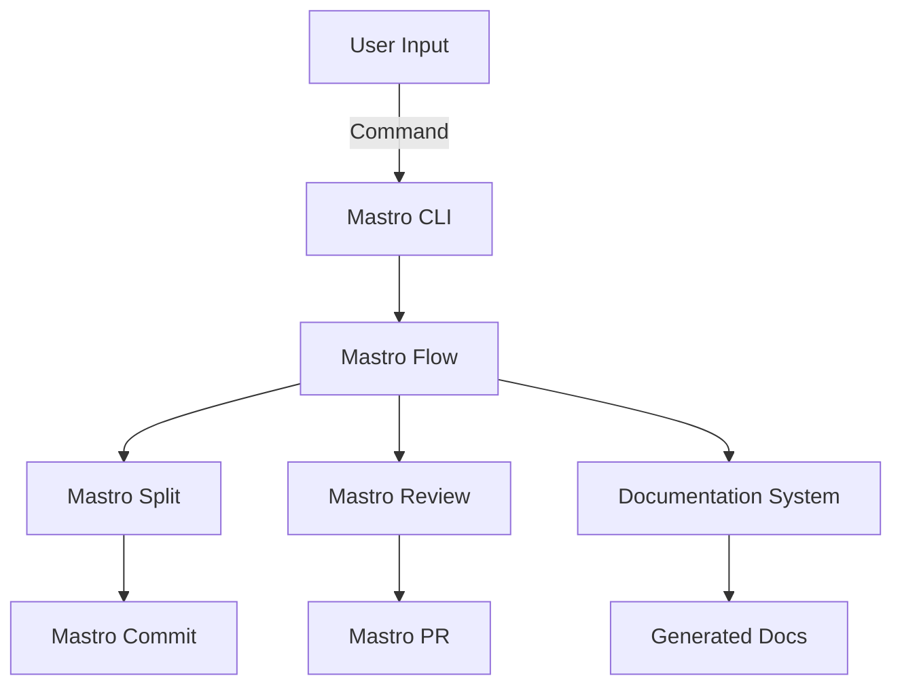
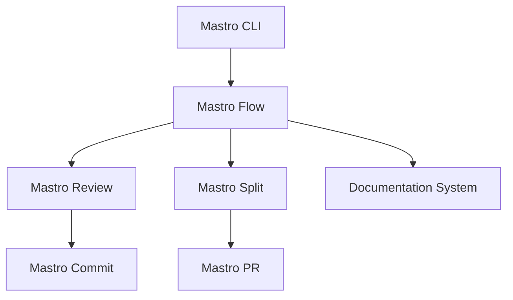

<!---
This file was automatically generated by Mastro CLI
Generated on: 2025-08-12T04:20:29.926Z
Document type: architecture
Title: Architecture Documentation
References: .claude/settings.local.json, .mastro/analytics.json, lib/commands/config.d.ts, lib/commands/config.d.ts.map, lib/commands/config.js, lib/commands/config.js.map, lib/commands/config/init.d.ts, lib/commands/config/init.d.ts.map, lib/commands/config/init.js, lib/commands/config/init.js.map, lib/commands/config/interactive.d.ts, lib/commands/config/interactive.d.ts.map, lib/commands/config/interactive.js, lib/commands/config/interactive.js.map, lib/lib/config.d.ts, lib/lib/config.d.ts.map, lib/lib/config.js, lib/lib/config.js.map, mastro-vscode/.eslintrc.json, mastro-vscode/package-lock.json, mastro-vscode/package.json, mastro-vscode/tsconfig.json, src/commands/config.ts, src/commands/config/init.ts, src/commands/config/interactive.ts, src/lib/config.ts, bin/run.js, lib/index.d.ts, lib/index.d.ts.map, lib/index.js, lib/index.js.map, lib/analyzers/change-detector.d.ts, lib/analyzers/change-detector.d.ts.map, lib/analyzers/change-detector.js, lib/analyzers/change-detector.js.map, lib/analyzers/impact-analyzer.d.ts

To prevent this file from being overwritten, add custom content
between the CUSTOM_START and CUSTOM_END markers below.
--->

# Mastro Architecture Documentation

## 1. High-Level System Architecture Overview

The Mastro project is designed as a command-line interface (CLI) tool for workflow orchestration, code review, commit management, and documentation generation. The architecture is modular, allowing for easy extension and maintenance. The system is built using TypeScript and Node.js, leveraging various libraries to enhance functionality.

### Key Components:
- **Mastro Flow**: Orchestrates the complete workflow from splitting code to analytics.
- **Mastro Review**: Provides AI-powered code review capabilities.
- **Mastro Split**: Analyzes commit boundaries intelligently.
- **Mastro Commit**: Generates enhanced commit messages.
- **Mastro PR**: Manages pull requests effectively.
- **Documentation System**: Generates multi-format documentation, including Mermaid diagrams.

## 2. Component Relationships and Data Flow

The components of Mastro interact closely to facilitate a seamless workflow. The data flow can be summarized as follows:

1. **Input**: User initiates a command via the CLI.
2. **Processing**:
   - The command is parsed and routed to the appropriate component (e.g., `mastro flow`, `mastro review`).
   - Each component processes the input, potentially interacting with others (e.g., `mastro split` may call `mastro review` for validation).
3. **Output**: Results are returned to the user, including logs, commit messages, or documentation.

### Data Flow Diagram


## 3. Design Patterns and Architectural Decisions

### Design Patterns:
- **Command Pattern**: Each CLI command is encapsulated as an object, allowing for easy addition of new commands.
- **Observer Pattern**: Components can subscribe to events (e.g., workflow checkpoints) to react accordingly.
- **Factory Pattern**: Used for creating instances of various components based on user input.

### Architectural Decisions:
- **Modularity**: Each component is designed to be independent, promoting separation of concerns.
- **Extensibility**: The architecture allows for easy integration of new features without affecting existing functionality.

## 4. Technology Stack and Rationale

- **TypeScript**: Provides type safety and improved developer experience.
- **Node.js**: Enables asynchronous processing, making the CLI responsive.
- **Oclif**: A framework for building CLI applications, simplifying command management.
- **AI Libraries**: Utilized for enhanced code review capabilities.

## 5. Directory Structure and Organization

The directory structure is organized to facilitate easy navigation and understanding of the codebase:

```
mastro/
├── .claude/                # Source code files
├── .mastro/                # Source code files
├── bin/                    # CLI entry point
├── docs/                   # Documentation files
│   └── diagrams/           # Mermaid diagrams
├── lib/                    # Core library files
│   ├── analyzers/          # Analysis tools
│   ├── base/               # Base classes
│   ├── commands/           # CLI commands
│   │   ├── config/         # Configuration commands
│   │   ├── docs/           # Documentation commands
│   │   └── pr/             # Pull request commands
│   ├── core/               # Core functionalities
│   ├── lib/                # Additional libraries
│   └── types/              # Type definitions
```

## 6. Module Dependencies and Interfaces

### Key Dependencies:
- `@anthropic-ai/sdk`: For AI functionalities.
- `@oclif/core`: For CLI framework.
- `chalk`: For terminal string styling.
- `dotenv`: For environment variable management.

### Interfaces:
Each module exposes a clear interface, allowing for easy integration and testing. For example, the `mastro review` module provides methods for validating code and generating feedback.

## 7. Data Models and Storage Architecture

Mastro primarily operates in-memory, but it can be extended to support persistent storage if needed. Key data models include:

- **Workflow**: Represents the state and steps of a workflow.
- **Review**: Contains information about code reviews, including feedback and validation results.
- **Commit**: Represents commit messages and associated metadata.

## 8. Security Architecture and Considerations

Security is a critical aspect of Mastro, especially when handling code reviews and commits. Key considerations include:

- **Input Validation**: Ensure all user inputs are validated to prevent injection attacks.
- **Environment Variables**: Sensitive information is managed using `.env` files and the `dotenv` library.
- **Access Control**: Implement role-based access control for different CLI commands.

## 9. Performance and Scalability Design

Mastro is designed to handle enterprise-level workloads. Key performance considerations include:

- **Asynchronous Processing**: Leveraging Node.js's non-blocking I/O for improved responsiveness.
- **Caching**: Implement caching strategies for frequently accessed data, such as validation results.
- **Load Testing**: Regular load testing to identify bottlenecks and optimize performance.

## 10. Deployment Architecture

Mastro can be deployed in various environments, including local machines, CI/CD pipelines, and cloud platforms. Key deployment considerations include:

- **Containerization**: Using Docker for consistent deployment across environments.
- **CI/CD Integration**: Automating testing and deployment processes using tools like GitHub Actions.

## 11. Mermaid Diagrams for Visual Representation

### Component Interaction Diagram


### Data Flow Diagram


---

This documentation aims to provide both new team members and experienced developers with a comprehensive understanding of the Mastro architecture, enabling informed decisions regarding modifications or extensions.\n\n## System Architecture\n\nHigh-level system architecture overview\n\n```mermaid\nflowchart TD\n        A[Client Application] --> B[API Gateway]\n        B --> C[Business Logic Layer]\n        C --> D[Data Access Layer]\n        D --> E[Database]\n        F[nodejs] --> C\n```\n\n\n\n## Main User Journey Flow\n\nUser flow diagram for Main User Journey\n\n```mermaid\nflowchart TD\n        A[Load Application]\n        B[Navigate]\n        A --> B\n        C[Interact]\n        B --> C\n```\n\n

---

<!-- CUSTOM_START -->
<!-- Add your custom content here - it will be preserved during regeneration -->
<!-- CUSTOM_END -->

*Documentation generated by [Mastro CLI](https://github.com/your-org/mastro) on 8/12/2025*