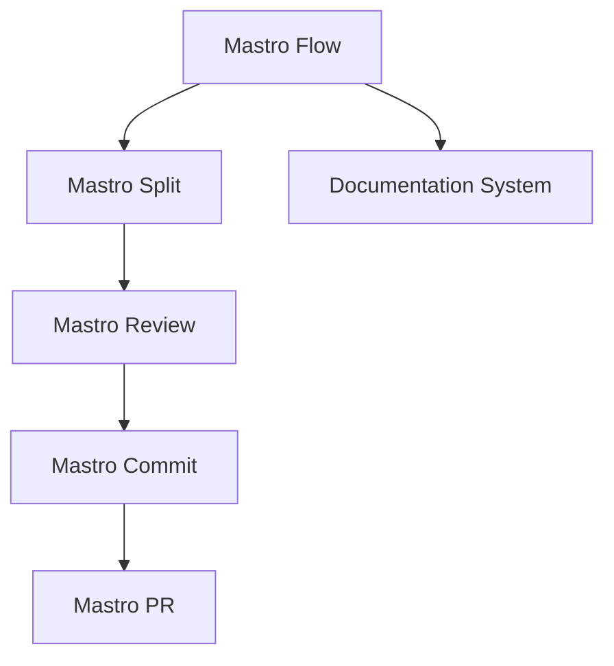
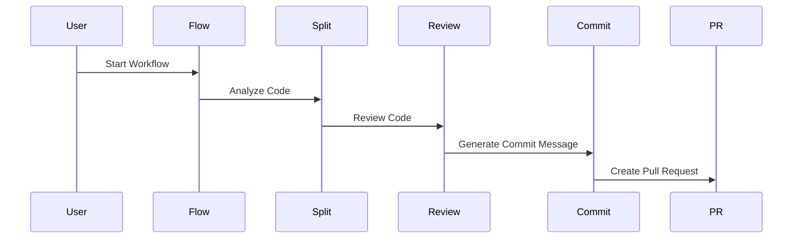

<!---
This file was automatically generated by Mastro CLI
Generated on: 2025-08-12T04:13:22.988Z
Document type: architecture
Title: Architecture Documentation
References: .claude/settings.local.json, .mastro/analytics.json, lib/commands/config.d.ts, lib/commands/config.d.ts.map, lib/commands/config.js, lib/commands/config.js.map, lib/commands/config/init.d.ts, lib/commands/config/init.d.ts.map, lib/commands/config/init.js, lib/commands/config/init.js.map, lib/commands/config/interactive.d.ts, lib/commands/config/interactive.d.ts.map, lib/commands/config/interactive.js, lib/commands/config/interactive.js.map, lib/lib/config.d.ts, lib/lib/config.d.ts.map, lib/lib/config.js, lib/lib/config.js.map, mastro-vscode/.eslintrc.json, mastro-vscode/package-lock.json, mastro-vscode/package.json, mastro-vscode/tsconfig.json, src/commands/config.ts, src/commands/config/init.ts, src/commands/config/interactive.ts, src/lib/config.ts, bin/run.js, lib/index.d.ts, lib/index.d.ts.map, lib/index.js, lib/index.js.map, lib/analyzers/change-detector.d.ts, lib/analyzers/change-detector.d.ts.map, lib/analyzers/change-detector.js, lib/analyzers/change-detector.js.map, lib/analyzers/impact-analyzer.d.ts

To prevent this file from being overwritten, add custom content
between the CUSTOM_START and CUSTOM_END markers below.
--->

# Mastro Architecture Documentation

## 1. High-Level System Architecture Overview

Mastro is a CLI-based workflow orchestration tool designed to streamline the software development process. It integrates various components to facilitate code review, commit management, and documentation generation. The architecture is modular, allowing for easy extension and maintenance.

### Key Components:
- **Mastro Flow**: Orchestrates the entire workflow from code splitting to analytics.
- **Mastro Review**: Provides AI-powered code review capabilities.
- **Mastro Split**: Analyzes commit boundaries intelligently.
- **Mastro Commit**: Generates enhanced commit messages.
- **Mastro PR**: Manages pull requests effectively.
- **Documentation System**: Generates multi-format documentation, including Mermaid diagrams.

## 2. Component Relationships and Data Flow

The components interact in a defined sequence to achieve the desired workflow:

1. **Mastro Flow** initiates the process.
2. **Mastro Split** analyzes the code and determines commit boundaries.
3. **Mastro Review** performs AI-driven code reviews on the split code.
4. **Mastro Commit** generates commit messages based on the review.
5. **Mastro PR** creates and manages pull requests.
6. **Documentation System** generates documentation throughout the workflow.



## 3. Design Patterns and Architectural Decisions

### Design Patterns:
- **Command Pattern**: Used for implementing CLI commands, allowing for easy addition of new commands.
- **Observer Pattern**: Employed for monitoring changes in code and triggering reviews and commits.
- **Factory Pattern**: Utilized for creating instances of various components based on user input.

### Architectural Decisions:
- Modular architecture to promote separation of concerns.
- Use of TypeScript for type safety and better maintainability.
- Integration of AI for enhanced code review capabilities.

## 4. Technology Stack and Rationale

- **Node.js**: Chosen for its non-blocking I/O and event-driven architecture, suitable for CLI applications.
- **TypeScript**: Provides static typing, enhancing code quality and maintainability.
- **Oclif**: A framework for building CLI applications, facilitating command management and plugin support.
- **Chalk**: For terminal string styling, improving user experience.
- **Dotenv**: Manages environment variables for configuration.

## 5. Directory Structure and Organization

The project follows a structured directory layout:

```
mastro/
├── .claude/                # Source code files
├── .mastro/                # Source code files
├── bin/                    # Executable files
├── docs/                   # Documentation files
│   └── diagrams/           # Mermaid diagrams
├── lib/                    # Library source code
│   ├── analyzers/          # Analysis tools
│   ├── base/               # Base classes and interfaces
│   ├── commands/           # Command implementations
│   │   ├── config/         # Configuration commands
│   │   ├── docs/           # Documentation commands
│   │   └── pr/             # PR commands
│   ├── core/               # Core functionalities
│   ├── lib/                # Utility libraries
│   └── types/              # Type definitions
```

## 6. Module Dependencies and Interfaces

### Key Dependencies:
- **@anthropic-ai/sdk**: For AI functionalities.
- **@oclif/core**: Core CLI functionalities.
- **chalk**: For styling CLI output.
- **dotenv**: For environment variable management.

### Interfaces:
- Each component exposes a well-defined interface, allowing for easy integration and testing.

## 7. Data Models and Storage Architecture

Mastro primarily operates in-memory for performance but can be extended to support persistent storage if needed. Data models include:

- **Commit**: Represents a code commit with metadata.
- **Review**: Contains review comments and validation results.
- **Workflow**: Represents the entire orchestration flow.

## 8. Security Architecture and Considerations

- **Input Validation**: All user inputs are validated to prevent injection attacks.
- **Environment Variables**: Sensitive information is stored in environment variables, not hardcoded.
- **Access Control**: Ensure that only authorized users can trigger workflows and access sensitive data.

## 9. Performance and Scalability Design

- **Asynchronous Processing**: Leveraging Node.js's asynchronous capabilities to handle multiple requests concurrently.
- **Caching**: Implement caching strategies for frequently accessed data to improve performance.
- **Load Balancing**: Future considerations for scaling the CLI tool across multiple instances.

## 10. Deployment Architecture

Mastro can be deployed as a standalone CLI tool or integrated into CI/CD pipelines. The deployment process involves:

1. Building the TypeScript code.
2. Packaging the application using tools like `npm` or `yarn`.
3. Distributing the CLI tool via package managers or direct downloads.

## 11. Mermaid Diagrams for Visual Representation

### Workflow Diagram


### Component Interaction Diagram


---

This documentation serves as a comprehensive guide for both new team members and experienced developers, providing insights into the Mastro architecture, component interactions, and design decisions. It aims to facilitate informed modifications and extensions to the system.\n\n## System Architecture\n\nHigh-level system architecture overview\n\n```mermaid\nflowchart TD\n        A[Client Application] --> B[API Gateway]\n        B --> C[Business Logic Layer]\n        C --> D[Data Access Layer]\n        D --> E[Database]\n        F[nodejs] --> C\n```\n\n\n\n## Main User Journey Flow\n\nUser flow diagram for Main User Journey\n\n```mermaid\nflowchart TD\n        A[Load Application]\n        B[Navigate]\n        A --> B\n        C[Interact]\n        B --> C\n```\n\n

---

<!-- CUSTOM_START -->
<!-- Add your custom content here - it will be preserved during regeneration -->
<!-- CUSTOM_END -->

*Documentation generated by [Mastro CLI](https://github.com/your-org/mastro) on 8/12/2025*