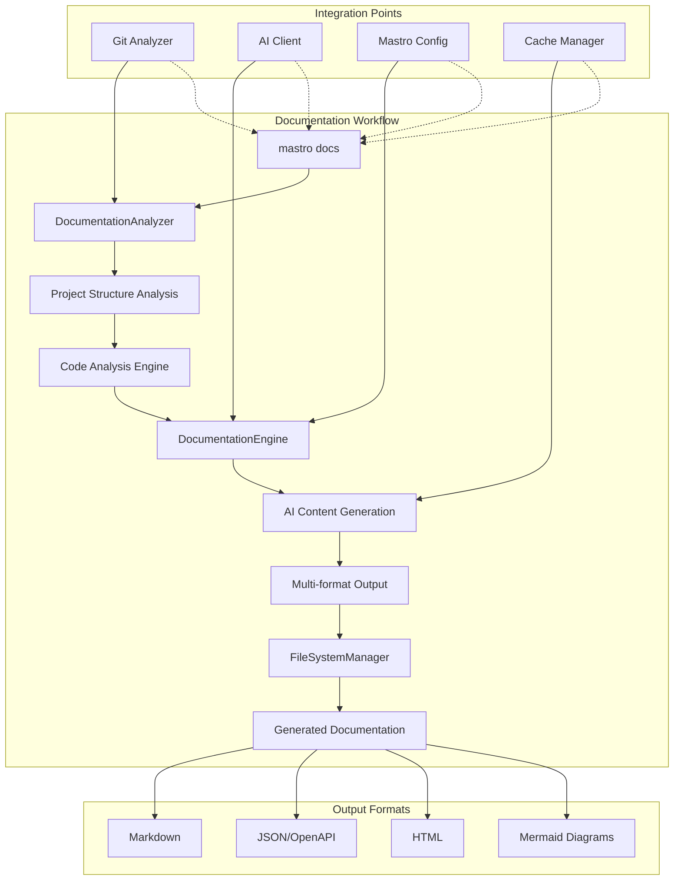

<!---
This file was automatically generated by Mastro CLI
Generated on: 2025-08-08T18:52:20.020Z
Document type: architecture
Title: Architecture Documentation
References: .claude/settings.local.json, lib/commands/config/init.d.ts, lib/commands/config/init.d.ts.map, lib/commands/config/init.js, lib/commands/config/init.js.map, lib/lib/config.d.ts, lib/lib/config.d.ts.map, lib/lib/config.js, lib/lib/config.js.map, mastro-vscode/.eslintrc.json, mastro-vscode/package-lock.json, mastro-vscode/package.json, mastro-vscode/tsconfig.json, src/commands/config/init.ts, src/lib/config.ts, bin/run.js, lib/index.d.ts, lib/index.d.ts.map, lib/index.js, lib/index.js.map, lib/analyzers/impact-analyzer.d.ts, lib/analyzers/impact-analyzer.d.ts.map, lib/analyzers/impact-analyzer.js, lib/analyzers/impact-analyzer.js.map, lib/analyzers/semantic-analyzer.d.ts

To prevent this file from being overwritten, add custom content
between the CUSTOM_START and CUSTOM_END markers below.
--->

# Architecture Documentation\n\nArchitecture overview for mastro\n\n## Project Overview\n\n**Language:** typescript\n**Framework:** nodejs\n**Complexity:** enterprise\n**Total Files:** 187\n**Total Lines:** 9,350\n\n## Directory Structure\n\n```\n.claude/\nbin/\ndocs/\n  diagrams/\nlib/\n  analyzers/\n  base/\n  commands/\n    config/\n    docs/\n    pr/\n  core/\n  lib/\n  types/\n  ui/\nmastro-vscode/\n  out/\n    providers/\n    services/\n  src/\n    commands/\n    providers/\n    services/\n    utils/\n    views/\nsrc/\n  analyzers/\n  base/\n  commands/\n    config/\n    docs/\n    pr/\n  core/\n  lib/\n  types/\n  ui/\n```\n\n## Dependencies\n\n### Production Dependencies\n\n- **@oclif/core** (^3.26.5): Library dependency\n- **@oclif/plugin-help** (^6.0.21): Library dependency\n- **@oclif/plugin-plugins** (^4.3.9): Library dependency\n- **chalk** (^5.3.0): Library dependency\n- **cosine-similarity** (^1.0.1): Library dependency\n- **dotenv** (^17.2.1): Library dependency\n- **glob** (^10.3.10): Library dependency\n- **ignore** (^5.3.1): Library dependency\n- **ink** (^4.4.1): Library dependency\n- **node-cache** (^5.1.2): Library dependency\n- **openai** (^4.28.4): Library dependency\n- **ora** (^8.0.1): Library dependency\n- **react** (^18.2.0): UI framework\n  - ⚠️ Critical dependency\n- **semver** (^7.6.0): Library dependency\n- **simple-git** (^3.22.0): Library dependency\n- **yaml** (^2.4.1): Library dependency\n- **zod** (^3.22.4): Library dependency\n\n## System Architecture\n\nHigh-level system architecture overview\n\n```mermaid\nflowchart TD\n        A[Client Application] --> B[API Gateway]\n        B --> C[Business Logic Layer]\n        C --> D[Data Access Layer]\n        D --> E[Database]\n        F[nodejs] --> C\n```\n\n Diagram\n\n```mermaid\nflowchart TD\n    A[Client] --> B[API Layer]\n    B --> C[Business Logic]\n    C --> D[Data Layer]\n    D --> E[Database]\n```\n\n\n## Main User Journey Flow\n\nUser flow diagram for Main User Journey\n\n```mermaid\nflowchart TD\n        A[Load Application]\n        B[Navigate]\n        A --> B\n        C[Interact]\n        B --> C\n```\n\n

---

<!-- CUSTOM_START -->

## 📚 Documentation Engine Architecture

### Core Documentation Components
The recently implemented Documentation Engine is a sophisticated AI-powered system that integrates seamlessly with Mastro's existing architecture:



### Documentation Engine Features
- **Multi-Type Generation**: API docs, architecture docs, user guides, README files
- **Intelligent Analysis**: Detects architectural patterns, API endpoints, complexity metrics
- **AI-Powered Content**: Leverages existing AI client for contextual documentation
- **Format Flexibility**: Markdown, JSON, HTML, OpenAPI specifications
- **Mermaid Integration**: Auto-generates system and user flow diagrams
- **Template System**: Extensible template architecture for custom documentation styles

### Integration with Existing Architecture
The Documentation Engine leverages Mastro's existing infrastructure:
- **AI Client**: Uses the same AI provider system as commit/review operations
- **Git Analyzer**: Builds on git analysis capabilities for project context
- **Cache Manager**: Optimizes performance through intelligent caching
- **File Manager**: Extends file operations for documentation output
- **Configuration System**: Integrates with Mastro's configuration framework

### Documentation Types Supported
1. **API Documentation**: REST endpoints, function signatures, usage examples, OpenAPI specs
2. **Architecture Documentation**: System diagrams, dependency analysis, pattern detection
3. **User Guides**: Installation steps, feature explanations, workflow documentation
4. **README Generation**: Project overview, quick start guides, key metrics
5. **Component Documentation**: Class structures, interfaces, relationships

<!-- CUSTOM_END -->

*Documentation generated by [Mastro CLI](https://github.com/your-org/mastro) on 8/8/2025*