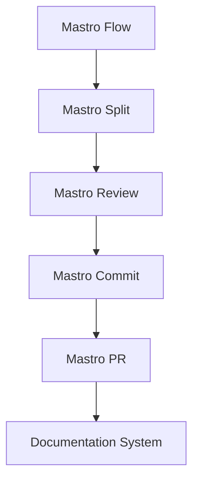
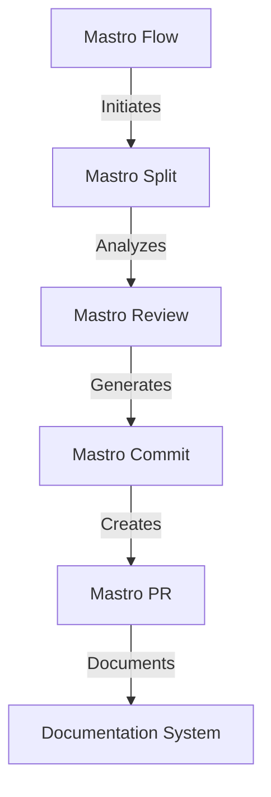
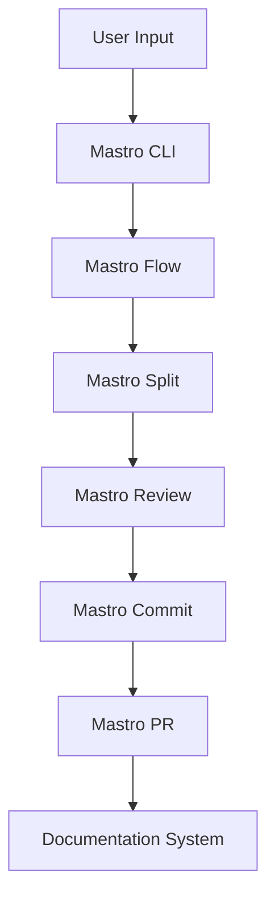

<!---
This file was automatically generated by Mastro CLI
Generated on: 2025-08-12T04:24:51.316Z
Document type: architecture
Title: Architecture Documentation
References: .claude/settings.local.json, .mastro/analytics.json, lib/commands/config.d.ts, lib/commands/config.d.ts.map, lib/commands/config.js, lib/commands/config.js.map, lib/commands/config/init.d.ts, lib/commands/config/init.d.ts.map, lib/commands/config/init.js, lib/commands/config/init.js.map, lib/commands/config/interactive.d.ts, lib/commands/config/interactive.d.ts.map, lib/commands/config/interactive.js, lib/commands/config/interactive.js.map, lib/lib/config.d.ts, lib/lib/config.d.ts.map, lib/lib/config.js, lib/lib/config.js.map, mastro-vscode/.eslintrc.json, mastro-vscode/package-lock.json, mastro-vscode/package.json, mastro-vscode/tsconfig.json, src/commands/config.ts, src/commands/config/init.ts, src/commands/config/interactive.ts, src/lib/config.ts, bin/run.js, lib/index.d.ts, lib/index.d.ts.map, lib/index.js, lib/index.js.map, lib/analyzers/change-detector.d.ts, lib/analyzers/change-detector.d.ts.map, lib/analyzers/change-detector.js, lib/analyzers/change-detector.js.map, lib/analyzers/impact-analyzer.d.ts

To prevent this file from being overwritten, add custom content
between the CUSTOM_START and CUSTOM_END markers below.
--->

# Mastro Architecture Documentation

## 1. High-Level System Architecture Overview

Mastro is an enterprise-level CLI tool designed for workflow orchestration, code review, commit management, and documentation generation. The architecture is modular, allowing for easy extension and maintenance. The system is built using TypeScript and Node.js, leveraging a variety of libraries to enhance functionality.

### Key Components:
- **Mastro Flow**: Orchestrates the complete workflow from splitting code to analytics.
- **Mastro Review**: Provides AI-powered code review capabilities.
- **Mastro Split**: Analyzes commit boundaries intelligently.
- **Mastro Commit**: Generates enhanced commit messages.
- **Mastro PR**: Manages pull requests efficiently.
- **Documentation System**: Generates multi-format documentation with visual diagrams.

## 2. Component Relationships and Data Flow

The components interact in a defined sequence to facilitate the workflow:

1. **Mastro Flow** initiates the process.
2. **Mastro Split** analyzes the codebase and determines commit boundaries.
3. **Mastro Review** performs an AI-driven review of the code.
4. **Mastro Commit** generates commit messages based on the review.
5. **Mastro PR** creates and manages pull requests.
6. **Documentation System** generates documentation at various stages.

### Data Flow Diagram


## 3. Design Patterns and Architectural Decisions

### Design Patterns:
- **Command Pattern**: Used in the CLI commands to encapsulate request handling.
- **Observer Pattern**: Employed for event-driven updates in the workflow.
- **Factory Pattern**: Utilized for creating instances of various components dynamically.

### Architectural Decisions:
- Modular architecture to promote separation of concerns.
- Use of TypeScript for type safety and better maintainability.
- Integration of AI for enhanced code review processes.

## 4. Technology Stack and Rationale

- **TypeScript**: Provides static typing, enhancing code quality and maintainability.
- **Node.js**: Asynchronous, event-driven architecture suitable for I/O-heavy applications.
- **Oclif**: Framework for building CLI applications, providing extensibility and plugin support.
- **Chalk**: For terminal string styling, improving user experience.
- **Dotenv**: For managing environment variables securely.

## 5. Directory Structure and Organization

The directory structure is organized to facilitate easy navigation and understanding:

```
mastro/
├── .claude/                # Source code files
├── .mastro/                # Source code files
├── bin/                    # Executable files
├── docs/                   # Documentation files
│   └── diagrams/           # Diagram source files
├── lib/                    # Library files
│   ├── analyzers/          # Analysis modules
│   ├── base/               # Base classes and utilities
│   ├── commands/           # Command implementations
│   │   ├── config/         # Configuration commands
│   │   ├── docs/           # Documentation commands
│   │   └── pr/             # Pull request commands
│   ├── core/               # Core functionalities
│   ├── lib/                # Additional libraries
│   └── types/              # Type definitions
```

## 6. Module Dependencies and Interfaces

### Key Dependencies:
- **@anthropic-ai/sdk**: For AI functionalities.
- **@oclif/core**: Core CLI functionalities.
- **chalk**: For terminal output styling.
- **dotenv**: For environment variable management.

### Interfaces:
Each component exposes a well-defined interface, ensuring loose coupling and easier testing. For example, the `MastroReview` module exposes methods for initiating reviews and retrieving results.

## 7. Data Models and Storage Architecture

Mastro primarily operates in-memory for performance but can be extended to support persistent storage if needed. Data models include:

- **Commit**: Represents a code commit with metadata.
- **Review**: Represents the results of a code review, including comments and suggestions.
- **Workflow**: Represents the state and progress of the workflow.

## 8. Security Architecture and Considerations

Security is paramount, especially when handling code and credentials. Key considerations include:

- **Environment Variables**: Sensitive information is stored in `.env` files and accessed via the `dotenv` library.
- **Input Validation**: All user inputs are validated to prevent injection attacks.
- **Access Control**: Implement role-based access control for sensitive operations.

## 9. Performance and Scalability Design

Mastro is designed to handle enterprise-level workloads. Key strategies include:

- **Asynchronous Processing**: Leveraging Node.js's non-blocking I/O for improved performance.
- **Modular Design**: Allows for scaling individual components as needed.
- **Caching**: Implement caching strategies for frequently accessed data.

## 10. Deployment Architecture

Mastro can be deployed in various environments, including local machines and cloud platforms. Key deployment considerations include:

- **Containerization**: Using Docker for consistent environments.
- **CI/CD Integration**: Automated testing and deployment pipelines for rapid iteration.
- **Monitoring**: Implementing logging and monitoring for performance tracking.

## 11. Mermaid Diagrams for Visual Representation

### Component Interaction Diagram


### Data Flow Diagram


---

This documentation serves as a comprehensive guide for both new team members and experienced developers, providing insights into the architecture, design decisions, and operational considerations of the Mastro project.\n\n## System Architecture\n\nHigh-level system architecture overview\n\n```mermaid\nflowchart TD\n        A[Client Application] --> B[API Gateway]\n        B --> C[Business Logic Layer]\n        C --> D[Data Access Layer]\n        D --> E[Database]\n        F[nodejs] --> C\n```\n\n\n\n## Main User Journey Flow\n\nUser flow diagram for Main User Journey\n\n```mermaid\nflowchart TD\n        A[Load Application]\n        B[Navigate]\n        A --> B\n        C[Interact]\n        B --> C\n```\n\n

---

<!-- CUSTOM_START -->
<!-- Add your custom content here - it will be preserved during regeneration -->
<!-- CUSTOM_END -->

*Documentation generated by [Mastro CLI](https://github.com/your-org/mastro) on 8/12/2025*