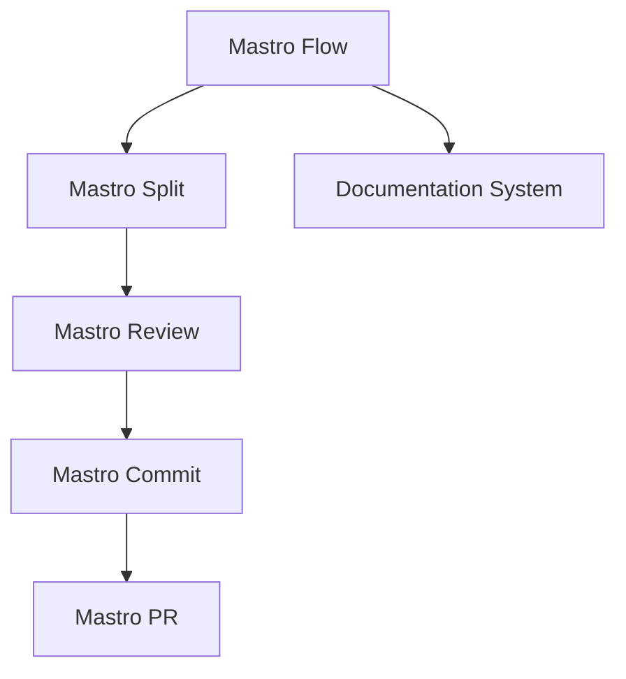
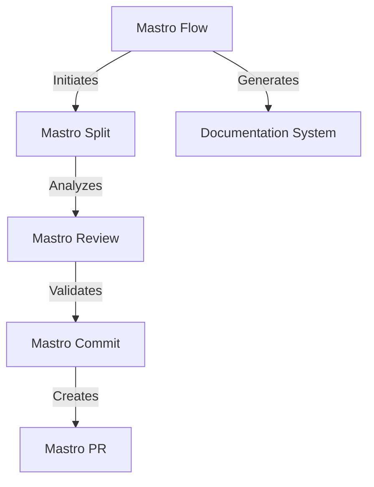
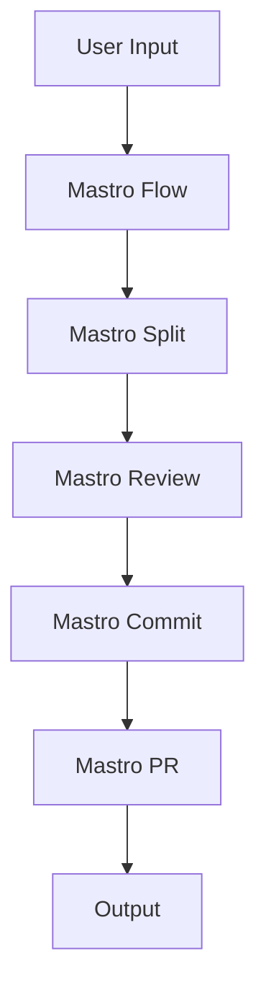

<!---
This file was automatically generated by Mastro CLI
Generated on: 2025-08-12T04:22:48.852Z
Document type: architecture
Title: Architecture Documentation
References: .claude/settings.local.json, .mastro/analytics.json, lib/commands/config.d.ts, lib/commands/config.d.ts.map, lib/commands/config.js, lib/commands/config.js.map, lib/commands/config/init.d.ts, lib/commands/config/init.d.ts.map, lib/commands/config/init.js, lib/commands/config/init.js.map, lib/commands/config/interactive.d.ts, lib/commands/config/interactive.d.ts.map, lib/commands/config/interactive.js, lib/commands/config/interactive.js.map, lib/lib/config.d.ts, lib/lib/config.d.ts.map, lib/lib/config.js, lib/lib/config.js.map, mastro-vscode/.eslintrc.json, mastro-vscode/package-lock.json, mastro-vscode/package.json, mastro-vscode/tsconfig.json, src/commands/config.ts, src/commands/config/init.ts, src/commands/config/interactive.ts, src/lib/config.ts, bin/run.js, lib/index.d.ts, lib/index.d.ts.map, lib/index.js, lib/index.js.map, lib/analyzers/change-detector.d.ts, lib/analyzers/change-detector.d.ts.map, lib/analyzers/change-detector.js, lib/analyzers/change-detector.js.map, lib/analyzers/impact-analyzer.d.ts

To prevent this file from being overwritten, add custom content
between the CUSTOM_START and CUSTOM_END markers below.
--->

# Mastro Architecture Documentation

## 1. High-Level System Architecture Overview

Mastro is an enterprise-level CLI tool designed for workflow orchestration, code review, and documentation generation. It integrates various components to streamline the development process, ensuring efficient code management and collaboration. The architecture is modular, allowing for easy extension and maintenance.

### Key Components:
- **Mastro Flow**: Orchestrates the entire workflow from splitting code to analytics.
- **Mastro Review**: Provides AI-powered code reviews with enhanced validation.
- **Mastro Split**: Analyzes commit boundaries intelligently.
- **Mastro Commit**: Generates meaningful commit messages.
- **Mastro PR**: Manages pull requests seamlessly.
- **Documentation System**: Generates multi-format documentation with visual diagrams.

## 2. Component Relationships and Data Flow

The components of Mastro interact in a defined sequence, facilitating a smooth workflow:

1. **Mastro Flow** initiates the process.
2. **Mastro Split** analyzes the code and determines commit boundaries.
3. **Mastro Review** performs AI-driven reviews and validates code.
4. **Mastro Commit** generates commit messages based on the review.
5. **Mastro PR** creates and manages pull requests.
6. **Documentation System** generates documentation throughout the workflow.

### Data Flow Diagram


## 3. Design Patterns and Architectural Decisions

### Design Patterns:
- **Command Pattern**: Used extensively in the CLI commands to encapsulate request handling.
- **Observer Pattern**: Implemented for monitoring changes in code and triggering reviews.
- **Factory Pattern**: Utilized for creating instances of various components dynamically.

### Architectural Decisions:
- Modular architecture to promote separation of concerns.
- Use of TypeScript for type safety and improved developer experience.
- Integration of AI for enhanced code review capabilities.

## 4. Technology Stack and Rationale

- **Node.js**: Chosen for its non-blocking I/O and event-driven architecture, which is ideal for CLI applications.
- **TypeScript**: Provides static typing, enhancing code quality and maintainability.
- **Oclif**: A framework for building CLI applications, facilitating command management and plugin support.
- **Chalk**: For colorful terminal output, improving user experience.

## 5. Directory Structure and Organization

The directory structure is organized to separate concerns and facilitate navigation:

```
mastro/
├── .claude/                # Source code files
├── .mastro/                # Source code files
├── bin/                    # Executable files
├── docs/                   # Documentation files
│   └── diagrams/           # Mermaid diagrams
├── lib/                    # Library source code
│   ├── analyzers/          # Analysis logic
│   ├── base/               # Base classes and interfaces
│   ├── commands/           # Command implementations
│   │   ├── config/         # Configuration commands
│   │   ├── docs/           # Documentation commands
│   │   └── pr/             # Pull request commands
│   ├── core/               # Core functionalities
│   ├── lib/                # Utility libraries
│   └── types/              # Type definitions
```

## 6. Module Dependencies and Interfaces

### Key Dependencies:
- **@anthropic-ai/sdk**: For AI functionalities.
- **@oclif/core**: Core CLI functionalities.
- **chalk**: For terminal styling.
- **dotenv**: For environment variable management.

### Interfaces:
Each module exposes interfaces that define the expected behavior, promoting loose coupling and easier testing.

## 7. Data Models and Storage Architecture

Mastro primarily operates in-memory for performance but can integrate with external storage solutions as needed. Data models include:

- **Commit**: Represents a code commit with metadata.
- **Review**: Contains review comments and validation results.
- **Workflow**: Represents the state and progress of the orchestration.

## 8. Security Architecture and Considerations

Security is paramount in Mastro, especially in handling code and user data. Key considerations include:

- **Input Validation**: Ensuring all inputs are sanitized to prevent injection attacks.
- **Authentication**: Implementing OAuth for secure access to external APIs.
- **Data Encryption**: Using HTTPS for all external communications.

## 9. Performance and Scalability Design

Mastro is designed to handle enterprise-level workloads. Key strategies include:

- **Asynchronous Processing**: Non-blocking operations to handle multiple requests simultaneously.
- **Caching**: Implementing caching for frequently accessed data to reduce latency.
- **Load Balancing**: Distributing workloads across multiple instances for scalability.

## 10. Deployment Architecture

Mastro can be deployed in various environments, including:

- **Local Development**: Using Docker for containerization.
- **Cloud Deployment**: Deploying on platforms like AWS or Azure for scalability.
- **CI/CD Integration**: Integrating with CI/CD pipelines for automated testing and deployment.

## 11. Mermaid Diagrams for Visual Representation

### Component Interaction Diagram


### Data Flow Diagram


---

This documentation aims to provide a comprehensive understanding of the Mastro architecture, facilitating both new team members and experienced developers in making informed decisions regarding modifications or extensions.\n\n## System Architecture\n\nHigh-level system architecture overview\n\n```mermaid\nflowchart TD\n        A[Client Application] --> B[API Gateway]\n        B --> C[Business Logic Layer]\n        C --> D[Data Access Layer]\n        D --> E[Database]\n        F[nodejs] --> C\n```\n\n\n\n## Main User Journey Flow\n\nUser flow diagram for Main User Journey\n\n```mermaid\nflowchart TD\n        A[Load Application]\n        B[Navigate]\n        A --> B\n        C[Interact]\n        B --> C\n```\n\n

---

<!-- CUSTOM_START -->
<!-- Add your custom content here - it will be preserved during regeneration -->
<!-- CUSTOM_END -->

*Documentation generated by [Mastro CLI](https://github.com/your-org/mastro) on 8/12/2025*