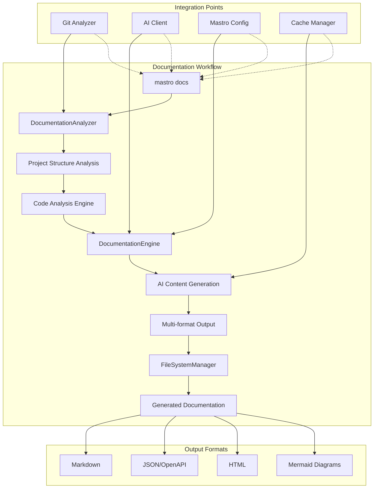
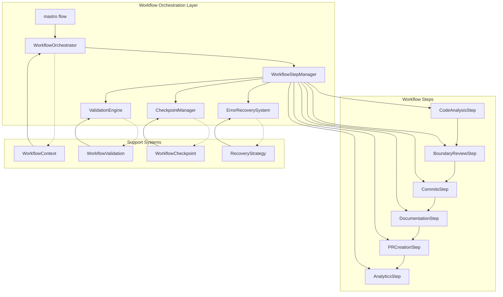
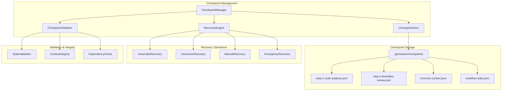
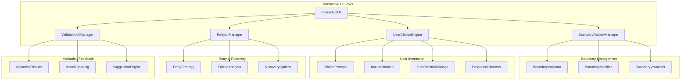
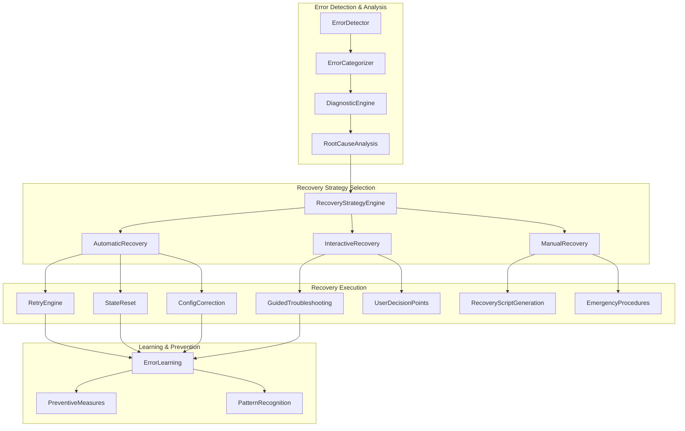
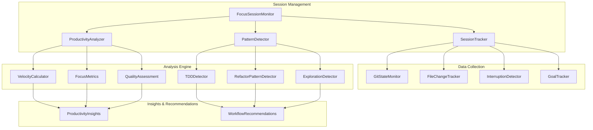

<!---
This file was automatically generated by Mastro CLI
Generated on: 2025-08-08T18:52:20.020Z
Document type: architecture
Title: Architecture Documentation
References: .claude/settings.local.json, lib/commands/config/init.d.ts, lib/commands/config/init.d.ts.map, lib/commands/config/init.js, lib/commands/config/init.js.map, lib/lib/config.d.ts, lib/lib/config.d.ts.map, lib/lib/config.js, lib/lib/config.js.map, mastro-vscode/.eslintrc.json, mastro-vscode/package-lock.json, mastro-vscode/package.json, mastro-vscode/tsconfig.json, src/commands/config/init.ts, src/lib/config.ts, bin/run.js, lib/index.d.ts, lib/index.d.ts.map, lib/index.js, lib/index.js.map, lib/analyzers/impact-analyzer.d.ts, lib/analyzers/impact-analyzer.d.ts.map, lib/analyzers/impact-analyzer.js, lib/analyzers/impact-analyzer.js.map, lib/analyzers/semantic-analyzer.d.ts

To prevent this file from being overwritten, add custom content
between the CUSTOM_START and CUSTOM_END markers below.
--->

# Architecture Documentation\n\nArchitecture overview for mastro\n\n## Project Overview\n\n**Language:** typescript\n**Framework:** nodejs\n**Complexity:** enterprise\n**Total Files:** 187\n**Total Lines:** 9,350\n\n## Directory Structure\n\n```\n.claude/\nbin/\ndocs/\n  diagrams/\nlib/\n  analyzers/\n  base/\n  commands/\n    config/\n    docs/\n    pr/\n  core/\n  lib/\n  types/\n  ui/\nmastro-vscode/\n  out/\n    providers/\n    services/\n  src/\n    commands/\n    providers/\n    services/\n    utils/\n    views/\nsrc/\n  analyzers/\n  base/\n  commands/\n    config/\n    docs/\n    pr/\n  core/\n  lib/\n  types/\n  ui/\n```\n\n## Dependencies\n\n### Production Dependencies\n\n- **@oclif/core** (^3.26.5): Library dependency\n- **@oclif/plugin-help** (^6.0.21): Library dependency\n- **@oclif/plugin-plugins** (^4.3.9): Library dependency\n- **chalk** (^5.3.0): Library dependency\n- **cosine-similarity** (^1.0.1): Library dependency\n- **dotenv** (^17.2.1): Library dependency\n- **glob** (^10.3.10): Library dependency\n- **ignore** (^5.3.1): Library dependency\n- **ink** (^4.4.1): Library dependency\n- **node-cache** (^5.1.2): Library dependency\n- **openai** (^4.28.4): Library dependency\n- **ora** (^8.0.1): Library dependency\n- **react** (^18.2.0): UI framework\n  - ⚠️ Critical dependency\n- **semver** (^7.6.0): Library dependency\n- **simple-git** (^3.22.0): Library dependency\n- **yaml** (^2.4.1): Library dependency\n- **zod** (^3.22.4): Library dependency\n\n## System Architecture\n\nHigh-level system architecture overview\n\n```mermaid\nflowchart TD\n        A[Client Application] --> B[API Gateway]\n        B --> C[Business Logic Layer]\n        C --> D[Data Access Layer]\n        D --> E[Database]\n        F[nodejs] --> C\n```\n\n Diagram\n\n```mermaid\nflowchart TD\n    A[Client] --> B[API Layer]\n    B --> C[Business Logic]\n    C --> D[Data Layer]\n    D --> E[Database]\n```\n\n\n## Main User Journey Flow\n\nUser flow diagram for Main User Journey\n\n```mermaid\nflowchart TD\n        A[Load Application]\n        B[Navigate]\n        A --> B\n        C[Interact]\n        B --> C\n```\n\n

---

<!-- CUSTOM_START -->

## 📚 Documentation Engine Architecture

### Core Documentation Components
The recently implemented Documentation Engine is a sophisticated AI-powered system that integrates seamlessly with Mastro's existing architecture:



### Documentation Engine Features
- **Multi-Type Generation**: API docs, architecture docs, user guides, README files
- **Intelligent Analysis**: Detects architectural patterns, API endpoints, complexity metrics
- **AI-Powered Content**: Leverages existing AI client for contextual documentation
- **Format Flexibility**: Markdown, JSON, HTML, OpenAPI specifications
- **Mermaid Integration**: Auto-generates system and user flow diagrams
- **Template System**: Extensible template architecture for custom documentation styles

### Integration with Existing Architecture
The Documentation Engine leverages Mastro's existing infrastructure:
- **AI Client**: Uses the same AI provider system as commit/review operations
- **Git Analyzer**: Builds on git analysis capabilities for project context
- **Cache Manager**: Optimizes performance through intelligent caching
- **File Manager**: Extends file operations for documentation output
- **Configuration System**: Integrates with Mastro's configuration framework

### Documentation Types Supported
1. **API Documentation**: REST endpoints, function signatures, usage examples, OpenAPI specs
2. **Architecture Documentation**: System diagrams, dependency analysis, pattern detection
3. **User Guides**: Installation steps, feature explanations, workflow documentation
4. **README Generation**: Project overview, quick start guides, key metrics
5. **Component Documentation**: Class structures, interfaces, relationships

## 🌊 Workflow Orchestration Architecture

### Overview
The Workflow Orchestration system represents a significant architectural advancement, transforming Mastro from individual command execution to comprehensive workflow automation. This system orchestrates the entire development process from code analysis to PR creation.

### Core Components



### Workflow Orchestration Patterns

**1. Step-Based Execution**
- Each workflow step implements the `WorkflowStep` interface
- Steps are executed sequentially with dependency validation
- Each step can produce checkpoints for recovery
- Steps can be skipped, retried, or force-executed based on configuration

**2. Context Propagation**
- `WorkflowContext` maintains state across all steps
- Context includes session ID, working directory, branch state, and boundaries
- Context is persisted at checkpoints for recovery scenarios

**3. Validation & Error Handling**
- Pre-step validation ensures prerequisites are met
- Post-step validation confirms successful execution
- Failed steps trigger error recovery workflows
- Emergency recovery mode provides manual intervention capabilities

### Integration with Existing Architecture

The workflow orchestration system leverages and extends existing Mastro components:

- **AI Client**: Enhanced for workflow-specific AI operations
- **Git Analyzer**: Extended with `getCurrentCommit()` for workflow validation
- **Interactive UI**: Integrated for boundary review and user confirmations
- **Analytics Engine**: Enhanced with workflow pattern detection
- **File System**: Extended for checkpoint persistence in `.git/mastro/`

## 💾 Checkpoint System Architecture

### Overview
The Checkpoint System provides comprehensive state management and recovery capabilities, enabling robust workflow execution with graceful error recovery.

### Architecture Components



### Checkpoint Storage Strategy

**1. Git-Based Persistence**
- Checkpoints stored in `.git/mastro/checkpoints/` to avoid repository contamination
- JSON format for human readability and debugging
- Automatic cleanup of old checkpoints to prevent storage bloat

**2. Hierarchical State Management**
```typescript
// Checkpoint data structure
{
  "id": "step-3-commits-1691234567890",
  "timestamp": "2023-08-05T10:42:47.890Z",
  "step": "commits",
  "stepNumber": 3,
  "totalSteps": 6,
  "context": { /* complete workflow context */ },
  "data": { /* step-specific state */ },
  "success": true,
  "nextSteps": ["documentation", "pr-creation", "analytics"]
}
```

**3. Recovery Context Preservation**
- Complete workflow state captured at each checkpoint
- Step-specific data preserved for exact recovery
- User preferences and configuration maintained across recovery

### Recovery Architecture Patterns

**Multi-Level Recovery Strategy**
1. **Level 1 - Automatic**: Retry with exponential backoff, auto-correct common issues
2. **Level 2 - Interactive**: Guided troubleshooting with user input
3. **Level 3 - Manual**: Custom recovery scripts, expert-level intervention

## 🎯 Interactive UI Architecture

### Overview
The Interactive UI system provides sophisticated user interaction capabilities for boundary review, customization, and workflow control.

### Component Architecture



### Interactive Boundary Review Features

**1. Comprehensive Boundary Management**
- File addition/removal from boundaries
- Boundary splitting and merging capabilities
- Commit message editing and regeneration
- Detailed diff viewing and analysis

**2. Validation & Quality Assurance**
- Real-time boundary quality scoring (0-100 scale)
- Issue detection (mixed concerns, large boundaries, dependencies)
- Automated suggestions with confidence scores
- User-guided resolution of validation failures

**3. Retry & Recovery Mechanisms**
- Automatic retry for transient failures
- User-guided retry with customization options
- Recovery from validation failures with step-by-step guidance
- Rollback capabilities for failed operations

### UI Design Patterns

**1. Progressive Enhancement**
- Basic functionality works without interaction
- Enhanced features available in interactive mode
- Graceful degradation when interactive features unavailable

**2. Context-Aware Assistance**
- AI-powered suggestions based on code analysis
- Historical pattern matching for user preferences
- Intelligent defaults based on repository patterns

**3. Error-Resistant Design**
- Input validation at all interaction points
- Confirmation dialogs for destructive operations
- Comprehensive error messaging with recovery guidance

## 🛡️ Error Recovery System Architecture

### Overview
The Error Recovery System provides multi-level error handling with intelligent diagnostics, automated recovery strategies, and comprehensive troubleshooting support.

### Architecture Components



### Error Recovery Patterns

**1. Intelligent Error Classification**
- Automatic categorization: `git`, `ai-service`, `filesystem`, `network`, `user`, `config`
- Severity assessment: `low`, `medium`, `high`, `critical`
- Recovery confidence scoring based on error type and context

**2. Context-Aware Recovery**
- User experience level consideration (`beginner`, `intermediate`, `advanced`, `expert`)
- Historical success patterns for similar errors
- Repository-specific patterns and preferences
- Current workflow state and step dependencies

**3. Progressive Recovery Escalation**
```typescript
// Recovery escalation pattern
Level 1: Automatic → Retry with backoff, auto-correct config
  ↓ (if failed)
Level 2: Interactive → Guided troubleshooting, user input
  ↓ (if failed)  
Level 3: Manual → Custom scripts, emergency procedures
```

### Diagnostic Engine Features

**1. Comprehensive Context Collection**
- System environment (OS, Node.js, Git versions)
- Repository state (branch, staging area, working directory)
- Process information (running Git processes, resource usage)
- User session data (recent commands, productivity patterns)

**2. Root Cause Analysis**
- Multi-factor analysis considering system, user, and environmental factors
- Pattern matching against known error signatures
- Confidence scoring for identified causes
- Technical and user-friendly explanations

**3. Learning System**
- Error resolution tracking and success rate monitoring
- Pattern recognition for recurring issues
- Preventive measure suggestions based on historical data
- Continuous improvement of recovery strategies

## 🎯 Focus Session Architecture

### Overview
The Focus Session system provides advanced productivity tracking, pattern detection, and intelligent development insights through continuous session monitoring.

### Architecture Components



### Focus Session Features

**1. Real-Time Session Monitoring**
- Continuous Git state tracking (branch, commits, staging area)
- File system change detection with impact assessment
- Interruption detection and categorization
- Goal progress tracking with milestone recognition

**2. Productivity Metrics Calculation**
- Lines per minute, files per hour, commits per hour
- Deep work session identification (25+ minute focused periods)
- Context switch frequency and impact analysis
- Focus ratio calculation (deep work vs total time)

**3. Pattern Recognition System**
```typescript
// Example pattern detection
TDD Pattern: {
  confidence: 0.95,
  evidence: [
    "4 test files modified before corresponding source files",
    "Red-green-refactor cycle detected",
    "Test coverage increased by 15%"
  ],
  recommendation: "Excellent TDD practice! Continue this approach."
}
```

**4. Intelligent Recommendations**
- Peak productivity hour identification
- Optimal session length recommendations
- Break suggestions based on focus patterns
- Workflow optimization guidance

### Integration with Existing Systems

The Focus Session architecture seamlessly integrates with existing Mastro components:

- **Analytics Engine**: Enhanced with focus session data
- **Git Analyzer**: Extended for real-time state monitoring
- **Workflow Orchestration**: Focus sessions inform workflow timing
- **Error Recovery**: Session context aids in recovery strategies

<!-- CUSTOM_END -->

*Documentation generated by [Mastro CLI](https://github.com/your-org/mastro) on 8/8/2025*