# Mastro Class Interactions & Component Diagrams

> **Detailed UML-style diagrams showing class relationships, component interactions, and system architecture patterns**

## System Component Overview

```mermaid
classDiagram
    %% Base Classes
    class BaseCommand {
        #mastroConfig: MastroConfig
        #gitAnalyzer: GitAnalyzer
        #aiClient: AIClient
        #cacheManager: CacheManager
        +init() Promise~void~
        +handleError(error, operation) Promise~void~
        +startSpinner(message) void
        +stopSpinner(success, message?) void
        +ensureGitRepository() Promise~void~
    }
    
    %% Command Classes
    class CommitCommand {
        -renderer: UIRenderer
        -interactiveUI: InteractiveUI
        +run() Promise~void~
        -refineCommitMessage(original, refinement, context) Promise~CommitMessage~
        -applyCommit(message) Promise~void~
        -learnFromCommit(message, context) Promise~void~
    }
    
    class ExplainCommand {
        -renderer: UIRenderer
        +run() Promise~void~
        -parseRevision(revision) RevisionInfo
        -analyzeSingleCommit(commit) Promise~CommitContext~
        -analyzeCommitRange(from, to, maxCommits) Promise~CommitContext~
        -analyzeBranch(branchName) Promise~CommitContext~
        -enhanceExplanation(explanation, flags) Promise~DiffExplanation~
        -formatOutput(explanation, format, context) Promise~string~
    }
    
    class ReviewCommand {
        -sessionTracker: SessionTracker
        -reviewEngine: ReviewEngine
        -workflowAnalyzer: WorkflowAnalyzer
        -streamingRenderer: StreamingRenderer
        -reviewFormatter: ReviewFormatter
        +run() Promise~void~
        -setupReviewPersona(flags) ReviewPersona
        -processStreamingReview() Promise~SessionReview~
        -processStandardReview() Promise~SessionReview~
    }
    
    class PRCreateCommand {
        -sessionTracker: SessionTracker
        -reviewEngine: ReviewEngine
        -workflowAnalyzer: WorkflowAnalyzer
        -streamingRenderer: StreamingRenderer
        -reviewFormatter: ReviewFormatter
        +run() Promise~void~
        -validateBranchState(flags) Promise~void~
        -performPrePRReview(session) Promise~void~
        -detectMigrations(session) Promise~MigrationDetection~
        -generatePRContext(session, flags, migration?) Promise~SmartPRContext~
        -createActualPR(description, context, flags) Promise~void~
    }
    
    %% Core Services
    class GitAnalyzer {
        -git: SimpleGit
        -config: MastroConfig
        +getStagedChanges() Promise~GitChange[]~
        +getWorkingChanges() Promise~GitChange[]~
        +getBranchChanges(from, to) Promise~GitChange[]~
        +buildCommitContext(staged) Promise~CommitContext~
        +buildRepoContext() Promise~RepoContext~
        +getCurrentBranch() Promise~string~
        +getRecentCommits(limit) Promise~CommitHistory[]~
        +parseDiffForFile(content) GitChange
        -parseDiff(diffContent) GitChange[]
        -parseHunk(hunkContent) GitHunk
    }
    
    class AIClient {
        -provider: AIProvider
        +generateCommitMessage(context) Promise~CommitMessage~
        +explainChanges(context) Promise~DiffExplanation~
        +createPRDescription(context) Promise~PRDescription~
        +reviewCode(context, persona) Promise~CodeReview~
    }
    
    class OpenAIProvider {
        -client: OpenAI
        -config: AIConfig
        +generateCommitMessage(context) Promise~CommitMessage~
        +explainChanges(context) Promise~DiffExplanation~
        +createPRDescription(context) Promise~PRDescription~
        +reviewCode(context, persona) Promise~CodeReview~
        -buildCommitPrompt(context) string
        -buildExplanationPrompt(context) string
        -buildPRPrompt(context) string
        -buildReviewPrompt(context, persona) string
        -validateCommitMessage(message) CommitMessage
    }
    
    %% Session Management
    class SessionTracker {
        -config: MastroConfig
        -gitAnalyzer: GitAnalyzer
        -currentSession: SessionState
        +getCurrentSession() Promise~DevelopmentSession~
        +updateSessionState() Promise~void~
        +hasSessionChanges() Promise~boolean~
        -initializeNewSession() Promise~SessionState~
        -shouldResetSession() boolean
        -calculateRiskAssessment(session) SessionRisk
        -detectSessionPatterns(session) SessionPattern[]
    }
    
    class ReviewEngine {
        -config: MastroConfig
        -aiClient: AIClient
        -semanticAnalyzer: SemanticAnalyzer
        -impactAnalyzer: ImpactAnalyzer
        +reviewSession(session, persona) Promise~SessionReview~
        +generateActionableItems(review) Promise~ActionableItem[]~
        -enhanceWithPersona(review, persona) SessionReview
        -prioritizeItems(items) ActionableItem[]
    }
    
    class WorkflowAnalyzer {
        -semanticAnalyzer: SemanticAnalyzer
        -gitAnalyzer: GitAnalyzer
        -config: MastroConfig
        +analyzeWorkflowPatterns(session) Promise~SessionPattern[]~
        +detectPRType(session) Promise~PRTemplateType~
        +generateWorkflowSuggestions(session) Promise~WorkflowSuggestion[]~
        +optimizeCommitStrategy(session) Promise~string[]~
        -detectTDDPattern(changes, session) SessionPattern?
        -detectFeatureFlagPattern(changes) SessionPattern?
        -detectAntiPatterns(session) DevelopmentAntiPattern[]
    }
    
    %% Analysis Services
    class SemanticAnalyzer {
        +analyzeChanges(changes) Promise~SemanticAnalysis~
        +detectPatterns(content) CodePattern[]
        +calculateComplexity(change) ComplexityScore
        +identifyFrameworks(changes) Framework[]
        -analyzeFileStructure(change) FileStructure
        -detectImportPatterns(lines) ImportPattern[]
    }
    
    class ImpactAnalyzer {
        +assessImpact(context) Promise~ImpactAnalysis~
        +analyzeBusinessImpact(changes) BusinessImpact
        +analyzeTechnicalImpact(changes) TechnicalImpact
        +assessSecurityImpact(changes) SecurityImpact
        +evaluatePerformanceImpact(changes) PerformanceImpact
        -identifyBreakingChanges(changes) BreakingChange[]
        -assessMigrationNeeds(changes) MigrationNeeds
    }
    
    %% Cache Management
    class CacheManager {
        -commitCache: NodeCache
        -explanationCache: NodeCache
        -contextCache: NodeCache
        -config: MastroConfig
        +getCachedCommitMessage(context) Promise~CommitMessage?~
        +setCachedCommitMessage(context, message) Promise~void~
        +getCachedExplanation(context) Promise~DiffExplanation?~
        +setCachedExplanation(context, explanation) Promise~void~
        +clearCache() void
        -generateContextHash(context) string
        -findSimilarContext(context, threshold) Promise~CacheEntry?~
        -calculateSimilarity(context1, context2) Promise~number~
    }
    
    %% UI Components
    class UIRenderer {
        -config: MastroConfig
        +renderCommitMessage(message) string
        +renderDiffExplanation(explanation) string
        +renderError(error, context) string
        -formatWithColors(content, type) string
        -createProgressBar(percentage) string
    }
    
    class StreamingRenderer {
        -config: MastroConfig
        -loadingManager: LoadingStateManager
        +renderStreamingReview(reviewPromise, config) Promise~void~
        +renderProgressiveResults(review) void
        +cleanup() void
        -createStreamingIndicator(message) StreamingIndicator
    }
    
    class ReviewFormatter {
        -config: MastroConfig
        +formatSessionReview(review, format) string
        +formatActionableItems(items, format) string
        +formatWorkflowSuggestions(suggestions, format) string
        -formatTerminal(review) string
        -formatMarkdown(review) string
        -formatJSON(review) string
        -formatHTML(review) string
    }
    
    class SessionUI {
        -loadingManager: LoadingStateManager
        -config: MastroConfig
        +displaySessionOverview(session) void
        +displaySessionStats(stats, output?) void
        +displayRiskAssessment(risk, output?) void
        +displaySessionPatterns(patterns, output?) void
        +displayActionableItemsSummary(items) void
        +showInteractiveSessionMenu() void
        +createLiveSessionMonitor() SessionMonitor
    }
    
    class LoadingStateManager {
        -config: MastroConfig
        -activeSpinners: Map
        +startSpinner(message) Spinner
        +stopSpinner(success, message?) void
        +startStreamingIndicator(message) StreamingIndicator
        +updateProgress(progress) void
    }
    
    %% Inheritance Relationships
    BaseCommand <|-- CommitCommand
    BaseCommand <|-- ExplainCommand
    BaseCommand <|-- ReviewCommand
    BaseCommand <|-- PRCreateCommand
    
    AIProvider <|.. OpenAIProvider
    
    %% Composition Relationships
    BaseCommand *-- GitAnalyzer
    BaseCommand *-- AIClient
    BaseCommand *-- CacheManager
    
    CommitCommand *-- UIRenderer
    CommitCommand *-- InteractiveUI
    
    ExplainCommand *-- UIRenderer
    
    ReviewCommand *-- SessionTracker
    ReviewCommand *-- ReviewEngine
    ReviewCommand *-- WorkflowAnalyzer
    ReviewCommand *-- StreamingRenderer
    ReviewCommand *-- ReviewFormatter
    
    PRCreateCommand *-- SessionTracker
    PRCreateCommand *-- ReviewEngine
    PRCreateCommand *-- WorkflowAnalyzer
    PRCreateCommand *-- StreamingRenderer
    PRCreateCommand *-- ReviewFormatter
    
    AIClient *-- OpenAIProvider
    
    SessionTracker *-- GitAnalyzer
    
    ReviewEngine *-- AIClient
    ReviewEngine *-- SemanticAnalyzer
    ReviewEngine *-- ImpactAnalyzer
    
    WorkflowAnalyzer *-- SemanticAnalyzer
    WorkflowAnalyzer *-- GitAnalyzer
    
    StreamingRenderer *-- LoadingStateManager
    SessionUI *-- LoadingStateManager
```

## Command Execution Flow Patterns

### 1. Commit Command Execution Pattern

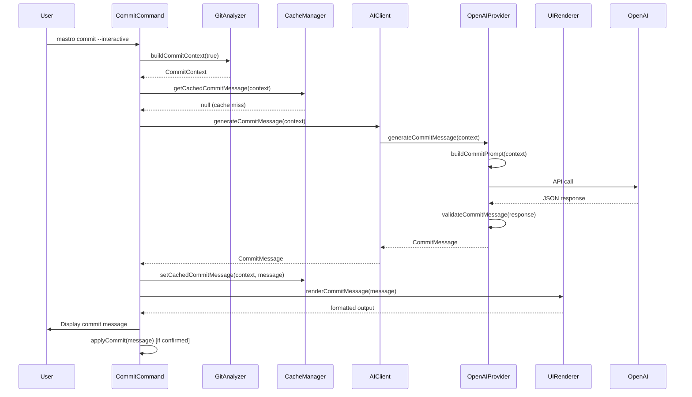

### 2. Review Command Execution Pattern

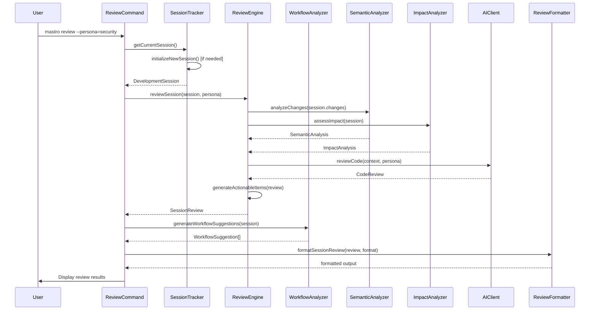

## Data Flow Architecture

### 1. Git Analysis Data Flow

```mermaid
flowchart TD
    GitRepo[Git Repository] --> GA[GitAnalyzer]
    GA --> SimpleGit[simple-git library]
    SimpleGit --> DiffParsing[Diff Parsing]
    DiffParsing --> GitChanges[GitChange[]]
    GitChanges --> GitHunks[GitHunk[]]
    GitHunks --> GitLines[GitLine[]]
    GitLines --> CommitContext[CommitContext]
    CommitContext --> RepoContext[RepoContext]
    RepoContext --> TeamPatterns[TeamPatterns]
    TeamPatterns --> FinalContext[Complete Context]
    
    subgraph "Context Building"
        CommitContext
        RepoContext
        TeamPatterns
    end
    
    subgraph "Git Data Structures"
        GitChanges
        GitHunks
        GitLines
    end
```

### 2. AI Processing Data Flow

```mermaid
flowchart LR
    Context[CommitContext] --> TokenBudget[Token Budget Manager]
    TokenBudget --> Optimization[Context Optimization]
    Optimization --> PromptBuilder[Prompt Builder]
    PromptBuilder --> AIProvider[AI Provider]
    AIProvider --> OpenAI[OpenAI API]
    OpenAI --> ResponseParser[Response Parser]
    ResponseParser --> Validator[Response Validator]
    Validator --> CacheStore[Cache Storage]
    CacheStore --> Output[Final Output]
    
    subgraph "Pre-Processing"
        TokenBudget
        Optimization
        PromptBuilder
    end
    
    subgraph "AI Processing"
        AIProvider
        OpenAI
        ResponseParser
    end
    
    subgraph "Post-Processing"
        Validator
        CacheStore
        Output
    end
```

### 3. Session Management Data Flow

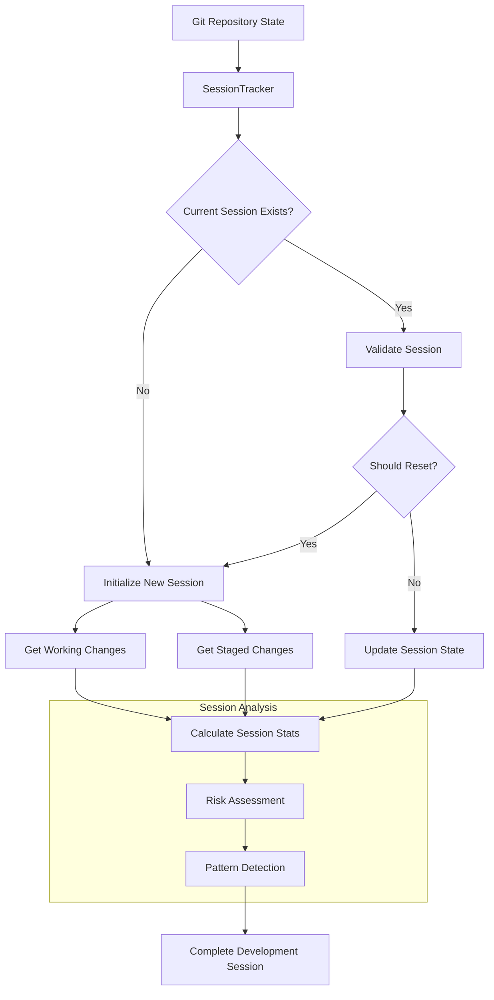

## Component Integration Patterns

### 1. Cache Integration Pattern

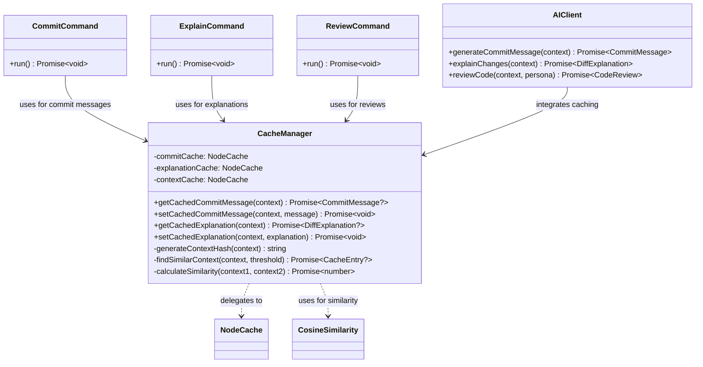

### 2. UI Component Integration

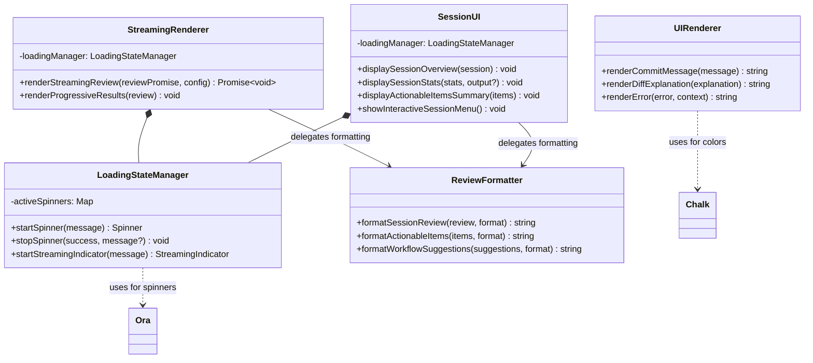

### 3. Analysis Pipeline Integration

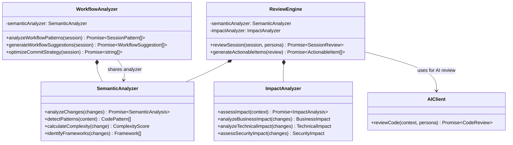

## Error Handling Architecture

### 1. Error Propagation Pattern

```mermaid
classDiagram
    class BaseCommand {
        +handleError(error, operation) Promise~void~
        +ensureGitRepository() Promise~void~
    }
    
    class MastroError {
        +code: string
        +context: any
        +message: string
    }
    
    class GitAnalyzer {
        +getStagedChanges() Promise~GitChange[]~
        -throwGitError(error, operation) never
    }
    
    class AIClient {
        +generateCommitMessage(context) Promise~CommitMessage~
        -throwAIError(error, operation) never
    }
    
    class OpenAIProvider {
        +generateCommitMessage(context) Promise~CommitMessage~
        -handleOpenAIError(error) never
    }
    
    class CacheManager {
        +getCachedCommitMessage(context) Promise~CommitMessage?~
        -handleCacheError(error) void
    }
    
    %% Error Relationships
    BaseCommand ..> MastroError : handles
    GitAnalyzer ..> MastroError : throws
    AIClient ..> MastroError : throws
    OpenAIProvider ..> MastroError : throws
    CacheManager ..> MastroError : throws (non-fatal)
    
    %% Error Codes
    note for MastroError "Error Codes:\n- AI_API_KEY_MISSING\n- AI_REQUEST_FAILED\n- GIT_REPO_NOT_FOUND\n- NO_STAGED_CHANGES\n- CONFIG_INVALID\n- TOKEN_LIMIT_EXCEEDED"
```

### 2. Configuration Management Pattern

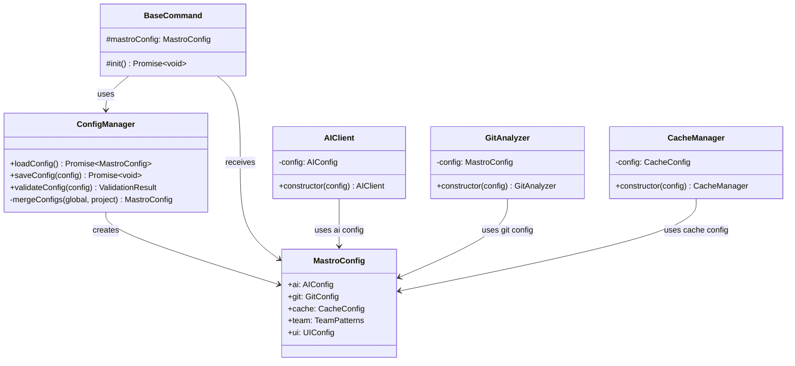

## Plugin Architecture Pattern

### 1. AI Provider Plugin System

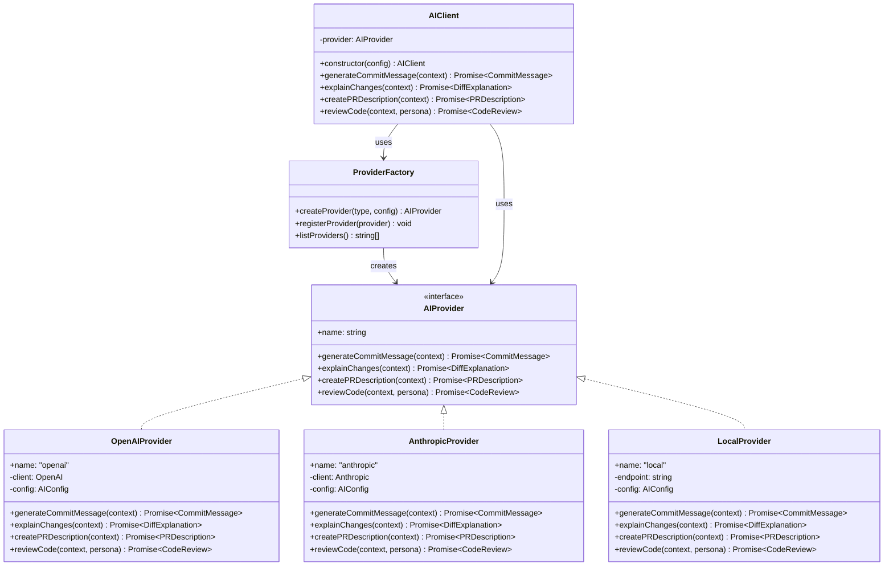

### 2. Extension Points Architecture

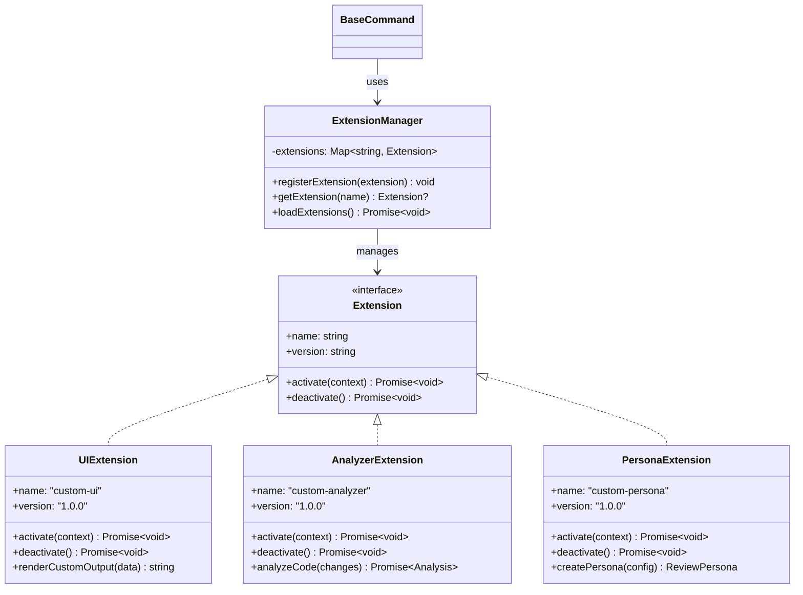

This comprehensive class interaction model shows how mastro's modular architecture enables clean separation of concerns, extensibility, and maintainable code organization while supporting complex AI-powered workflows.