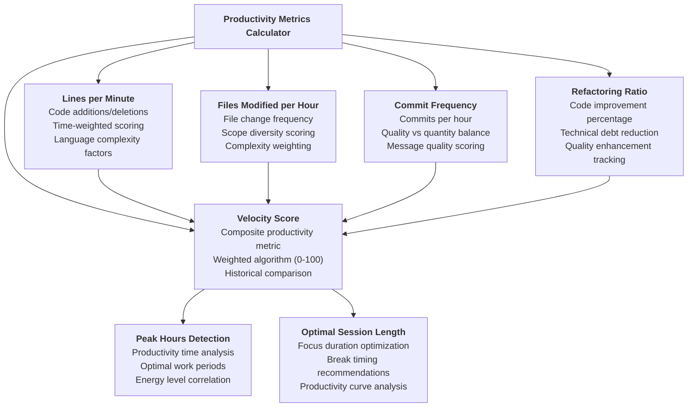
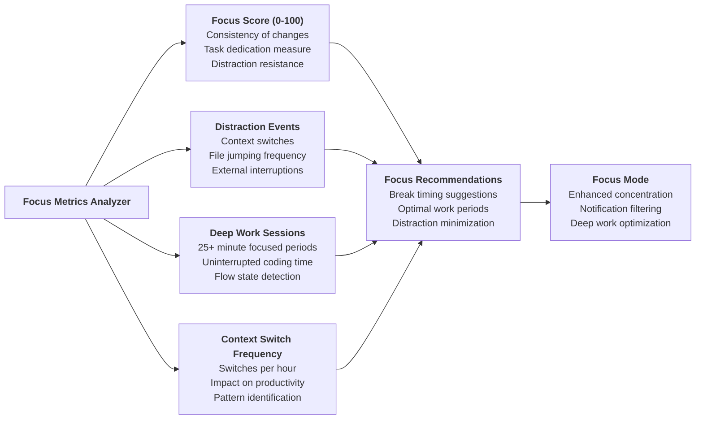
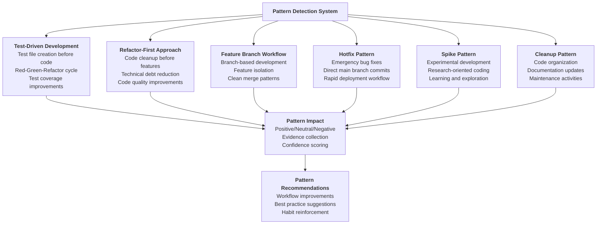
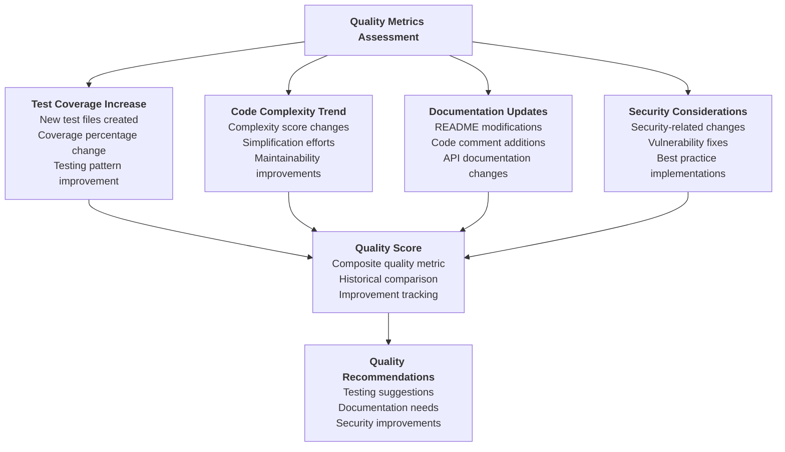
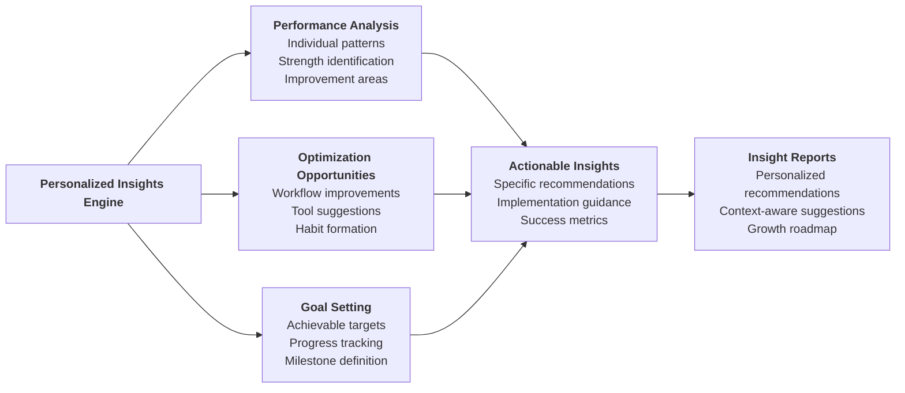
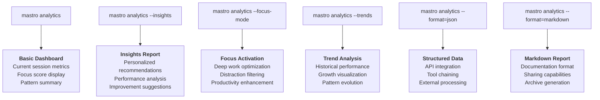
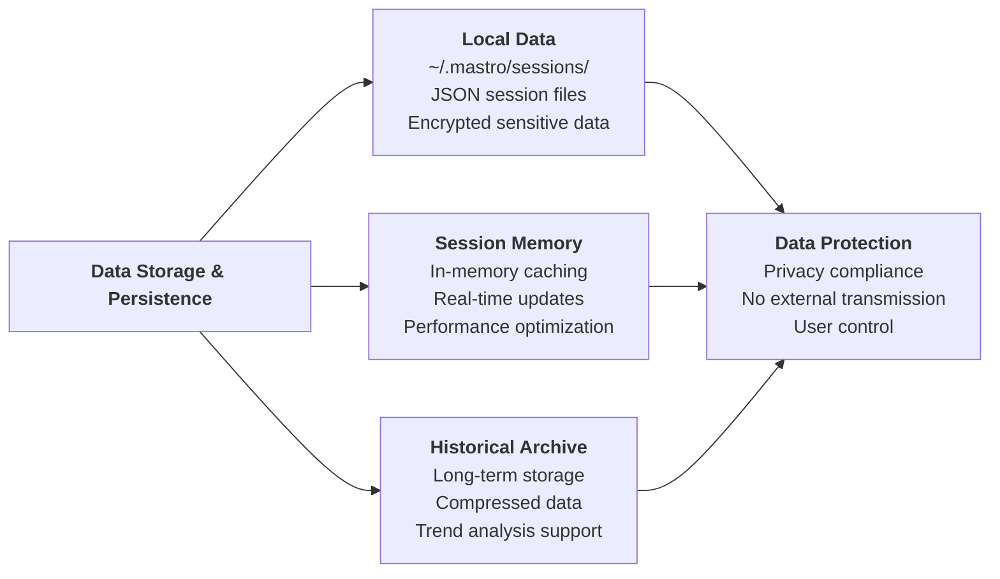

# Mastro Analytics Flow - Enhanced Session Intelligence

This diagram illustrates the technical workflow for `mastro analytics` command, showing the comprehensive productivity analytics and session tracking system.

## Complete Analytics Workflow

```mermaid

graph TD
    A["`**Session Start**
    Git repository detection
    Development session initialization
    Baseline metrics capture`"] --> B["`**Real-Time Tracking**
    File change monitoring
    Git activity logging
    Pattern detection
    Productivity measurement`"]
    
    B --> C["`**Data Collection**
    📊 File modifications
    🕒 Time tracking
    📝 Commit patterns
    🔄 Context switches`"]
    
    C --> D["`**Session Analysis**
    🧠 Pattern recognition
    📈 Productivity scoring
    🎯 Focus evaluation
    🔍 Quality assessment`"]
    
    D --> E["`**Historical Analysis**
    📚 Past session comparison
    📊 Trend identification
    🎯 Performance patterns
    💡 Insight generation`"]
    
    E --> F["`**AI Insights Engine**
    🤖 Personalized recommendations
    📊 Productivity optimization
    🎯 Focus improvement
    ⚡ Workflow suggestions`"]
    
    F --> G{"`**User Request**
    Which analytics view?`"}
    
    G -->|Current Session| H["`**Live Dashboard**
    Real-time metrics
    Current focus score
    Active patterns
    Session progress`"]
    
    G -->|Insights Mode| I["`**Insights Report**
    Personalized recommendations
    Optimization suggestions
    Pattern analysis
    Productivity tips`"]
    
    G -->|Focus Mode| J["`**Focus Activation**
    Distraction filtering
    Deep work tracking
    Notification management
    Productivity monitoring`"]
    
    G -->|Historical| K["`**Trend Analysis**
    Weekly/monthly patterns
    Performance comparisons
    Improvement tracking
    Goal progress`"]
    
    H --> L["`**Terminal Display**
    Rich formatted output
    Progress indicators
    Visual metrics`"]
    
    I --> M["`**Recommendation Engine**
    Actionable suggestions
    Improvement plans
    Habit formation`"]
    
    J --> N["`**Focus Session**
    Enhanced productivity
    Reduced distractions
    Deep work optimization`"]
    
    K --> O["`**Progress Reports**
    Growth visualization
    Achievement tracking
    Goal adjustment`"]

    style A fill:#e1f5fe color:#000000
    style D fill:#fff3e0 color:#000000
    style F fill:#f3e5f5 color:#000000
    style N fill:#e8f5e8 color:#000000
    style O fill:#fff9c4 color:#000000

```

## Session Tracking Engine

```mermaid

graph TB
    STE["`**Session Tracking Engine**`"] --> FM["`**File Monitoring**
    • File change detection
    • Modification timestamps
    • Content diff analysis
    • Language detection`"]
    
    STE --> TT["`**Time Tracking**
    • Session duration
    • Active coding time
    • Break detection
    • Peak hour identification`"]
    
    STE --> GA["`**Git Activity**
    • Commit frequency
    • Branch operations
    • Merge activities
    • Staging patterns`"]
    
    STE --> CS["`**Context Switching**
    • Project switching
    • File jumping
    • Task interruptions
    • Focus breaks`"]
    
    FM --> PM["`**Pattern Matching**
    • TDD detection
    • Refactoring patterns
    • Feature development
    • Bug fixing patterns`"]
    
    TT --> PM
    GA --> PM
    CS --> PM
    
    PM --> SD["`**Session Data**
    Structured metrics
    Pattern classifications
    Performance scores`"]

    style STE fill:#e3f2fd color:#000000
    style FM fill:#f1f8e9 color:#000000
    style TT fill:#fff8e1 color:#000000
    style GA fill:#f3e5f5 color:#000000
    style CS fill:#fce4ec color:#000000
    style PM fill:#fff3e0 color:#000000
    style SD fill:#e8f5e8 color:#000000

```

## Productivity Metrics Calculation

## Focus Metrics & Deep Work Analysis

## Pattern Detection System

## Quality Metrics Assessment

## Personalized Insights Engine

## Command Options & Output Formats

### Analytics Command Flow

## Data Storage & Persistence

---

**Key Features:**
- **Real-Time Tracking**: Continuous monitoring of development activities
- **Pattern Recognition**: AI-powered detection of development workflows
- **Focus Optimization**: Deep work enhancement and distraction management
- **Personalized Insights**: Context-aware recommendations for productivity improvement
- **Historical Analysis**: Long-term trend tracking and performance comparison
- **Privacy-First**: All data stored locally with no external transmission

**Technical Implementation:**
- File system monitoring with optimized performance
- SQLite database for session storage and analytics
- Machine learning algorithms for pattern detection
- Real-time metrics calculation with caching
- Configurable privacy and data retention settings