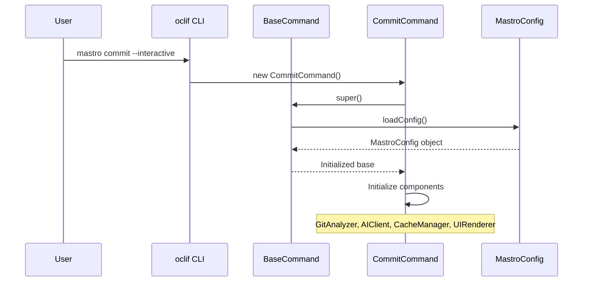
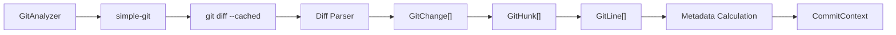
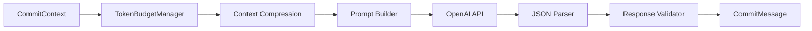
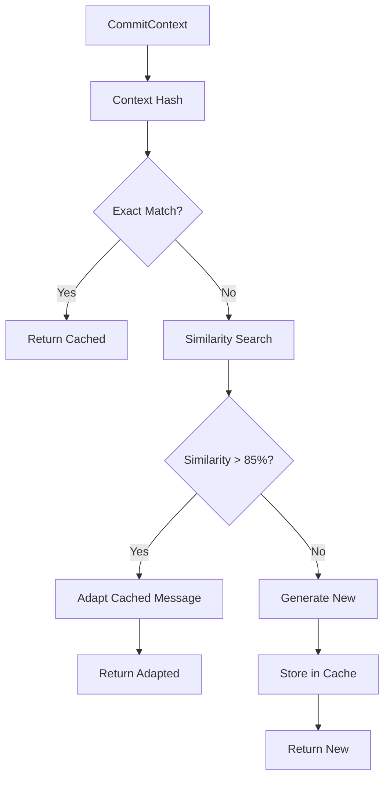

# Mastro Commit Command - Technical Flow

> **Detailed technical flow showing the complete commit generation process with all components, classes, and libraries involved**

## Complete Commit Generation Flow

```mermaid
graph TB
    %% User Input Layer
    User[👤 User] --> CLI["`**mastro commit**
    oclif Command Parser`"]
    
    %% Command Processing Layer
    CLI --> CommitCmd["`**Commit.ts**
    BaseCommand Extension`"]
    CommitCmd --> Init["`**init()**
    Load MastroConfig
    Initialize Components`"]
    
    %% Configuration & Setup
    Init --> Config["`**MastroConfig**
    ~/.mastro/config.json
    ./mastro.config.json`"]
    Config --> Components["`**Component Setup**
    - GitAnalyzer (simple-git)
    - AIClient (OpenAI)
    - CacheManager (node-cache)
    - UIRenderer (chalk, ora)`"]
    
    %% Git Analysis Phase
    Components --> GitCheck{"`**Git Repository Check**
    ensureGitRepository()`"}
    GitCheck -->|Yes| StagedCheck["`**Check Staged Changes**
    gitAnalyzer.getStagedChanges()
    simple-git.diff(['--cached'])`"]
    GitCheck -->|No| Error1["`❌ **Error**
    'Not in a git repository'`"]
    
    StagedCheck --> HasChanges{"`**Has Staged Changes?**
    changes.length > 0`"}
    HasChanges -->|No| Error2["`❌ **Warning**
    'No staged changes found'`"]
    HasChanges -->|Yes| BuildContext["`**Build Commit Context**
    gitAnalyzer.buildCommitContext(true)`"]
    
    %% Context Building Phase
    BuildContext --> ContextDetails["`**Context Building Process**
    1. Parse git diff output
    2. Extract GitChange objects
    3. Build GitHunk structures  
    4. Analyze file types & patterns
    5. Calculate metadata stats`"]
    
    ContextDetails --> RepoContext["`**Build Repository Context**
    - getCurrentBranch() via simple-git
    - getRecentCommits(10) 
    - Detect language/framework
    - Load team patterns from config`"]
    
    RepoContext --> ComplexityCheck["`**Change Complexity Analysis**
    - File count analysis
    - Line count analysis  
    - Critical change detection
    - Token budget estimation`"]
    
    %% Caching Layer
    ComplexityCheck --> CacheCheck{"`**Cache Lookup**
    cacheManager.getCachedCommitMessage()
    node-cache + cosine-similarity`"}
    
    CacheCheck -->|Cache Hit| CacheHit["`✅ **Cached Result**
    Similarity > 85%
    Return adapted message`"]
    CacheCheck -->|Cache Miss| AIGeneration["`**AI Generation Required**
    Prepare for OpenAI call`"]
    
    %% AI Processing Phase  
    AIGeneration --> TokenOpt["`**Token Budget Management**
    TokenBudgetManager.optimizeContext()
    - Semantic change ranking
    - Progressive compression
    - Critical change preservation`"]
    
    TokenOpt --> AIRequest["`**OpenAI API Call**
    aiClient.generateCommitMessage()
    
    **Request Structure:**
    - Model: gpt-4
    - Max Tokens: 4096
    - Temperature: 0.3
    - Response Format: JSON`"]
    
    AIRequest --> Persona["`**Principal Engineer Persona**
    System Prompt:
    '15+ years experience...'
    'Enforce conventional commits...'
    'Consider architectural impact...'`"]
    
    Persona --> PromptBuild["`**Prompt Construction**
    buildCommitPrompt(context)
    
    **Includes:**
    - Repository metadata
    - Change analysis  
    - Team patterns
    - Recent commit history
    - Conventional commit rules`"]
    
    PromptBuild --> OpenAICall["`**OpenAI.chat.completions.create()**
    openai NPM package
    GPT-4 Model Processing`"]
    
    %% Response Processing
    OpenAICall --> Response{"`**AI Response**
    JSON Format Validation`"}
    Response -->|Valid| ParseResponse["`**Parse Response**
    validateCommitMessage()
    
    **Extract:**
    - title: string
    - body?: string  
    - type: string
    - scope?: string
    - confidence: number
    - reasoning: string`"]
    
    Response -->|Invalid| AIError["`❌ **AI Error**
    'Invalid response format'`"]
    
    ParseResponse --> CacheStore["`**Cache Storage**
    cacheManager.setCachedCommitMessage()
    TTL: 1 hour
    Semantic similarity indexing`"]
    
    %% UI Rendering Phase
    CacheStore --> Render["`**UI Rendering**
    renderer.renderCommitMessage()
    
    **Using:**
    - chalk for colors
    - Terminal formatting
    - Confidence indicators`"]
    
    CacheHit --> Render
    
    Render --> Display["`📝 **Display Commit Message**
    
    **Shows:**
    - Formatted title & body
    - Commit type & scope
    - Confidence percentage
    - AI reasoning
    - Team pattern compliance`"]
    
    %% Interactive Refinement
    Display --> Interactive{"`**Interactive Mode?**
    flags.interactive || 
    config.ui.interactive`"}
    
    Interactive -->|Yes| RefinementUI["`**Interactive Refinement**
    interactiveUI.promptForRefinement()
    
    **Options:**
    - 'More technical'
    - 'More concise'  
    - 'Match team style'
    - Custom refinement`"]
    
    RefinementUI --> RefineRequest{"`**User Refinement?**
    User selected option`"}
    
    RefineRequest -->|Yes| RefineProcess["`**Refine Message**
    refineCommitMessage()
    Apply refinement rules
    Update reasoning`"]
    RefineProcess --> Render
    RefineRequest -->|No| DryRun
    
    Interactive -->|No| DryRun{"`**Dry Run Mode?**
    flags['dry-run']`"}
    
    %% Commit Application
    DryRun -->|Yes| DryRunExit["`ℹ️ **Dry Run Complete**
    'Generated but not applied'`"]
    DryRun -->|No| Confirm["`**Confirmation Prompt**
    interactiveUI.confirmAction()
    'Apply this commit message?'`"]
    
    Confirm -->|No| Cancelled["`🚫 **Cancelled**
    'Commit cancelled'`"]
    Confirm -->|Yes| ApplyCommit["`**Apply Commit**
    applyCommit(commitMessage)
    
    **Process:**
    1. Build commit text
    2. Execute git.commit()
    3. Handle errors`"]
    
    ApplyCommit --> GitCommit["`**Git Commit Execution**
    simple-git.commit(messageText)
    Native git commit command`"]
    
    GitCommit --> Success{"`**Commit Success?**
    Git operation result`"}
    Success -->|Yes| Learn{"`**Learning Mode?**
    flags.learn`"}
    Success -->|No| CommitError["`❌ **Commit Error**
    Git operation failed`"]
    
    %% Learning & Completion
    Learn -->|Yes| LearnProcess["`**Learn From Commit**
    learnFromCommit()
    Update team patterns
    Store successful patterns`"]
    Learn -->|No| Complete["`✅ **Success**
    'Commit created successfully!'`"]
    
    LearnProcess --> Complete
    
    %% Error Handling
    Error1 --> ErrorHandler["`**Error Handler**
    handleError(error, operation)
    
    **Features:**
    - Contextual error messages
    - Suggested fixes
    - Debug information
    - Graceful cleanup`"]
    
    Error2 --> ErrorHandler
    AIError --> ErrorHandler  
    CommitError --> ErrorHandler
    
    ErrorHandler --> Exit["`🔚 **Exit**
    Process termination
    Cleanup resources`"]
    
    DryRunExit --> Exit
    Cancelled --> Exit
    Complete --> Exit
    
    %% Styling
    classDef userClass fill:#e1f5fe,color:#000000
    classDef commandClass fill:#fff3e0,color:#000000
    classDef processClass fill:#f3e5f5,color:#000000
    classDef aiClass fill:#e8f5e8,color:#000000
    classDef errorClass fill:#ffebee,color:#000000
    classDef successClass fill:#e8f5e8,color:#000000
    
    class User,CLI userClass
    class CommitCmd,Init,Components commandClass
    class BuildContext,ContextDetails,RepoContext,ComplexityCheck processClass
    class AIRequest,Persona,PromptBuild,OpenAICall,ParseResponse aiClass
    class Error1,Error2,AIError,CommitError,ErrorHandler errorClass
    class Complete,Success successClass

```

## Component Interaction Details

### 1. Command Initialization Flow

### 2. Git Analysis Process

### 3. AI Processing Pipeline

### 4. Caching Strategy Flow

## Key Libraries and Dependencies

### Core Dependencies
- **oclif**: CLI framework and command parsing
- **simple-git**: Git operations and repository analysis  
- **openai**: OpenAI API client for GPT-4 integration
- **chalk**: Terminal styling and color output
- **ora**: Terminal spinners and loading indicators
- **node-cache**: In-memory caching with TTL
- **cosine-similarity**: Semantic similarity calculations

### Internal Classes
- **BaseCommand**: Abstract base for all commands
- **GitAnalyzer**: Git repository analysis and diff parsing
- **AIClient**: AI provider abstraction layer
- **OpenAIProvider**: OpenAI-specific implementation  
- **CacheManager**: Intelligent caching with similarity matching
- **UIRenderer**: Terminal output formatting
- **InteractiveUI**: User interaction and confirmation prompts
- **TokenBudgetManager**: Context optimization for token limits

## Performance Optimizations

### 1. Semantic Caching
- **Cosine Similarity**: Matches similar contexts even with different files
- **Adaptive Reuse**: Modifies cached responses for current context
- **TTL Strategy**: 1-hour cache for commit messages, 4-hour for explanations

### 2. Token Budget Management  
- **Progressive Compression**: Full → Moderate → Aggressive → Minimal
- **Semantic Ranking**: Prioritizes critical changes over cosmetic ones
- **Intelligent Truncation**: Preserves important context while reducing tokens

### 3. Async Operations
- **Parallel Processing**: Git analysis and cache lookup run concurrently
- **Streaming UI**: Real-time progress indicators during AI processing
- **Error Recovery**: Graceful degradation when AI services are unavailable

## Error Handling Strategies

### 1. Git Repository Errors
- **Not a repository**: Clear guidance to run `git init`
- **No staged changes**: Instructions to stage files first
- **Merge conflicts**: Detect and provide resolution guidance

### 2. AI Service Errors  
- **API key missing**: Configuration setup instructions
- **Rate limiting**: Retry logic with exponential backoff
- **Token limits**: Automatic context compression and retry
- **Service unavailable**: Fallback to manual commit message input

### 3. Configuration Errors
- **Invalid config**: Schema validation with specific error messages
- **Missing dependencies**: Installation and setup guidance
- **Permission issues**: File access troubleshooting

This flow ensures robust, intelligent commit message generation while maintaining excellent performance and user experience through caching, optimization, and comprehensive error handling.