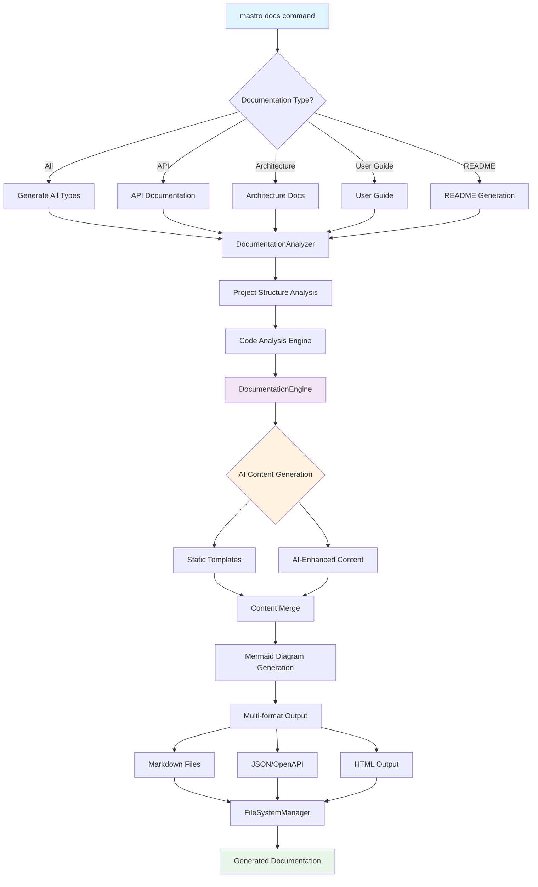
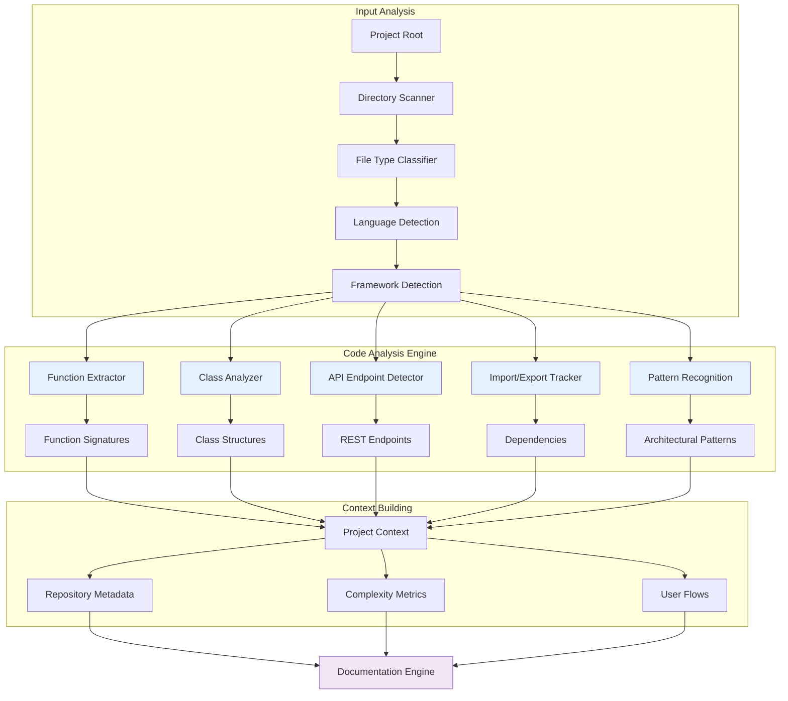
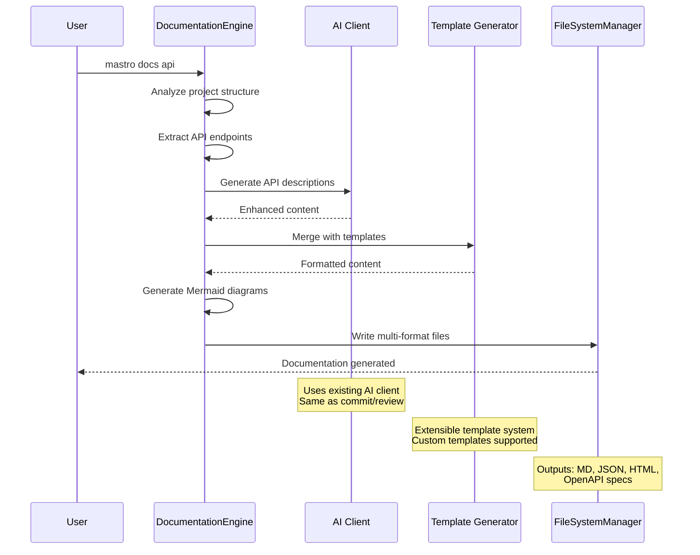
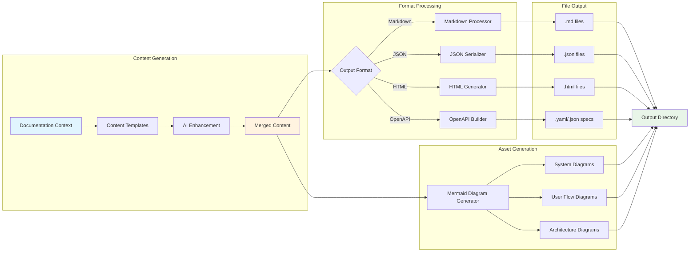
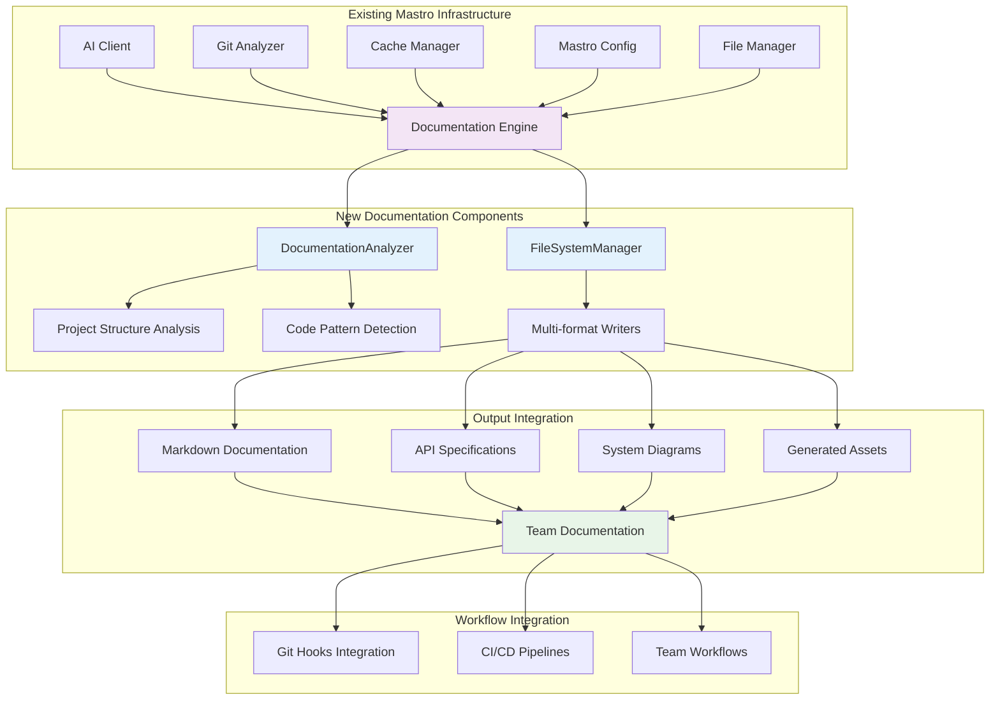
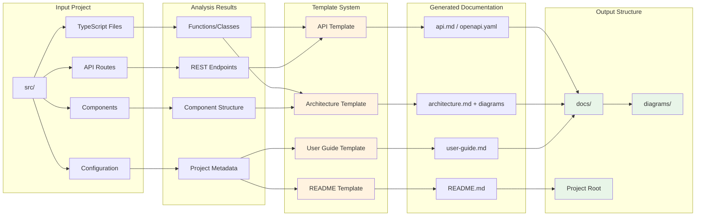
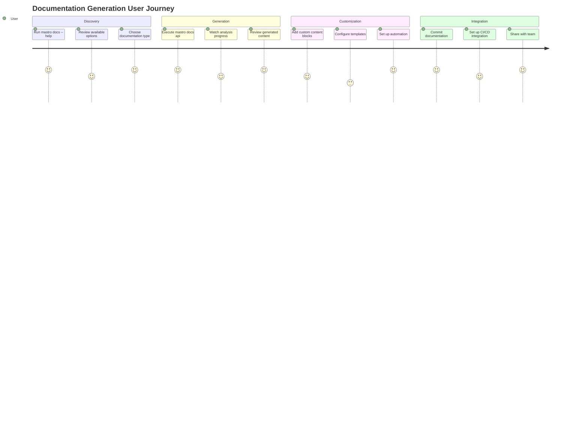
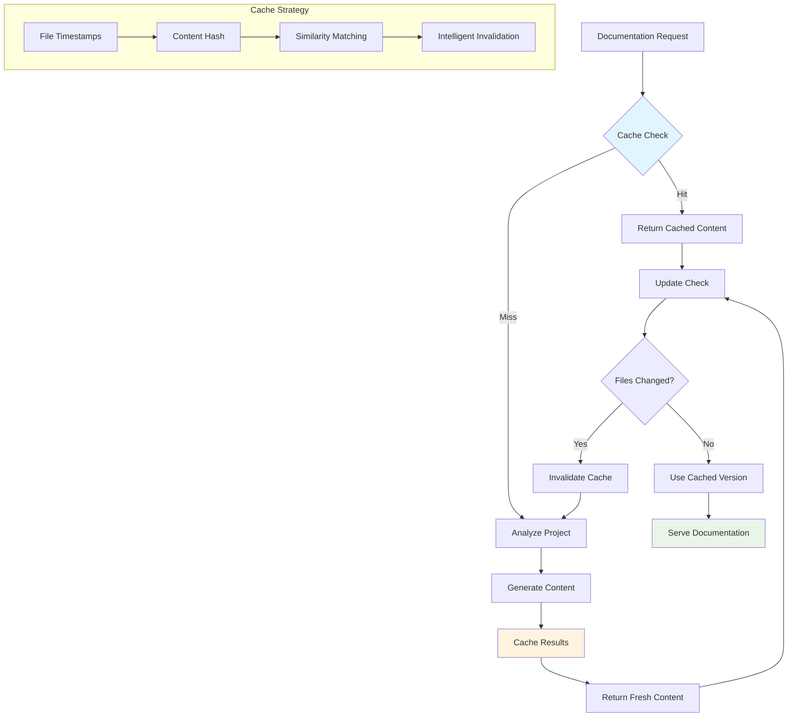

# Mastro Documentation Generation Workflow

> **Complete documentation generation process flow with AI integration and multi-format output**

This diagram illustrates the comprehensive documentation generation workflow in Mastro, showing how the system analyzes project structure, leverages AI for content generation, and produces multi-format documentation output.

## High-Level Documentation Workflow

## Detailed Analysis Pipeline

## AI-Powered Content Generation

## Multi-Format Output Generation

## Integration with Existing Mastro Components

## File Structure and Templates

## Command Flow and User Experience

## Performance and Caching Strategy

---

## Implementation Notes

### Key Design Decisions
1. **Reuse Existing Infrastructure**: Leverages AI Client, Git Analyzer, and Config system
2. **Extensible Template System**: Allows custom documentation templates
3. **Multi-format Support**: Single analysis, multiple output formats
4. **Intelligent Caching**: Performance optimization with smart invalidation
5. **Integration-First**: Designed to work with existing Mastro workflows

### Performance Considerations
- **Incremental Analysis**: Only re-analyze changed files
- **Parallel Processing**: Concurrent analysis of multiple file types
- **Smart Caching**: Content-aware cache invalidation
- **Template Optimization**: Pre-compiled templates for faster generation

### Future Enhancements
- **Custom AI Providers**: Support for different AI models
- **Live Updates**: Watch mode for real-time documentation updates
- **Plugin System**: Third-party documentation generators
- **Advanced Analytics**: Documentation quality metrics and insights

*This diagram represents the complete documentation generation system implemented in Mastro v1.0*