# Mastro Error Recovery System - Multi-Level Recovery Architecture

> **Comprehensive technical flow for error detection, analysis, and recovery across all Mastro operations with intelligent diagnostics and automated resolution strategies**

## Complete Error Recovery Flow

```mermaid
graph TB
    %% Error Detection Layer
    Operation["`**Any Mastro Operation**
    commit, review, flow, split, etc.`"] --> Monitor["`**Error Monitor**
    try/catch blocks
    Promise rejection handlers`"]
    
    Monitor --> Detected{"`**Error Detected?**
    Exception thrown or 
    operation failed`"}
    
    Detected -->|No| Success["`✅ **Operation Success**
    Continue normal flow`"]
    Detected -->|Yes| Capture["`**Error Capture**
    - Stack trace
    - Operation context  
    - System state
    - User session data`"]
    
    %% Error Analysis Phase
    Capture --> Categorize["`**Error Categorization**
    errorCategorizer.categorize(error)`"]
    
    Categorize --> Category{"`**Error Category**
    Determine error type`"}
    
    Category --> GitError["`🔄 **Git Errors**
    - Repository access
    - Merge conflicts
    - Lock files
    - Permission issues`"]
    
    Category --> AIError["`🤖 **AI Service Errors**  
    - API key missing
    - Rate limiting
    - Network timeouts
    - Invalid responses`"]
    
    Category --> FSError["`📂 **File System Errors**
    - Permission denied
    - Disk full
    - Path not found
    - Read/write failures`"]
    
    Category --> NetworkError["`🌐 **Network Errors**
    - Connection timeout
    - DNS resolution
    - Certificate issues
    - Proxy problems`"]
    
    Category --> UserError["`👤 **User Errors**
    - Invalid input
    - Cancelled operation
    - Configuration errors
    - Missing dependencies`"]
    
    Category --> ConfigError["`⚙️ **Configuration Errors**
    - Invalid config file
    - Missing settings
    - Version mismatch
    - Environment issues`"]
    
    %% Diagnostic Engine
    GitError --> Diagnostics
    AIError --> Diagnostics
    FSError --> Diagnostics
    NetworkError --> Diagnostics
    UserError --> Diagnostics
    ConfigError --> Diagnostics
    
    Diagnostics["`**Diagnostic Engine**
    diagnosticEngine.analyze(error, context)`"] --> RootCause["`**Root Cause Analysis**
    - System context collection
    - Similar error matching
    - Pattern recognition
    - Confidence scoring`"]
    
    RootCause --> SystemContext["`**System Context Collection**
    - OS and versions
    - Running processes
    - Resource usage
    - Environment variables
    - Git repository state`"]
    
    SystemContext --> SimilarErrors["`**Similar Error Analysis**
    - Search error database
    - Pattern matching
    - Success rate tracking
    - Resolution history`"]
    
    SimilarErrors --> ContextAnalysis["`**User Context Analysis**
    - Recent commands
    - Session duration
    - Productivity patterns
    - Experience level
    - Preferences`"]
    
    ContextAnalysis --> RecoveryEngine["`**Recovery Strategy Engine**
    Select optimal recovery approach`"]
    
    %% Recovery Strategy Selection
    RecoveryEngine --> StrategySelect{"`**Recovery Strategy Selection**
    Based on error type, context, 
    and user preferences`"}
    
    StrategySelect --> Level1{"`**Level 1: Automatic Recovery**
    Can be resolved without user input?`"}
    StrategySelect --> Level2{"`**Level 2: Interactive Recovery**  
    User guidance and input required?`"}
    StrategySelect --> Level3{"`**Level 3: Manual Recovery**
    Complex resolution required?`"}
    
    %% Level 1: Automatic Recovery
    Level1 -->|Yes| AutoRecovery["`**Automatic Recovery System**
    Fully automated resolution`"]
    
    AutoRecovery --> RetryEngine["`**Retry Engine**
    - Exponential backoff
    - Max retry limits
    - Condition checking
    - State preservation`"]
    
    AutoRecovery --> StateReset["`**State Reset**
    - Git state cleanup
    - Cache invalidation
    - Temporary file cleanup
    - Process restart`"]
    
    AutoRecovery --> ConfigCorrection["`**Config Correction**
    - Auto-detect missing values
    - Environment setup
    - Permission fixes
    - Path corrections`"]
    
    RetryEngine --> AutoValidation{"`**Auto Recovery Success?**
    Validation of automated fix`"}
    StateReset --> AutoValidation
    ConfigCorrection --> AutoValidation
    
    AutoValidation -->|Yes| RecoverySuccess["`✅ **Recovery Successful**
    Operation resumed/completed`"]
    AutoValidation -->|No| EscalateL2["`⬆️ **Escalate to Level 2**
    Automatic recovery failed`"]
    
    %% Level 2: Interactive Recovery
    Level2 -->|Yes| InteractiveRecovery["`**Interactive Recovery System**
    User-guided resolution`"]
    Level1 -->|No| InteractiveRecovery
    EscalateL2 --> InteractiveRecovery
    
    InteractiveRecovery --> GuidedTroubleshooting["`**Guided Troubleshooting**
    Step-by-step resolution guide`"]
    
    GuidedTroubleshooting --> TroubleshootSteps["`**Troubleshooting Steps**
    1. Diagnose issue
    2. Explain cause  
    3. Provide solutions
    4. Validate resolution
    5. Prevent recurrence`"]
    
    TroubleshootSteps --> UserDecisions["`**User Decision Points**
    - Multiple solution options
    - Risk assessment
    - Time estimates
    - Rollback availability`"]
    
    UserDecisions --> UserChoice{"`**User Selection**
    Which recovery option?`"}
    
    UserChoice --> Option1["`**Option 1: Quick Fix**
    Fast but may not address root cause`"]
    UserChoice --> Option2["`**Option 2: Comprehensive Fix**
    Slower but thorough resolution`"]
    UserChoice --> Option3["`**Option 3: Skip/Workaround**
    Bypass issue temporarily`"]
    UserChoice --> Manual["`**Option 4: Manual Resolution**
    User will handle manually`"]
    
    Option1 --> ExecuteOption["`**Execute Recovery Option**
    Apply selected solution`"]
    Option2 --> ExecuteOption
    Option3 --> ExecuteOption
    
    ExecuteOption --> InteractiveValidation{"`**Interactive Recovery Success?**
    User confirms resolution`"}
    
    InteractiveValidation -->|Yes| RecoverySuccess
    InteractiveValidation -->|No| EscalateL3["`⬆️ **Escalate to Level 3**
    Interactive recovery failed`"]
    
    Manual --> ManualResolution["`**Manual Resolution Path**
    Provide documentation and exit`"]
    
    %% Level 3: Manual Recovery
    Level3 -->|Yes| ManualRecovery["`**Manual Recovery System**
    Expert-level intervention`"]
    Level2 -->|No| ManualRecovery
    EscalateL3 --> ManualRecovery
    
    ManualRecovery --> RecoveryScript["`**Recovery Script Generation**
    generateRecoveryScript(error, context)`"]
    
    RecoveryScript --> ScriptContent["`**Custom Recovery Script**
    #!/bin/bash
    # Recovery script for: {error}
    # Context: {operation}
    # Timestamp: {date}
    
    echo 'Starting recovery...'
    # Preserve current work
    git stash push -m 'mastro-recovery'
    
    # Clean state
    git reset --hard HEAD
    git clean -fd
    
    # Restore checkpoint if available
    if [ -f .git/mastro/recovery-context.json ]; then
        # Restore from checkpoint
    fi
    
    echo 'Recovery complete'`"]
    
    ManualRecovery --> EmergencyProcedures["`**Emergency Procedures**
    - Diagnostic data export
    - State preservation
    - Support contact info
    - Documentation links`"]
    
    ManualRecovery --> ExpertGuidance["`**Expert-Level Guidance**
    - Detailed technical analysis
    - Advanced troubleshooting
    - System administration tips
    - Community resources`"]
    
    ScriptContent --> ScriptValidation["`**Script Validation**
    - Syntax checking
    - Safety verification
    - Rollback planning
    - Risk assessment`"]
    
    ScriptValidation --> UserApproval{"`**User Approval**
    Execute recovery script?`"}
    
    UserApproval -->|Yes| ExecuteScript["`**Execute Recovery Script**
    Run generated script with monitoring`"]
    UserApproval -->|No| ManualResolution
    
    ExecuteScript --> ScriptValidation2{"`**Script Execution Success?**
    Monitor script execution`"}
    
    ScriptValidation2 -->|Yes| RecoverySuccess
    ScriptValidation2 -->|No| CriticalFailure["`💥 **Critical Failure**
    Recovery script failed
    Manual intervention required`"]
    
    %% Learning and Prevention
    RecoverySuccess --> Learning["`**Recovery Learning System**
    learn from successful recovery`"]
    
    Learning --> UpdatePatterns["`**Update Recovery Patterns**
    - Success rate tracking
    - Pattern refinement
    - Strategy optimization
    - User preference learning`"]
    
    UpdatePatterns --> PreventiveMeasures["`**Preventive Measures**
    - Configuration recommendations
    - Environment setup
    - Warning systems
    - Proactive monitoring`"]
    
    PreventiveMeasures --> KnowledgeBase["`**Knowledge Base Update**
    - Error catalog
    - Solution database
    - Best practices
    - Troubleshooting guides`"]
    
    %% Emergency Mode
    CriticalFailure --> EmergencyMode["`🚨 **Emergency Mode**
    flags.emergency-recovery`"]
    
    EmergencyMode --> DiagnosticBundle["`**Diagnostic Bundle Generation**
    - Complete system state
    - Error history
    - Recovery attempts
    - User session data`"]
    
    DiagnosticBundle --> SupportContact["`**Support Resources**
    - Generated diagnostic file
    - Error report template
    - Community forums
    - Professional support`"]
    
    %% Checkpoint Integration
    RecoveryEngine --> CheckpointCheck{"`**Checkpoint Available?**
    .git/mastro/checkpoints/`"}
    CheckpointCheck -->|Yes| CheckpointRecovery["`**Checkpoint Recovery**
    Restore from last known good state`"]
    CheckpointCheck -->|No| DirectRecovery["`**Direct Recovery**
    Recover without checkpoint`"]
    
    CheckpointRecovery --> ValidateCheckpoint["`**Validate Checkpoint**
    - State consistency
    - Git integrity
    - Context validity`"]
    ValidateCheckpoint --> RestoreState["`**Restore State**
    - Workflow context
    - Git position
    - User preferences`"]
    RestoreState --> RecoverySuccess
    
    %% Styling
    classDef operationClass fill:#e3f2fd,color:#000000
    classDef errorClass fill:#ffebee,color:#000000
    classDef diagnosticClass fill:#f3e5f5,color:#000000
    classDef level1Class fill:#e8f5e8,color:#000000
    classDef level2Class fill:#fff3e0,color:#000000
    classDef level3Class fill:#fce4ec,color:#000000
    classDef successClass fill:#e8f5e8,color:#000000
    classDef criticalClass fill:#ffcdd2,color:#000000
    classDef learningClass fill:#e0f2f1,color:#000000
    
    class Operation,Monitor operationClass
    class Detected,Capture,Categorize,Category errorClass
    class Diagnostics,RootCause,SystemContext,SimilarErrors,ContextAnalysis diagnosticClass
    class Level1,AutoRecovery,RetryEngine,StateReset,ConfigCorrection level1Class
    class Level2,InteractiveRecovery,GuidedTroubleshooting level2Class
    class Level3,ManualRecovery,RecoveryScript,EmergencyMode level3Class
    class RecoverySuccess,Success successClass
    class CriticalFailure,EmergencyMode criticalClass
    class Learning,UpdatePatterns,PreventiveMeasures,KnowledgeBase learningClass
```



## Recovery Strategy Decision Matrix

### 1. Error Classification and Recovery Mapping


### 2. Recovery Confidence Scoring


### 3. Context-Aware Recovery Selection


## Error Recovery Components

### Core Recovery Classes

```typescript
// Main recovery system interfaces
interface ErrorRecoverySystem {
  handleError(error: Error, context: OperationContext): Promise<RecoveryResult>;
  categorizeError(error: Error): ErrorCategory;
  selectRecoveryStrategy(error: CategorizedError): RecoveryStrategy;
  executeRecovery(strategy: RecoveryStrategy): Promise<RecoveryResult>;
}

interface DiagnosticEngine {
  analyzeError(error: Error, context: OperationContext): Promise<ErrorDiagnostics>;
  collectSystemContext(): Promise<SystemContext>;
  findSimilarErrors(error: Error): Promise<SimilarError[]>;
  generateRootCauseAnalysis(diagnostics: ErrorDiagnostics): Promise<RootCause>;
}

interface RecoveryStrategyEngine {
  selectStrategy(diagnostics: ErrorDiagnostics): Promise<RecoveryStrategy>;
  scoreStrategies(strategies: RecoveryStrategy[]): ScoredStrategy[];
  validateStrategy(strategy: RecoveryStrategy): Promise<boolean>;
}
```

### Recovery Strategy Types

```typescript
// Recovery strategy implementations
interface AutomaticRecoveryStrategy extends RecoveryStrategy {
  type: 'automatic';
  maxRetries: number;
  backoffStrategy: 'linear' | 'exponential' | 'custom';
  validationSteps: ValidationStep[];
  rollbackPlan: RollbackPlan;
}

interface InteractiveRecoveryStrategy extends RecoveryStrategy {
  type: 'interactive';
  troubleshootingSteps: TroubleshootingStep[];
  userChoices: RecoveryOption[];
  guidanceLevel: 'basic' | 'detailed' | 'expert';
}

interface ManualRecoveryStrategy extends RecoveryStrategy {
  type: 'manual';
  scriptTemplate: string;
  emergencyProcedures: EmergencyProcedure[];
  expertGuidance: ExpertGuidance;
  supportResources: SupportResource[];
}
```

## Integration with Existing Systems

### 1. Workflow Integration

```typescript
// Integration with workflow orchestration
interface WorkflowOrchestrator {
  // Existing methods...
  handleWorkflowError(error: WorkflowError, step: WorkflowStep): Promise<WorkflowRecoveryResult>;
  validateRecoveryState(context: WorkflowContext): Promise<boolean>;
  resumeFromRecovery(checkpoint: WorkflowCheckpoint): Promise<void>;
}
```

### 2. Command Integration

```typescript
// Error handling in all commands
abstract class BaseCommand {
  // Existing methods...
  protected async handleError(error: Error, operation: string): Promise<void> {
    const recoverySystem = new ErrorRecoverySystem(this.config);
    const context = this.buildOperationContext(operation);
    const result = await recoverySystem.handleError(error, context);
    
    if (result.success) {
      this.log('Recovery successful, continuing operation...');
    } else {
      this.error('Recovery failed. Manual intervention required.');
    }
  }
}
```

### 3. Interactive UI Integration

```typescript
// Enhanced UI for recovery operations
interface InteractiveUI {
  // Existing methods...
  showRecoveryOptions(options: RecoveryOption[]): Promise<RecoveryChoice>;
  confirmRecoveryAction(action: RecoveryAction): Promise<boolean>;
  displayTroubleshootingSteps(steps: TroubleshootingStep[]): Promise<void>;
  showRecoveryProgress(progress: RecoveryProgress): void;
}
```

## Performance and Reliability Features

### 1. Recovery Performance
- **Fast Error Classification**: Sub-100ms error categorization
- **Parallel Diagnostics**: Concurrent system context collection
- **Cached Solutions**: Reuse successful recovery patterns
- **Streaming Progress**: Real-time recovery status updates

### 2. Reliability Safeguards
- **State Preservation**: Always preserve user work before recovery
- **Rollback Capability**: Every recovery step can be undone
- **Validation Checkpoints**: Verify recovery success at each step
- **Emergency Stops**: User can cancel recovery at any point

### 3. Learning System
- **Success Rate Tracking**: Monitor recovery effectiveness
- **Pattern Recognition**: Learn from recurring error patterns
- **User Preference Learning**: Adapt to individual recovery preferences
- **Continuous Improvement**: Refine strategies based on outcomes

This multi-level error recovery system provides comprehensive, intelligent error handling with automatic resolution, user-guided troubleshooting, and expert-level manual recovery capabilities.