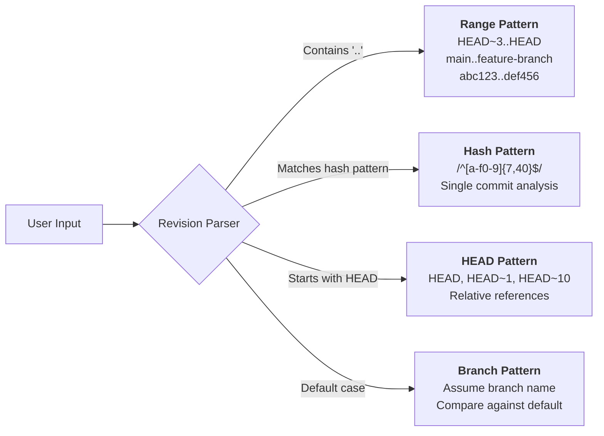
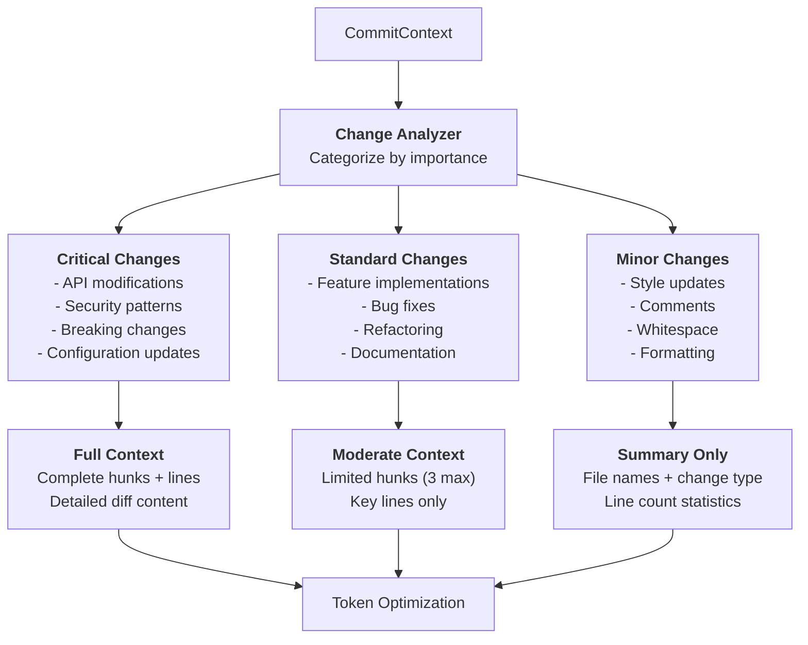
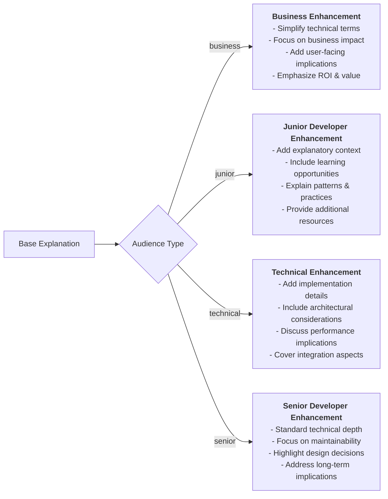
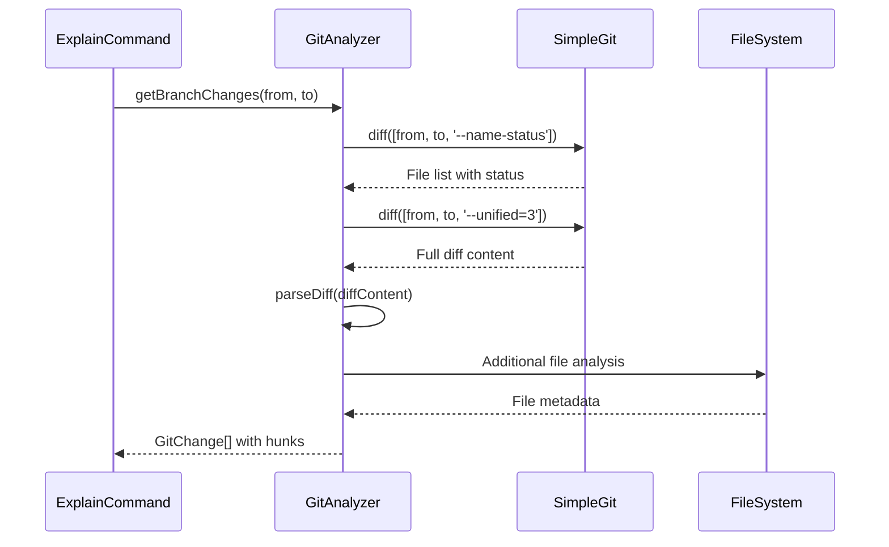
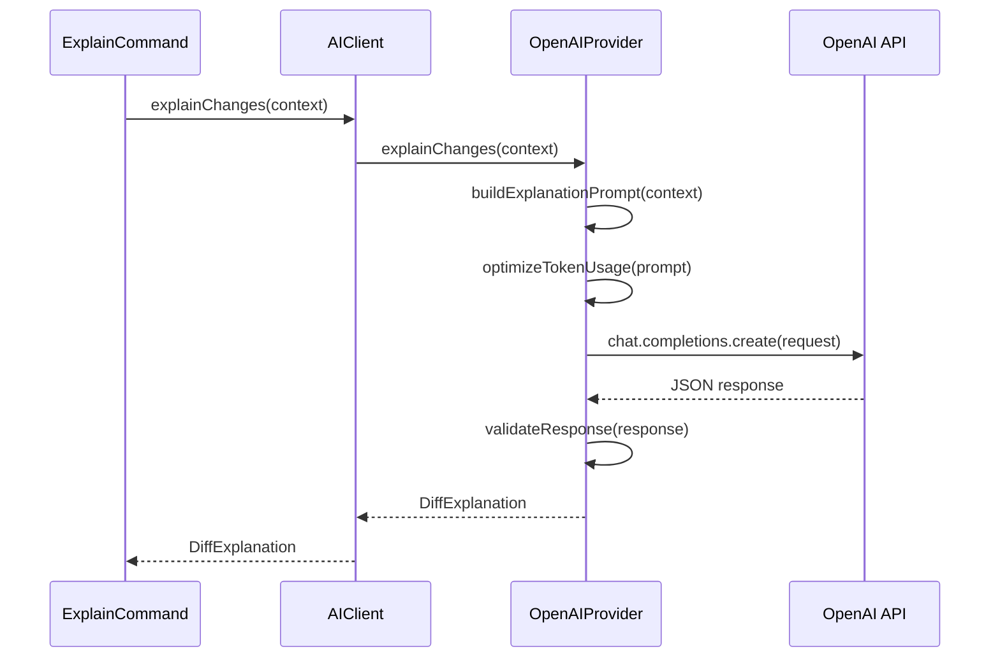
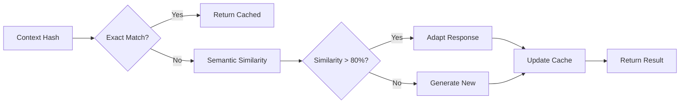
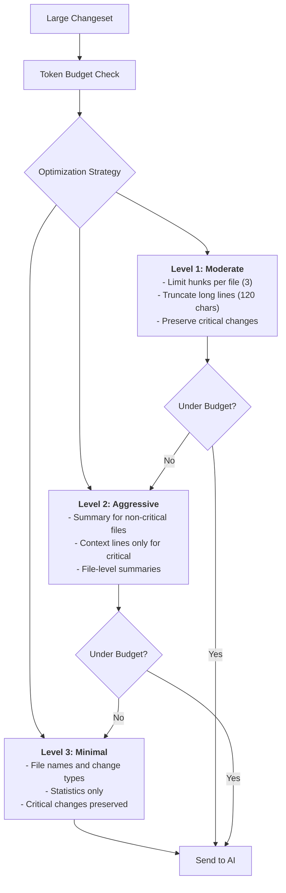
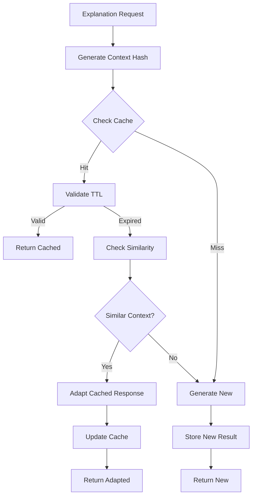

# Mastro Explain Command - Technical Flow

> **Detailed technical flow for multi-commit analysis and code change explanation with comprehensive technical details**

## Complete Explain Command Flow

```mermaid
graph TB
    %% User Input Layer
    User[👤 User] --> CLI["`**mastro explain HEAD~3..HEAD**
    oclif Command Parser
    Args + Flags Processing`"]
    
    %% Command Processing
    CLI --> ExplainCmd["`**Explain.ts**
    BaseCommand Extension
    Args: revision (default: 'HEAD')
    Flags: impact, audience, format`"]
    
    ExplainCmd --> Init["`**Initialization**
    - Load MastroConfig
    - Initialize UIRenderer
    - Setup GitAnalyzer
    - Initialize AIClient`"]
    
    %% Configuration & Validation
    Init --> GitCheck{"`**Git Repository Check**
    ensureGitRepository()
    Verify .git directory exists`"}
    
    GitCheck -->|No| Error1["`❌ **Error**
    'Not in a git repository'`"]
    GitCheck -->|Yes| ParseRevision["`**Revision Parsing**
    parseRevision(args.revision)
    
    **Patterns:**
    - Single: HEAD, abc1234
    - Range: HEAD~3..HEAD  
    - Branch: feature-branch`"]
    
    %% Revision Type Analysis
    ParseRevision --> RevisionType{"`**Revision Type Detection**
    Regex Pattern Matching`"}
    
    RevisionType -->|Contains '..'| RangeFlow["`**Range Analysis**
    analyzeCommitRange(from, to)`"]
    RevisionType -->|Looks like hash/HEAD| SingleFlow["`**Single Commit**
    analyzeSingleCommit(commit)`"]
    RevisionType -->|Branch name| BranchFlow["`**Branch Analysis**
    analyzeBranch(branchName)`"]
    
    %% Single Commit Analysis
    SingleFlow --> SingleGit["`**Single Commit Git Analysis**
    gitAnalyzer.getBranchChanges()
    git diff ${commit}~1..${commit}
    
    **Exception Handling:**
    - First commit: Use staged changes
    - Invalid commit: Use working changes`"]
    
    %% Range Analysis
    RangeFlow --> RangeGit["`**Range Git Analysis**
    gitAnalyzer.getBranchChanges(to, from)
    git diff ${from}..${to}
    
    **Validation:**
    - Max commits check (default: 10)
    - Large changeset warning
    - Token budget consideration`"]
    
    %% Branch Analysis  
    BranchFlow --> BranchGit["`**Branch Git Analysis**
    Compare against default branch
    gitAnalyzer.getBranchChanges()
    git diff ${defaultBranch}..${branch}
    
    **Uses:**
    - config.git.defaultBranch
    - Repository context analysis`"]
    
    %% Common Processing Path
    SingleGit --> ContextBuild["`**Build Commit Context**
    Common processing for all types`"]
    RangeGit --> ContextBuild
    BranchGit --> ContextBuild
    
    ContextBuild --> RepoContext["`**Repository Context Building**
    buildRepoContext()
    
    **Includes:**
    - Repository name & root
    - Language detection (TypeScript)
    - Framework detection (Node.js)
    - Team patterns from config
    - Recent commit history (10 commits)`"]
    
    RepoContext --> MetadataCalc["`**Metadata Calculation**
    Calculate change complexity
    
    **Metrics:**
    - totalInsertions: sum of additions
    - totalDeletions: sum of removals  
    - fileCount: changed files
    - changeComplexity: low|medium|high
    
    **Thresholds:**
    - High: >20 files OR >1000 lines
    - Medium: >5 files OR >200 lines
    - Low: everything else`"]
    
    MetadataCalc --> SpinnerStart["`🔄 **Start Spinner**
    'Analyzing changes...'
    Show file count & line stats
    ora spinner with chalk colors`"]
    
    %% Caching Layer
    SpinnerStart --> CacheCheck{"`**Cache Lookup**
    !flags['no-cache'] ?
    cacheManager.getCachedExplanation()`"}
    
    CacheCheck -->|Hit| CacheHit["`✅ **Cache Hit**
    Found similar explanation
    updateSpinner('Found cached')`"]
    CacheCheck -->|Miss| AIGeneration["`**AI Generation Required**
    updateSpinner('Generating with AI')`"]
    
    %% AI Processing Pipeline
    AIGeneration --> TokenOpt["`**Token Optimization**
    buildExplanationPrompt(context)
    
    **Optimization Strategy:**
    - Limit hunks per file (max 3)
    - Truncate lines per hunk (max 10)
    - Show full context for critical changes
    - Summary-only for large files`"]
    
    TokenOpt --> PromptBuild["`**Advanced Prompt Construction**
    buildExplanationPrompt(context)
    
    **Includes:**
    - Repository metadata
    - Change complexity analysis
    - Optimized diff content
    - Operation context (explain)
    - Expected response schema`"]
    
    PromptBuild --> AICall["`**OpenAI API Call**
    client.chat.completions.create()
    
    **Configuration:**
    - Model: gpt-4
    - Max Tokens: 4096
    - Temperature: 0.3
    - Response Format: JSON`"]
    
    AICall --> PersonaPrompt["`**Principal Engineer Persona**
    System prompt with authority context:
    
    '15+ years experience...'
    'Technical authority...'
    'Consider long-term implications...'
    'Architectural concerns...'
    'System reliability focus...'`"]
    
    PersonaPrompt --> AIResponse{"`**AI Response Processing**
    JSON validation & parsing`"}
    
    AIResponse -->|Success| ParseExplanation["`**Parse Explanation**
    Extract DiffExplanation:
    - summary: string
    - impact: ImpactAnalysis  
    - technicalDetails: string[]
    - businessContext?: string
    - migrationNotes?: string[]
    - architecturalConsiderations?: string[]`"]
    
    AIResponse -->|Error| AIError["`❌ **AI Error**
    API key issues
    Rate limiting
    Invalid response format`"]
    
    %% Enhancement Processing
    ParseExplanation --> Enhancement["`**Explanation Enhancement**
    enhanceExplanation(explanation, flags)
    
    **Audience-Based Enhancement:**
    - business: Simplify technical details
    - junior: Add explanatory context
    - technical: Add implementation depth
    - senior: Standard technical focus`"]
    
    Enhancement --> ImpactFocus{"`**Impact Focus?**
    flags.impact === true`"}
    
    ImpactFocus -->|Yes| ImpactEnhance["`**Impact Enhancement**
    - Enhance businessContext
    - Add migration notes if missing
    - Focus on business implications
    - Risk assessment details`"]
    ImpactFocus -->|No| CacheStore
    
    ImpactEnhance --> CacheStore["`**Cache Storage**
    cacheManager.setCachedExplanation()
    TTL: 4 hours
    Content-based similarity indexing`"]
    
    CacheHit --> StopSpinner
    CacheStore --> StopSpinner["`✅ **Stop Spinner**
    stopSpinner(true, 'Explanation generated')
    Success indication with checkmark`"]
    
    %% Output Formatting
    StopSpinner --> FormatCheck{"`**Output Format Selection**
    flags.format: terminal|markdown|json`"}
    
    FormatCheck -->|terminal| TerminalFormat["`**Terminal Format**
    renderer.renderDiffExplanation()
    
    **Features:**
    - Colored output with chalk
    - Structured sections
    - Icon indicators
    - Readable formatting`"]
    
    FormatCheck -->|markdown| MarkdownFormat["`**Markdown Format**
    formatMarkdown(explanation, context)
    
    **Structure:**
    - # Code Change Explanation
    - ## Change Summary (metadata)
    - ## Summary & Impact Analysis
    - ## Technical Details  
    - ## Business Context
    - ## Migration Notes`"]
    
    FormatCheck -->|json| JSONFormat["`**JSON Format**
    JSON.stringify(explanation + context)
    
    **Includes:**
    - Full explanation object
    - Sanitized context object
    - Metadata preservation
    - Pretty formatting (2 spaces)`"]
    
    %% Output Display
    TerminalFormat --> Display["`📄 **Display Results**
    console.log(output)
    Formatted explanation display`"]
    MarkdownFormat --> Display
    JSONFormat --> Display
    
    Display --> Complete["`✅ **Complete**
    Process finished successfully`"]
    
    %% Error Handling Flow
    Error1 --> ErrorHandler["`**Error Handler**
    handleError(error, 'explain changes')
    
    **Error Types:**
    - Git repository errors
    - Invalid revision formats
    - AI API failures  
    - Configuration issues
    - Network timeouts`"]
    
    AIError --> ErrorCheck{"`**Error Analysis**
    Classify error type`"}
    ErrorCheck -->|API Key| KeyError["`**API Key Error**
    'API key not configured'
    'Set OPENAI_API_KEY or run config:init'`"]
    ErrorCheck -->|Other| OtherError["`**Other AI Error**
    Generic error handling
    Suggest troubleshooting steps`"]
    
    KeyError --> ErrorHandler
    OtherError --> ErrorHandler
    ErrorHandler --> Exit["`🔚 **Exit**
    Process termination
    Error code: 1`"]
    
    Complete --> Exit2["`🔚 **Exit**
    Success termination  
    Error code: 0`"]
    
    %% Styling
    classDef userClass fill:#e1f5fe
    classDef commandClass fill:#fff3e0
    classDef processClass fill:#f3e5f5
    classDef gitClass fill:#e8f5e8
    classDef aiClass fill:#fff9c4
    classDef errorClass fill:#ffebee
    classDef successClass fill:#e8f5e8
    
    class User,CLI userClass
    class ExplainCmd,Init commandClass
    class ParseRevision,RevisionType,ContextBuild,RepoContext processClass
    class SingleGit,RangeGit,BranchGit,MetadataCalc gitClass
    class TokenOpt,PromptBuild,AICall,PersonaPrompt,ParseExplanation aiClass
    class Error1,AIError,ErrorHandler,KeyError,OtherError errorClass
    class Complete successClass
```



## Advanced Analysis Patterns

### 1. Revision Pattern Parsing



### 2. Context Optimization Strategy



### 3. Multi-Audience Enhancement Pipeline



## Component Integration Details

### 1. GitAnalyzer Interaction Flow



### 2. AI Processing Sequence



### 3. Cache Management Flow



## Performance Optimizations

### 1. Token Budget Management



### 2. Caching Strategy



## Error Handling Matrix

| Error Type | Detection | Response | Recovery |
|------------|-----------|----------|----------|
| **Git Repository** | `.git` directory check | Clear error message | Guide to `git init` |
| **Invalid Revision** | Git command failure | Parse error details | Suggest valid formats |
| **API Key Missing** | OpenAI client error | Configuration guidance | Point to `config:init` |
| **Token Limit** | API response error | Auto-compression retry | Progressive reduction |
| **Network Timeout** | Request timeout | Retry with backoff | Offline mode suggestion |
| **Invalid Response** | JSON parse error | Schema validation | Regeneration attempt |

## Output Format Examples

### Terminal Output Structure
```
📊 Code Change Analysis
─────────────────────────

Summary: [AI-generated summary]

Impact Analysis:
• Risk Level: MEDIUM
• Scope: MODULE
• Affected Components: [list]

Technical Details:
• [Detailed explanations]

Business Context:
[Business impact explanation]
```

### Markdown Output Structure
```markdown
# Code Change Explanation

## Change Summary
- **Files changed**: 5
- **Lines added**: 120
- **Lines removed**: 45
- **Complexity**: medium

## Summary
[AI explanation]

## Technical Details
- [Detail 1]
- [Detail 2]
```

### JSON Output Structure
```json
{
  "explanation": {
    "summary": "...",
    "impact": { ... },
    "technicalDetails": [...],
    "businessContext": "..."
  },
  "context": {
    "branch": "feature-branch",
    "metadata": { ... }
  }
}
```

This comprehensive flow ensures intelligent, context-aware code change explanations while maintaining excellent performance through caching and optimization strategies.