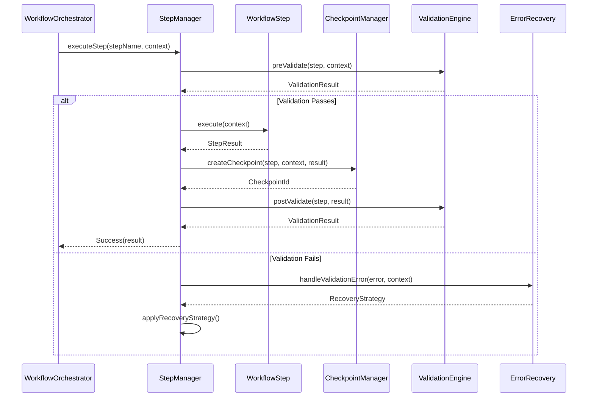
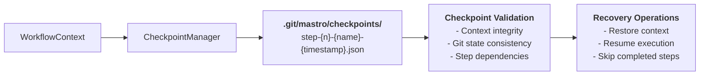
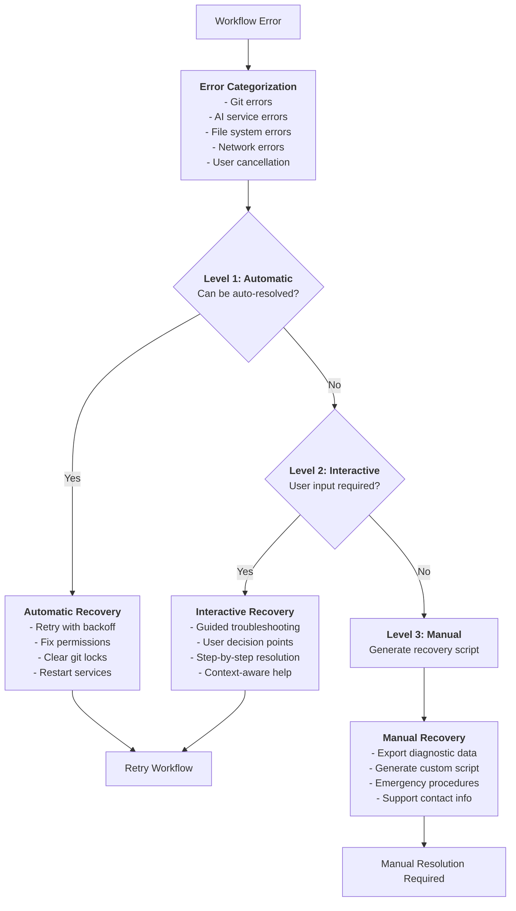

# Mastro Flow Orchestration - Complete Workflow System

> **Comprehensive technical flow for the `mastro flow` command showing complete workflow automation from code analysis to PR creation with error recovery and checkpoint management**

## Complete Workflow Orchestration Flow

```mermaid
graph TB
    %% User Input Layer
    User[👤 User] --> CLI["`**mastro flow**
    oclif Command Parser`"]
    
    %% Command Processing Layer
    CLI --> FlowCmd["`**FlowCommand.ts**
    BaseCommand Extension`"]
    FlowCmd --> Init["`**init()**
    Load MastroConfig
    Initialize WorkflowOrchestrator`"]
    
    %% Configuration & Setup
    Init --> Config["`**MastroConfig**
    ~/.mastro/config.json
    workflow section`"]
    Config --> WO["`**WorkflowOrchestrator**
    - CheckpointManager
    - ValidationEngine
    - ErrorRecoverySystem
    - WorkflowStepManager`"]
    
    %% Workflow Validation
    WO --> PreValidation{"`**Pre-Workflow Validation**
    validateWorkflowPreconditions()`"}
    PreValidation -->|Fail| ValidationError["`❌ **Validation Failed**
    Git repo check, working changes, etc.`"]
    PreValidation -->|Pass| RecoveryCheck{"`**Recovery Mode?**
    flags.recover || 
    interrupted workflow detected`"}
    
    %% Recovery Path
    RecoveryCheck -->|Yes| LoadCheckpoint["`**Load Checkpoint**
    checkpointManager.getLatestCheckpoint()
    Restore WorkflowContext`"]
    LoadCheckpoint --> RecoveryValidation["`**Validate Checkpoint**
    Ensure context is still valid
    Check git state consistency`"]
    RecoveryValidation --> ResumeStep["`**Resume From Step**
    Jump to checkpoint step
    Skip completed steps`"]
    
    RecoveryCheck -->|No| InitContext["`**Initialize Context**
    new WorkflowContext()
    - sessionId: uuid
    - workingDirectory
    - currentBranch
    - baseCommit`"]
    
    %% Step 1: Code Analysis
    InitContext --> Step1["`**Step 1: Code Analysis**
    CodeAnalysisStep.execute()`"]
    ResumeStep --> StepRouter{"`**Step Router**
    Route to correct step based on checkpoint`"}
    StepRouter --> Step1
    StepRouter --> Step2
    StepRouter --> Step3
    StepRouter --> Step4
    StepRouter --> Step5
    StepRouter --> Step6
    
    Step1 --> Checkpoint1["`**Checkpoint 1**
    Save: code-analysis
    Context: boundaries, metadata`"]
    
    Checkpoint1 --> AnalysisValidation{"`**Analysis Validation**
    flags.validate enabled?`"}
    AnalysisValidation -->|Yes| ValidateStep1["`**Validate Analysis**
    Check boundaries exist
    Verify file access`"]
    ValidateStep1 -->|Fail| RecoveryS1["`**Step 1 Recovery**
    Retry analysis, fix permissions`"]
    RecoveryS1 --> Step1
    ValidateStep1 -->|Pass| Step2
    AnalysisValidation -->|No| Step2
    
    %% Step 2: Boundary Review
    Step2["`**Step 2: Boundary Review**
    BoundaryReviewStep.execute()
    Interactive review if enabled`"] --> Checkpoint2["`**Checkpoint 2**
    Save: boundary-review
    Context: validated boundaries`"]
    
    Checkpoint2 --> BoundaryValidation{"`**Boundary Validation**
    Quality score > threshold?`"}
    BoundaryValidation -->|Fail| InteractiveReview["`**Interactive Review**
    Enable interactive-review mode
    User customization`"]
    InteractiveReview --> BoundaryRetry["`**Boundary Retry**
    Apply user modifications
    Re-validate boundaries`"]
    BoundaryRetry --> BoundaryValidation
    BoundaryValidation -->|Pass| Step3
    
    %% Step 3: Commits
    Step3["`**Step 3: Progressive Commits**
    CommitsStep.execute()
    Create commits from boundaries`"] --> Checkpoint3["`**Checkpoint 3**
    Save: commits
    Context: commit hashes`"]
    
    Checkpoint3 --> CommitValidation{"`**Commit Validation**
    All commits successful?`"}
    CommitValidation -->|Fail| CommitRecovery["`**Commit Recovery**
    Reset to checkpoint
    Retry failed commits`"]
    CommitRecovery --> Step3
    CommitValidation -->|Pass| SkipDocs{"`**Skip Documentation?**
    flags.skip-docs || 
    context.skipDocumentation`"}
    
    %% Step 4: Documentation
    SkipDocs -->|No| Step4["`**Step 4: Documentation**
    DocumentationStep.execute()
    Generate API/architecture docs`"]
    SkipDocs -->|Yes| SkipPR
    
    Step4 --> Checkpoint4["`**Checkpoint 4**
    Save: documentation
    Context: generated docs`"]
    
    Checkpoint4 --> DocValidation{"`**Doc Validation**
    Files generated successfully?`"}
    DocValidation -->|Fail| DocRecovery["`**Documentation Recovery**
    Clean up partial files
    Retry generation`"]
    DocRecovery --> Step4
    DocValidation -->|Pass| SkipPR{"`**Skip PR Creation?**
    flags.skip-pr || 
    context.skipPR`"}
    
    %% Step 5: PR Creation
    SkipPR -->|No| Step5["`**Step 5: PR Creation**
    PRCreationStep.execute()
    Create GitHub/GitLab PR`"]
    SkipPR -->|Yes| SkipAnalytics
    
    Step5 --> Checkpoint5["`**Checkpoint 5**
    Save: pr-creation
    Context: PR URL, number`"]
    
    Checkpoint5 --> PRValidation{"`**PR Validation**
    PR created successfully?`"}
    PRValidation -->|Fail| PRRecovery["`**PR Recovery**
    Check network, auth
    Retry PR creation`"]
    PRRecovery --> Step5
    PRValidation -->|Pass| SkipAnalytics{"`**Skip Analytics?**
    flags.skip-analytics || 
    context.skipAnalytics`"}
    
    %% Step 6: Analytics
    SkipAnalytics -->|No| Step6["`**Step 6: Analytics Update**
    AnalyticsStep.execute()
    Update session analytics`"]
    SkipAnalytics -->|Yes| Complete
    
    Step6 --> Checkpoint6["`**Checkpoint 6**
    Save: analytics
    Context: session data`"]
    
    Checkpoint6 --> AnalyticsValidation{"`**Analytics Validation**
    Session data updated?`"}
    AnalyticsValidation -->|Fail| AnalyticsRecovery["`**Analytics Recovery**
    Skip analytics on failure
    Non-blocking error`"]
    AnalyticsRecovery --> Complete
    AnalyticsValidation -->|Pass| Complete
    
    %% Completion
    Complete["`✅ **Workflow Complete**
    - Cleanup checkpoints
    - Generate summary
    - Show recommendations`"]
    
    %% Error Handling
    ValidationError --> ErrorRecovery["`**Error Recovery System**
    Multi-level recovery:
    1. Automatic retry
    2. Interactive guidance  
    3. Manual recovery`"]
    
    ErrorRecovery --> EmergencyRecovery{"`**Emergency Recovery?**
    flags.emergency-recovery`"}
    EmergencyRecovery -->|Yes| EmergencyMode["`**Emergency Mode**
    - Export diagnostic data
    - Generate recovery script
    - Manual intervention required`"]
    EmergencyRecovery -->|No| RecoveryStrategy["`**Recovery Strategy**
    Select best recovery approach
    based on error type`"]
    
    RecoveryStrategy --> AutoRecovery{"`**Auto Recovery**
    Can be automatically resolved?`"}
    AutoRecovery -->|Yes| AutoFix["`**Automatic Fix**
    Apply known solution
    Retry operation`"]
    AutoRecovery -->|No| InteractiveRecovery["`**Interactive Recovery**
    Guide user through resolution
    Provide step-by-step help`"]
    
    AutoFix --> RetryWorkflow["`**Retry Workflow**
    Resume from failure point`"]
    InteractiveRecovery --> RetryWorkflow
    
    %% Force Mode
    PreValidation -->|Force Mode| ForceMode["`**Force Mode Enabled**
    Skip validations
    Continue despite errors`"]
    ForceMode --> InitContext
    
    %% Styling
    classDef userClass fill:#e1f5fe,color:#000000
    classDef commandClass fill:#fff3e0,color:#000000
    classDef stepClass fill:#e8f5e8,color:#000000
    classDef checkpointClass fill:#f3e5f5,color:#000000
    classDef validationClass fill:#fffde7,color:#000000
    classDef errorClass fill:#ffebee,color:#000000
    classDef recoveryClass fill:#fce4ec,color:#000000
    
    class User,CLI userClass
    class FlowCmd,Init,WO commandClass
    class Step1,Step2,Step3,Step4,Step5,Step6 stepClass
    class Checkpoint1,Checkpoint2,Checkpoint3,Checkpoint4,Checkpoint5,Checkpoint6 checkpointClass
    class AnalysisValidation,BoundaryValidation,CommitValidation,DocValidation,PRValidation,AnalyticsValidation validationClass
    class ValidationError,ErrorRecovery,EmergencyMode errorClass
    class RecoveryS1,CommitRecovery,DocRecovery,PRRecovery,AnalyticsRecovery recoveryClass
```



## Workflow Step Architecture

### 1. Step Execution Pattern



### 2. Checkpoint System Flow



### 3. Error Recovery Architecture



## Key Components and Classes

### Core Workflow Classes
- **WorkflowOrchestrator**: Main orchestration engine
- **WorkflowStepManager**: Manages step execution and dependencies
- **WorkflowContext**: Maintains state across steps
- **CheckpointManager**: Handles state persistence and recovery
- **ValidationEngine**: Pre/post step validation
- **ErrorRecoverySystem**: Multi-level error handling

### Workflow Steps
- **CodeAnalysisStep**: Analyzes working directory, detects boundaries
- **BoundaryReviewStep**: Interactive boundary review and validation
- **CommitsStep**: Progressive commit creation from boundaries
- **DocumentationStep**: Auto-generates project documentation
- **PRCreationStep**: Creates pull request with smart descriptions
- **AnalyticsStep**: Updates productivity and session analytics

### Support Systems
- **WorkflowValidator**: Validates preconditions and state
- **RecoveryStrategyEngine**: Selects optimal recovery approach
- **DiagnosticEngine**: Collects context for error analysis
- **EmergencyRecoverySystem**: Handles critical failure scenarios

## Integration with Existing Systems

### 1. Enhanced Git Analyzer
```typescript
// Extended GitAnalyzer for workflow operations
interface GitAnalyzer {
  // Existing methods...
  getCurrentCommit(): Promise<string>;        // Added for workflow validation
  validateWorkingState(): Promise<boolean>;   // Added for preconditions
  createWorkingSnapshot(): Promise<string>;   // Added for recovery
}
```

### 2. AI Client Integration
```typescript
// Workflow-aware AI operations
interface AIClient {
  // Existing methods...
  generateWorkflowSummary(context: WorkflowContext): Promise<string>;
  analyzeWorkflowPatterns(steps: WorkflowStep[]): Promise<Pattern[]>;
  suggestOptimizations(context: WorkflowContext): Promise<Suggestion[]>;
}
```

### 3. Interactive UI Enhancement
```typescript
// Workflow UI components
interface InteractiveUI {
  // Existing methods...
  confirmWorkflowStart(steps: WorkflowStep[]): Promise<boolean>;
  showWorkflowProgress(currentStep: number, totalSteps: number): void;
  handleWorkflowError(error: WorkflowError): Promise<RecoveryChoice>;
}
```

## Performance and Reliability Features

### 1. Fault Tolerance
- **Graceful Degradation**: Continue workflow with reduced functionality
- **Transactional Steps**: Each step can be rolled back independently
- **State Preservation**: Complete context saved at each checkpoint
- **Recovery Validation**: Ensure recovered state is consistent

### 2. Resource Management
- **Memory Optimization**: Stream large diffs, cleanup temporary data
- **Disk Space**: Automatic checkpoint cleanup, configurable retention
- **Network Resilience**: Retry logic for API calls, offline mode support
- **Process Management**: Proper cleanup on interruption or failure

### 3. Monitoring and Observability
- **Step Timing**: Track execution time for each workflow step
- **Error Metrics**: Count and categorize errors for improvement
- **Success Patterns**: Learn from successful workflow executions
- **Performance Analytics**: Identify bottlenecks and optimization opportunities

This comprehensive workflow orchestration system transforms Mastro from individual command execution to intelligent, fault-tolerant workflow automation with robust error recovery and state management.