# Mastro Focus Session Monitoring - Advanced Productivity Tracking

> **Comprehensive technical flow for enhanced focus session monitoring with real-time productivity analytics, pattern detection, and intelligent development insights**

## Complete Focus Session Monitoring Flow

```mermaid
graph TB
    %% Session Initiation
    User[👤 User] --> CLI["`**mastro analytics --focus-mode**
    Enhanced productivity monitoring`"]
    
    CLI --> AnalyticsCmd["`**AnalyticsCommand.ts**
    Enhanced with focus mode capabilities`"]
    
    AnalyticsCmd --> InitFocus["`**Initialize Focus Session**
    FocusSessionMonitor.startSession()`"]
    
    InitFocus --> SessionSetup["`**Focus Session Setup**
    - Generate unique session ID
    - Capture initial Git state
    - Set session goals (optional)
    - Initialize monitoring systems`"]
    
    %% Initial State Capture
    SessionSetup --> InitialState["`**Capture Initial State**
    GitStateMonitor.captureState()
    
    📊 Initial Git State:
    ├─ Branch: feature-auth
    ├─ Commit: a1b2c3d
    ├─ Staged files: 0
    ├─ Unstaged files: 3
    ├─ Untracked files: 1
    └─ Total files: 156`"]
    
    InitialState --> GoalSetting["`**Optional Goal Setting**
    
    🎯 Set Focus Session Goals:
    [1] Feature completion
    [2] Bug fixing session
    [3] Refactoring work
    [4] Learning/exploration
    [5] No specific goal
    
    Duration target: ⏱️ 90 minutes
    Specific targets:
    • Complete JWT authentication
    • Add 3 test files
    • Update documentation
    
    Choice:`"]
    
    GoalSetting --> StartMonitoring["`**🚀 Start Active Monitoring**
    
    Focus Session: feature-auth-1691234567
    Started: 10:15 AM
    Target Duration: 90 minutes
    Goals: Feature completion
    
    🔄 Real-time monitoring active...
    📊 Tracking: git changes, file operations, patterns
    
    Press Ctrl+C to end session`"]
    
    %% Real-Time Monitoring Loop
    StartMonitoring --> MonitoringLoop["`**📈 Real-Time Monitoring Loop**
    Continuous monitoring every 30 seconds`"]
    
    MonitoringLoop --> GitStateCheck["`**Git State Monitor**
    gitStateMonitor.checkChanges()
    
    🔍 Monitoring:
    • Branch switches
    • Commit activity
    • Staging changes
    • File modifications
    • Working tree status`"]
    
    GitStateCheck --> FileChangeDetection["`**File Change Tracker**
    fileChangeTracker.detectChanges()
    
    📝 Detected Changes:
    • src/auth/jwt-validator.ts (modified)
    • tests/auth/validator.test.ts (added)
    • docs/auth-api.md (modified)
    
    Impact Assessment: MEDIUM`"]
    
    FileChangeDetection --> PatternDetection["`**Pattern Detection Engine**
    patternDetector.analyzeActivity()
    
    🧠 Pattern Analysis:
    • TDD pattern: 85% confidence
    • Evidence: Test file created before implementation
    • Refactor pattern: 45% confidence
    • Focus level: HIGH (no interruptions)`"]
    
    PatternDetection --> ProductivityCalculation["`**Productivity Metrics Calculation**
    productivityAnalyzer.calculate()
    
    📊 Current Metrics (45 min elapsed):
    ├─ Lines/minute: 4.2 (above average)
    ├─ Files/hour: 8.5 (high)
    ├─ Commits/hour: 2.1 (optimal)
    ├─ Focus score: 92/100 (excellent)
    └─ Velocity score: 87/100 (excellent)`"]
    
    ProductivityCalculation --> InterruptionDetection["`**Interruption Detection**
    interruptionDetector.analyze()
    
    🚨 Interruption Analysis:
    • Context switches: 1 (branch switch)
    • Duration: 3 minutes
    • Impact: Minimal
    • Recovery time: 2 minutes
    
    ✅ Deep work session: 40 minutes continuous`"]
    
    InterruptionDetection --> QualityAssessment["`**Code Quality Assessment**
    qualityAssessment.analyze()
    
    📈 Quality Trends:
    ├─ Test coverage: +12% (excellent)
    ├─ Code complexity: Stable (good)
    ├─ Documentation: +3 files (good)
    ├─ Security improvements: 2 (good)
    └─ Performance considerations: 1 (adequate)`"]
    
    %% Real-time Insights and Recommendations
    QualityAssessment --> InsightsGeneration["`**🎯 Real-Time Insights Generation**
    insightsEngine.generateInsights()
    
    💡 Current Insights:
    • Excellent TDD practice detected
    • Peak productivity window identified
    • Deep focus session in progress
    • Quality metrics improving
    
    🚀 Recommendations:
    • Continue current approach
    • Consider break in 15 minutes
    • Document key decisions while fresh`"]
    
    InsightsGeneration --> SessionUpdate["`**Update Session Data**
    sessionTracker.updateSession()
    
    📊 Session Update:
    • Duration: 47 minutes
    • Productivity score: 89/100
    • Pattern confidence: TDD 87%
    • Next milestone: 60 minutes
    • Break recommendation: 13 minutes`"]
    
    SessionUpdate --> ContinueMonitoring{"`**Continue Monitoring?**
    Session still active?`"}
    
    ContinueMonitoring -->|Active| MonitoringLoop
    ContinueMonitoring -->|Ended| SessionEnd
    
    %% Break Detection and Management
    QualityAssessment --> BreakDetection["`**🛑 Break Detection**
    breakDetector.analyzeBreakNeeds()
    
    Break Analysis:
    • Session duration: 87 minutes
    • Last break: 2.5 hours ago
    • Focus degradation: 8% (slight)
    • Recommendation: 10-minute break
    
    Trigger break suggestion? YES`"]
    
    BreakDetection --> BreakSuggestion["`**☕ Break Suggestion**
    
    🧠 Break Recommendation
    
    You've been in deep focus for 87 minutes.
    Focus score has dropped 8% in the last 15 minutes.
    
    Suggested break: 10 minutes
    Benefits:
    • Restore cognitive capacity
    • Prevent burnout
    • Maintain quality
    
    [1] Take break now
    [2] Continue for 15 more minutes
    [3] Ignore suggestion
    
    Choice:`"]
    
    BreakSuggestion --> BreakChoice{"`**User Break Choice**
    Take break or continue?`"}
    
    BreakChoice -->|Break| StartBreak["`**🛑 Break Started**
    
    Break Timer: 10:00
    Session paused at: 11:42 AM
    
    📱 Break suggestions:
    • Stand and stretch
    • Hydrate
    • Look away from screen
    • Review session progress
    
    Timer counting down...`"]
    
    BreakChoice -->|Continue 15min| ExtendSession["`**⏰ Extended Session**
    Continue for 15 more minutes
    Next break check: 12:00 PM`"]
    
    BreakChoice -->|Ignore| ContinueMonitoring
    
    StartBreak --> BreakTimer["`**⏲️ Break Timer**
    
    Break Progress: 6:23 remaining
    
    📊 Session Summary (while on break):
    • Duration: 87 minutes of focus
    • Productivity: 91/100 (excellent)
    • Pattern: TDD workflow confirmed
    • Goals: 65% complete
    
    Auto-resume at timer end or press Enter to resume early`"]
    
    BreakTimer --> ResumeFromBreak["`**🚀 Resume From Break**
    
    Break completed: 8 minutes
    Resuming focus session...
    
    📈 Post-break state:
    • Expected focus boost: +15%
    • Cognitive refresh: Complete
    • Ready for deep work
    
    Session resumed at: 11:50 AM`"]
    
    ResumeFromBreak --> SessionUpdate
    ExtendSession --> SessionUpdate
    
    %% Session End Analysis
    SessionEnd["`**📊 Focus Session Ended**
    Final session analysis...`"] --> FinalAnalysis["`**🎯 Comprehensive Session Analysis**
    
    📊 Final Session Report
    ═══════════════════════════════════
    
    Session: feature-auth-1691234567
    Duration: 2 hours 15 minutes
    Started: 10:15 AM | Ended: 12:30 PM
    
    🚀 Productivity Metrics:
    ├─ Overall Score: 91/100 (Excellent)
    ├─ Velocity Score: 87/100 (Above Average)
    ├─ Focus Score: 88/100 (Excellent)  
    ├─ Lines per Minute: 4.2
    ├─ Files Modified/Hour: 8.5
    └─ Commit Frequency: 2.1/hour (Optimal)
    
    🎯 Focus Analysis:
    ├─ Deep Work Sessions: 3 (35+ min each)
    ├─ Average Session Length: 42 minutes
    ├─ Interruptions: 2 (Low)
    ├─ Context Switches: 0.9/hour (Excellent)
    └─ Recovery Time: Average 2.1 minutes
    
    🔍 Detected Patterns:
    ✅ Test-Driven Development (95% confidence)
       Evidence: 4 test files created before implementation
       Impact: Positive - improving code quality
       Recommendation: Continue this approach
       
    ✅ Refactor-First Approach (72% confidence)
       Evidence: Code cleanup before new features
       Impact: Positive - maintaining technical debt
       Recommendation: Good practice, maintain pattern
       
    📊 Feature Branch Workflow (78% confidence)
       Evidence: Focused changes in feature branch
       Impact: Neutral - standard development practice`"]
    
    FinalAnalysis --> QualityReport["`**📈 Quality Assessment Report**
    
    🎯 Session Quality Metrics:
    ├─ Test Coverage Increase: +12% (Excellent)
    ├─ Code Complexity Trend: Improving ↗️
    ├─ Documentation Updates: 3 files (Good)
    ├─ Security Considerations: 2 improvements (Good)
    ├─ Performance Optimizations: 1 (Adequate)
    └─ Refactoring Quality: High
    
    📊 Goal Achievement:
    🎯 Complete JWT authentication: ✅ 100%
    🧪 Add 3 test files: ✅ 100% (4 files added)
    📚 Update documentation: ✅ 100%
    
    Overall Goal Achievement: 100% ✅`"]
    
    QualityReport --> PersonalizedInsights["`**💡 Personalized Insights & Recommendations**
    
    🧠 Your Productivity Patterns:
    • Peak Hours: 10:00-12:00 AM, 2:00-4:00 PM
    • Optimal Session Length: 40-45 minutes
    • Best Break Interval: Every 90 minutes
    • TDD Pattern Success Rate: 94%
    
    📈 Performance Trends:
    • Weekly Productivity: +15% vs last week
    • Focus Improvement: +8% vs monthly average
    • Quality Consistency: Excellent
    • Goal Achievement Rate: 87% (above average)
    
    🚀 Personalized Recommendations:
    1. Maintain TDD approach - it's working excellently
    2. Your 90-minute focus blocks are optimal
    3. Consider 10-minute breaks every 45 minutes
    4. Authentication work aligns with your strengths
    5. Document architectural decisions while context is fresh
    
    📅 Scheduling Suggestions:
    • Schedule deep work during 10-12 AM window
    • Block 2-hour sessions for complex features
    • Plan breaks every 90 minutes
    • Reserve afternoons for code review/docs`"]
    
    PersonalizedInsights --> TrendAnalysis["`**📊 Historical Trend Analysis**
    
    🗓️ Productivity Trends (Last 30 Days):
    
    Daily Average:
    ├─ Session Duration: 1.8 hours (+0.2 vs last month)
    ├─ Focus Score: 84/100 (+5 vs last month)
    ├─ Productivity Score: 81/100 (+12 vs last month)
    ├─ Goal Achievement: 78% (+9% vs last month)
    └─ Deep Work Hours: 4.2/day (+0.8 vs last month)
    
    Weekly Patterns:
    📈 Best Days: Tuesday, Wednesday, Thursday
    📉 Lower Days: Monday (startup lag), Friday (week fatigue)
    
    🏆 Personal Records:
    • Longest Focus Session: 3.2 hours (2 weeks ago)
    • Best Daily Productivity: 97/100 (last week)
    • Best Weekly Focus: 89/100 (this week)
    • Highest Goal Achievement: 95% (last week)`"]
    
    TrendAnalysis --> SessionStorage["`**💾 Session Data Storage**
    
    🗄️ Storing Session Data:
    ├─ Session file: .git/mastro/sessions/focus-1691234567.json
    ├─ Analytics update: productivity metrics
    ├─ Pattern database: TDD pattern reinforced
    ├─ Trend history: 30-day rolling window
    └─ Personal insights: updated recommendations
    
    Data retention: 90 days (configurable)
    Privacy: Local storage only
    Export available: JSON, CSV, markdown`"]
    
    SessionStorage --> RecommendationsUpdate["`**🔄 Update Recommendations Engine**
    
    📚 Learning from Session:
    • TDD pattern success rate: 94% → 95%
    • Optimal session length: 42 minutes (confirmed)
    • Break timing: 90-minute intervals (optimal)
    • Focus score correlation: +0.15 with TDD
    
    🎯 Updated Personal Profile:
    • Development style: TDD-focused
    • Peak productivity: 10-12 AM
    • Optimal work blocks: 90 minutes
    • Preferred workflow: Feature branch
    • Break preference: Active breaks (confirmed)`"]
    
    RecommendationsUpdate --> SessionComplete["`✅ **Focus Session Complete**
    
    🎉 Session Analysis Complete!
    
    📋 Session Summary:
    • Duration: 2h 15m of productive work
    • Productivity: 91/100 (Excellent)
    • Goals achieved: 100%
    • Pattern reinforcement: TDD approach
    • Quality improvement: +12% test coverage
    
    📊 Next Steps:
    1. Review session insights in analytics dashboard
    2. Apply recommendations to future sessions
    3. Schedule next focused work block
    4. Continue current development approach
    
    💡 Key Takeaway:
    Your TDD approach and 90-minute focus blocks are highly effective.
    Maintain this pattern for continued high productivity.
    
    Session data saved to: .git/mastro/sessions/`"]
    
    %% Error Handling and Edge Cases
    MonitoringLoop --> ErrorDetection["`**🚨 Error Detection**
    Monitor for system issues`"]
    
    ErrorDetection --> SessionErrors{"`**Session Errors?**
    Git access, file system, etc.`"}
    
    SessionErrors -->|No Errors| ContinueMonitoring
    SessionErrors -->|Errors| ErrorRecovery["`**📋 Error Recovery**
    
    Common Issues:
    • Git repository access lost
    • File system monitoring failed  
    • Session data corruption
    • User interrupt (Ctrl+C)
    
    Recovery Actions:
    • Preserve session data
    • Attempt reconnection
    • Graceful degradation
    • Manual intervention prompt`"]
    
    ErrorRecovery --> RecoveryChoice{"`**Recovery Successful?**
    Can continue monitoring?`"}
    
    RecoveryChoice -->|Success| ContinueMonitoring
    RecoveryChoice -->|Failed| EmergencyEnd["`**🛑 Emergency Session End**
    
    Session terminated due to system error.
    Partial data saved successfully.
    
    📊 Partial Analysis Available:
    • Duration: 47 minutes (before error)
    • Productivity: 89/100 (excellent trend)
    • Patterns detected: TDD approach
    
    Recommendations:
    • Review partial data
    • Start new session when ready
    • Check system requirements`"]
    
    EmergencyEnd --> SessionComplete
    
    %% Background Analytics Updates
    SessionUpdate --> BackgroundAnalytics["`**📊 Background Analytics Update**
    
    🔄 Updating Analytics Database:
    • Personal productivity metrics
    • Pattern recognition data
    • Historical trend analysis
    • Recommendation refinement
    
    Processing in background...`"]
    
    BackgroundAnalytics --> AnalyticsIntegration["`**🔗 Analytics Integration**
    
    📈 Integration Points:
    • Weekly productivity reports
    • Monthly trend analysis
    • Personal insights dashboard
    • Team productivity comparisons (opt-in)
    • Workflow optimization suggestions
    
    Data flows to mastro analytics command`"]
    
    %% Styling
    classDef userClass fill:#e1f5fe,color:#000000
    classDef commandClass fill:#fff3e0,color:#000000
    classDef monitoringClass fill:#e8f5e8,color:#000000
    classDef analysisClass fill:#f3e5f5,color:#000000
    classDef insightsClass fill:#e0f2f1,color:#000000
    classDef breakClass fill:#fff8e1,color:#000000
    classDef errorClass fill:#ffebee,color:#000000
    classDef completeClass fill:#e8f5e8,color:#000000
    
    class User,CLI userClass
    class AnalyticsCmd,InitFocus,SessionSetup commandClass
    class MonitoringLoop,GitStateCheck,FileChangeDetection,PatternDetection monitoringClass
    class FinalAnalysis,QualityReport,TrendAnalysis analysisClass
    class PersonalizedInsights,InsightsGeneration,RecommendationsUpdate insightsClass
    class BreakDetection,BreakSuggestion,StartBreak,BreakTimer breakClass
    class ErrorDetection,ErrorRecovery,EmergencyEnd errorClass
    class SessionComplete,SessionStorage completeClass
```



## Focus Session Architecture Components

### 1. Real-Time Monitoring Pipeline


### 2. Pattern Detection Engine


### 3. Productivity Calculation Engine


## Key Focus Session Features

### Real-Time Monitoring
- **Git State Tracking**: Continuous monitoring of branch, commits, staging area
- **File Change Detection**: Track file modifications with impact assessment
- **Pattern Recognition**: AI-powered detection of development patterns (TDD, refactoring, etc.)
- **Interruption Analysis**: Identify and categorize productivity interruptions

### Productivity Analytics
- **Velocity Metrics**: Lines per minute, files per hour, commit frequency
- **Focus Analysis**: Deep work sessions, context switches, recovery times
- **Quality Trends**: Test coverage, complexity, documentation improvements
- **Goal Tracking**: Progress toward session objectives with milestone recognition

### Intelligent Insights
- **Personal Patterns**: Peak hours, optimal session lengths, preferred workflows
- **Trend Analysis**: Historical productivity trends and improvements
- **Recommendations**: Personalized suggestions based on individual patterns
- **Break Management**: Intelligent break suggestions based on focus degradation

### Integration with Workflow
- **Workflow Context**: Focus sessions inform workflow orchestration timing
- **Analytics Integration**: Data flows to main analytics system
- **Error Recovery**: Session context aids in error recovery strategies
- **Performance Tracking**: Monitor and optimize development velocity

## Focus Session Data Model

### Session Data Structure
```typescript
interface FocusSession {
  id: string;
  startTime: Date;
  endTime?: Date;
  duration: number;
  initialState: GitState;
  currentState: GitState;
  changes: FocusSessionChange[];
  interruptions: FocusInterruption[];
  productivity: FocusProductivityMetrics;
  patterns: FocusPattern[];
  goals: FocusGoal[];
  breaks: FocusBreak[];
  status: 'active' | 'paused' | 'completed' | 'cancelled';
}
```

### Productivity Metrics
```typescript
interface FocusProductivityMetrics {
  score: number; // 0-100 overall score
  velocity: {
    linesPerMinute: number;
    filesPerHour: number;
    commitsPerHour: number;
  };
  focus: {
    deepWorkSessions: number;
    averageSessionLength: number;
    interruptionFrequency: number;
    focusRatio: number;
  };
  quality: {
    testCoverageChange: number;
    complexityTrend: 'improving' | 'stable' | 'degrading';
    codeReviewScore: number;
  };
}
```

This comprehensive focus session monitoring system provides deep insights into development productivity with real-time tracking, intelligent pattern detection, and personalized recommendations for optimization.

<function_calls>
<invoke name="TodoWrite">
<parameter name="todos">[{"content": "Phase 1.1: Regenerate OCLiF manifest - Build and manifest generation to fix flow command discoverability", "status": "completed", "id": "1"}, {"content": "Phase 1.2: Test flow command integration - Verify flow command functionality and workflow context integration", "status": "completed", "id": "2"}, {"content": "Phase 2.1: Task 6 - Interactive boundary review with retry mechanism in split command", "status": "completed", "id": "3"}, {"content": "Phase 2.2: Task 7 - Error recovery and checkpoint system in workflow orchestration", "status": "completed", "id": "4"}, {"content": "Phase 3.1: Update User Guide - Add workflow orchestration, boundary development, error recovery sections", "status": "completed", "id": "5"}, {"content": "Phase 3.2: Update API Reference - Document flow command, workflow types, focus session interfaces", "status": "completed", "id": "6"}, {"content": "Phase 3.3: Update Architecture Documentation - Add workflow orchestration, checkpoint system, interactive UI architecture", "status": "completed", "id": "7"}, {"content": "Phase 3.4: Create new workflow diagrams - Orchestration, error recovery, interactive review, focus session flows", "status": "completed", "id": "8"}]