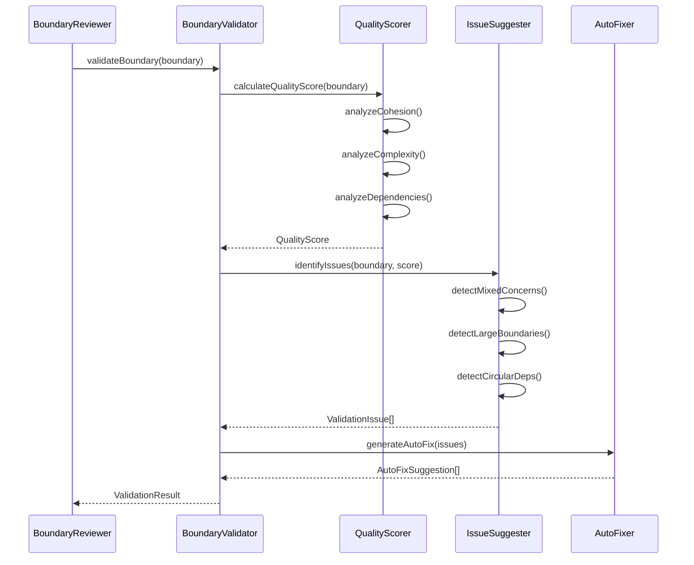
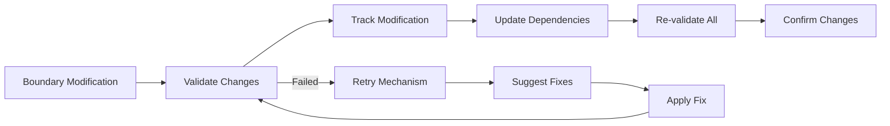
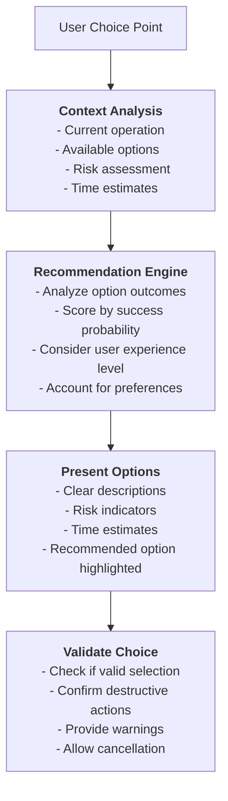

# Mastro Interactive Boundary Review - Advanced Commit Boundary Management

> **Comprehensive technical flow for the enhanced `mastro split --interactive-review` system showing intelligent boundary detection, validation, customization, and retry mechanisms**

## Complete Interactive Boundary Review Flow

```mermaid
graph TB
    %% User Input Layer
    User[👤 User] --> CLI["`**mastro split --interactive-review**
    Enhanced boundary management mode`"]
    
    %% Command Processing Layer
    CLI --> SplitCmd["`**SplitCommand.ts**
    Enhanced with interactive-review flag`"]
    SplitCmd --> Init["`**Initialize Interactive Session**
    InteractiveBoundarySession.create()`"]
    
    %% Initial Analysis Phase
    Init --> Config["`**Load Configuration**
    Interactive boundary options
    Validation thresholds
    Retry settings`"]
    
    Config --> GitAnalysis["`**Git Working Directory Analysis**
    gitAnalyzer.getWorkingChanges()
    - Unstaged changes
    - File modifications
    - Dependency analysis`"]
    
    GitAnalysis --> BoundaryDetection["`**AI Boundary Detection**
    boundaryDetector.detectBoundaries()
    - Semantic analysis
    - Dependency mapping
    - Change categorization
    - Priority scoring`"]
    
    BoundaryDetection --> InitialBoundaries["`**Initial Boundaries**
    Array<CommitBoundary>
    - Files grouped by logic
    - Dependency order
    - Priority ranking
    - Quality scores`"]
    
    %% Interactive Review Session Start
    InitialBoundaries --> SessionStart["`**Start Interactive Session**
    Display boundary overview
    Show validation results`"]
    
    SessionStart --> BoundaryOverview["`**Boundary Overview Display**
    📊 Boundary Analysis Results
    ─────────────────────────────
    
    Found 3 logical boundaries:
    
    🔥 HIGH: Authentication System (8 files)
       Score: 94/100 | Risk: MEDIUM
       Dependencies: None
    
    ⚡ MEDIUM: UI Components (3 files)  
       Score: 87/100 | Risk: LOW
       Dependencies: Authentication System
    
    📝 LOW: Documentation (2 files)
       Score: 76/100 | Risk: LOW
       Dependencies: Authentication System`"]
    
    BoundaryOverview --> InitialValidation["`**Initial Validation**
    Validate all boundaries
    Check quality thresholds
    Identify issues`"]
    
    InitialValidation --> ValidationResults{"`**Validation Results**
    All boundaries valid?`"}
    
    ValidationResults -->|All Valid| MainMenu
    ValidationResults -->|Issues Found| ValidationIssues["`**Show Validation Issues**
    ⚠️  Boundary 2 needs attention:
    
    Issue: Mixed concerns detected
    Files: LoginForm.tsx, auth-styles.css
    Suggestion: Split into separate boundaries
    
    Auto-fix available: Yes
    Confidence: 85%`"]
    
    ValidationIssues --> AutoFixPrompt{"`**Auto-fix Available?**
    Show auto-fix options`"}
    
    AutoFixPrompt -->|Yes| AutoFixChoice["`**Auto-fix Options**
    1. Apply suggested fix automatically
    2. Review fix before applying  
    3. Skip auto-fix (manual customization)
    4. Ignore validation issue
    
    Recommendation: Apply suggested fix (1)
    Risk: LOW | Confidence: 85%`"]
    
    AutoFixPrompt -->|No| MainMenu
    
    AutoFixChoice --> ApplyAutoFix{"`**User Choice**
    Apply auto-fix?`"}
    
    ApplyAutoFix -->|Apply| ExecuteAutoFix["`**Execute Auto-fix**
    - Split boundary into 2 boundaries
    - UI Logic: LoginForm.tsx
    - UI Styling: auth-styles.css
    - Update dependencies`"]
    
    ApplyAutoFix -->|Review| ShowAutoFix["`**Show Auto-fix Preview**
    Proposed changes:
    
    Current Boundary: UI Components
    ├─ LoginForm.tsx
    ├─ UserProfile.tsx  
    └─ auth-styles.css
    
    After Auto-fix:
    
    Boundary 2a: UI Logic
    ├─ LoginForm.tsx
    └─ UserProfile.tsx
    
    Boundary 2b: UI Styling
    └─ auth-styles.css`"]
    
    ShowAutoFix --> ConfirmAutoFix{"`**Confirm Auto-fix**
    Apply these changes?`"}
    ConfirmAutoFix -->|Yes| ExecuteAutoFix
    ConfirmAutoFix -->|No| MainMenu
    
    ApplyAutoFix -->|Skip| MainMenu
    ApplyAutoFix -->|Ignore| MainMenu
    
    ExecuteAutoFix --> AutoFixValidation["`**Validate Auto-fix**
    Re-validate modified boundaries
    Check quality improvements`"]
    
    AutoFixValidation --> AutoFixResult{"`**Auto-fix Success?**
    Validation passed?`"}
    
    AutoFixResult -->|Success| AutoFixSuccess["`✅ **Auto-fix Applied**
    Boundaries updated successfully
    Quality scores improved`"]
    AutoFixResult -->|Failed| AutoFixFailed["`❌ **Auto-fix Failed**
    Reverting changes
    Manual customization required`"]
    
    AutoFixSuccess --> MainMenu
    AutoFixFailed --> MainMenu
    
    %% Main Interactive Menu
    MainMenu["`**📋 Interactive Boundary Menu**
    
    Current boundaries:
    1. Authentication System (8 files) ✓
    2. UI Logic (2 files) ✓  
    3. UI Styling (1 file) ✓
    4. Documentation (2 files) ✓
    
    Actions:
    [1] Review boundary details
    [2] Customize boundaries
    [3] Validate boundaries
    [4] Preview commit messages
    [5] Continue with current boundaries
    [0] Cancel and exit
    
    Choice:`"] --> MenuChoice{"`**User Menu Selection**
    Which action?`"}
    
    %% Menu Action Routes
    MenuChoice -->|1| ReviewDetails["`**Review Boundary Details**
    Select boundary to review in detail`"]
    MenuChoice -->|2| CustomizeBoundaries["`**Customize Boundaries**
    Boundary modification interface`"]
    MenuChoice -->|3| ValidateBoundaries["`**Validate Boundaries**
    Force re-validation of all boundaries`"]
    MenuChoice -->|4| PreviewMessages["`**Preview Commit Messages**
    Generate and show commit messages`"]
    MenuChoice -->|5| ContinueWithBoundaries["`**Continue Workflow**
    Accept current boundaries`"]
    MenuChoice -->|0| CancelSession["`**Cancel Session**
    Exit without changes`"]
    
    %% Review Details Flow
    ReviewDetails --> SelectBoundary["`**Select Boundary for Review**
    1. Authentication System (8 files)
    2. UI Logic (2 files)
    3. UI Styling (1 file)  
    4. Documentation (2 files)
    
    Select boundary to review (1-4):`"]
    
    SelectBoundary --> BoundaryDetails["`**📋 Boundary Details**
    
    Boundary: Authentication System
    Priority: HIGH | Quality Score: 94/100
    Risk Assessment: MEDIUM
    Dependencies: None
    
    📁 Files (8):
    ├─ src/auth/jwt-validator.ts (+89 -23)
    ├─ src/auth/middleware.ts (+45 -12)
    ├─ src/auth/types.ts (+34 -5)
    ├─ src/auth/user-service.ts (+67 -28)
    ├─ tests/auth/validator.test.ts (+156 -0)
    ├─ tests/auth/middleware.test.ts (+89 -0)
    ├─ tests/auth/integration.test.ts (+234 -0)
    └─ src/types/user.ts (+23 -8)
    
    🎯 Suggested Message:
    feat(auth): implement JWT validation with RBAC
    
    🔗 Dependencies: None
    📊 Cohesion Score: 94/100 (Excellent)
    ⚡ Complexity Score: 76/100 (Good)
    🧪 Test Coverage: 89% (Good)`"]
    
    BoundaryDetails --> DetailActions["`**Detail Actions**
    [1] View file diffs
    [2] Edit boundary (add/remove files)
    [3] Split boundary
    [4] Merge with another boundary
    [5] Edit commit message
    [6] Back to main menu
    
    Choice:`"]
    
    DetailActions --> DetailChoice{"`**Detail Action Choice**
    What action?`"}
    
    DetailChoice -->|1| ViewDiffs["`**View File Diffs**
    Show detailed diffs for each file
    Navigate with j/k, q to quit`"]
    DetailChoice -->|2| EditBoundary
    DetailChoice -->|3| SplitBoundary
    DetailChoice -->|4| MergeBoundary
    DetailChoice -->|5| EditCommitMessage
    DetailChoice -->|6| MainMenu
    
    ViewDiffs --> DetailActions
    
    %% Customize Boundaries Flow
    CustomizeBoundaries --> CustomizeMenu["`**🛠️ Boundary Customization**
    
    Available customizations:
    [1] Add files to boundary
    [2] Remove files from boundary
    [3] Move files between boundaries
    [4] Split boundary into multiple
    [5] Merge boundaries together
    [6] Reorder boundaries
    [7] Back to main menu
    
    Choice:`"]
    
    CustomizeMenu --> CustomizeChoice{"`**Customization Choice**
    Which customization?`"}
    
    CustomizeChoice -->|1| AddFiles["`**Add Files to Boundary**
    Available unassigned files:
    - config/auth.json
    - docs/auth-api.md
    
    Select files to add (space-separated):`"]
    
    CustomizeChoice -->|2| RemoveFiles["`**Remove Files from Boundary**
    Select boundary to modify:
    1. Authentication System (8 files)
    2. UI Logic (2 files)
    3. UI Styling (1 file)
    4. Documentation (2 files)`"]
    
    CustomizeChoice -->|3| MoveFiles["`**Move Files Between Boundaries**
    1. Select source boundary
    2. Select files to move
    3. Select destination boundary`"]
    
    CustomizeChoice -->|4| SplitBoundary["`**Split Boundary**
    Select boundary to split:
    1. Authentication System (8 files) ⚠️
    2. UI Logic (2 files)
    3. UI Styling (1 file)
    4. Documentation (2 files)
    
    (⚠️ indicates boundary may benefit from splitting)`"]
    
    CustomizeChoice -->|5| MergeBoundary["`**Merge Boundaries**
    Select first boundary:
    1. Authentication System (8 files)
    2. UI Logic (2 files)
    3. UI Styling (1 file) ✓
    4. Documentation (2 files)
    
    (✓ indicates good merge candidates)`"]
    
    CustomizeChoice -->|6| ReorderBoundaries["`**Reorder Boundaries**
    Current order (by dependency):
    1. Authentication System (foundation)
    2. UI Logic (depends on auth)
    3. UI Styling (independent)
    4. Documentation (depends on all)
    
    Drag and drop or enter new order:`"]
    
    CustomizeChoice -->|7| MainMenu
    
    %% Boundary Editing Operations
    EditBoundary["`**Edit Boundary Files**
    Current files in boundary:
    ☑ src/auth/jwt-validator.ts
    ☑ src/auth/middleware.ts
    ☑ src/auth/types.ts
    ☑ src/auth/user-service.ts
    ☑ tests/auth/validator.test.ts
    ☑ tests/auth/middleware.test.ts
    ☑ tests/auth/integration.test.ts
    ☑ src/types/user.ts
    
    Available files:
    ☐ config/auth.json
    ☐ docs/auth-api.md
    
    Toggle files with space, Enter to confirm:`"] --> EditBoundaryResult["`**Update Boundary**
    Files added: config/auth.json
    Files removed: None
    
    Re-validating boundary...`"]
    
    EditBoundaryResult --> EditValidation{"`**Edit Validation**
    Updated boundary valid?`"}
    EditValidation -->|Valid| EditSuccess["`✅ **Boundary Updated**
    Quality score: 91/100 (-3)
    Still valid, changes applied`"]
    EditValidation -->|Invalid| EditFailed["`❌ **Validation Failed**
    Issues: Mixed file types detected
    Revert changes? (y/n)`"]
    
    EditSuccess --> MainMenu
    EditFailed --> EditRevert{"`**Revert Changes?**
    Undo boundary modifications`"}
    EditRevert -->|Yes| MainMenu
    EditRevert -->|No| EditBoundary
    
    %% Split Boundary Operation
    SplitBoundary --> SplitAnalysis["`**Analyze Boundary for Splitting**
    AI analysis of split opportunities...
    
    Split suggestions for Authentication System:
    
    Option 1: Core vs Tests (Recommended)
    ├─ Core Auth (4 files): Implementation
    └─ Auth Tests (4 files): Test coverage
    
    Option 2: JWT vs User Management
    ├─ JWT System (3 files): Token handling
    └─ User Management (5 files): User operations
    
    Option 3: Manual Split
    └─ Custom file selection`"]
    
    SplitAnalysis --> SplitChoice{"`**Split Option**
    Which split approach?`"}
    
    SplitChoice -->|1| CoreTestsSplit["`**Execute Core/Tests Split**
    Creating boundaries:
    
    Boundary 1a: Core Authentication
    ├─ src/auth/jwt-validator.ts
    ├─ src/auth/middleware.ts  
    ├─ src/auth/types.ts
    └─ src/auth/user-service.ts
    
    Boundary 1b: Authentication Tests
    ├─ tests/auth/validator.test.ts
    ├─ tests/auth/middleware.test.ts
    └─ tests/auth/integration.test.ts`"]
    
    SplitChoice -->|2| JWTUserSplit["`**Execute JWT/User Split**
    Creating boundaries based on functionality...`"]
    SplitChoice -->|3| ManualSplit["`**Manual Split Interface**
    Select files for first boundary:
    ☐ src/auth/jwt-validator.ts
    ☐ src/auth/middleware.ts
    ☐ src/auth/types.ts
    ☐ src/auth/user-service.ts`"]
    
    CoreTestsSplit --> SplitValidation["`**Validate Split Result**
    Checking new boundaries...
    
    Boundary 1a: Quality 92/100 ✓
    Boundary 1b: Quality 88/100 ✓
    Dependencies: 1b depends on 1a ✓`"]
    JWTUserSplit --> SplitValidation
    ManualSplit --> SplitValidation
    
    SplitValidation --> SplitResult{"`**Split Successful?**
    Both boundaries valid?`"}
    SplitResult -->|Yes| SplitSuccess["`✅ **Boundary Split Successful**
    Original boundary replaced with 2 new boundaries
    Dependencies updated`"]
    SplitResult -->|No| SplitFailed["`❌ **Split Failed**
    Validation issues detected
    Reverting to original boundary`"]
    
    SplitSuccess --> MainMenu
    SplitFailed --> SplitBoundary
    
    %% Merge Boundary Operation
    MergeBoundary --> SelectMergeSource["`**Select First Boundary**
    Which boundary to merge from?
    1. Authentication System (8 files)
    2. UI Logic (2 files) ✓
    3. UI Styling (1 file) ✓
    4. Documentation (2 files)
    
    (✓ good candidates for merging)`"]
    
    SelectMergeSource --> SelectMergeTarget["`**Select Second Boundary**
    Merging: UI Logic
    
    Which boundary to merge into?
    1. Authentication System (8 files) ⚠️
    2. UI Styling (1 file) ✓
    3. Documentation (2 files) ⚠️
    
    ✓ Recommended  ⚠️ May create mixed concerns`"]
    
    SelectMergeTarget --> MergeAnalysis["`**Analyze Merge Impact**
    Merging: UI Logic → UI Styling
    
    Result Preview:
    New boundary: UI Components
    ├─ LoginForm.tsx (UI Logic)
    ├─ UserProfile.tsx (UI Logic)  
    └─ auth-styles.css (UI Styling)
    
    Quality Assessment:
    - Cohesion: 78/100 (Good)
    - Complexity: 42/100 (Low)
    - Risk: LOW
    
    Recommendation: Merge is beneficial ✅`"]
    
    MergeAnalysis --> MergeConfirm{"`**Confirm Merge**
    Proceed with merge?`"}
    MergeConfirm -->|Yes| ExecuteMerge["`**Execute Merge**
    Combining boundaries...
    Updating dependencies...
    Re-validating result...`"]
    MergeConfirm -->|No| MainMenu
    
    ExecuteMerge --> MergeValidation{"`**Merge Validation**
    Merged boundary valid?`"}
    MergeValidation -->|Valid| MergeSuccess["`✅ **Merge Successful**
    2 boundaries combined into 1
    Quality maintained`"]
    MergeValidation -->|Invalid| MergeFailed["`❌ **Merge Failed**
    Quality threshold not met
    Reverting merge`"]
    
    MergeSuccess --> MainMenu
    MergeFailed --> MergeBoundary
    
    %% Edit Commit Message
    EditCommitMessage --> MessageEditor["`**📝 Commit Message Editor**
    
    Current message:
    feat(auth): implement JWT validation with RBAC
    
    Options:
    [1] Edit message manually
    [2] Regenerate with AI
    [3] Use different template
    [4] Add detailed body
    [5] Preview commit result
    [6] Keep current message
    
    Choice:`"]
    
    MessageEditor --> MessageChoice{"`**Message Edit Choice**
    How to edit message?`"}
    
    MessageChoice -->|1| ManualEdit["`**Manual Message Edit**
    Enter new commit message:
    (Leave empty to keep current)
    
    Current: feat(auth): implement JWT validation with RBAC
    New: `"]
    
    MessageChoice -->|2| RegenerateMessage["`**AI Regeneration**
    Regenerating commit message...
    
    New suggestion:
    feat(auth): add JWT token validation with role-based access control
    
    Confidence: 91%
    Changes:
    - More specific about token validation
    - Full expansion of RBAC acronym
    - Better technical accuracy`"]
    
    MessageChoice -->|3| TemplateSelect["`**Template Selection**
    Available templates:
    1. feat: new feature
    2. fix: bug fix  
    3. refactor: code restructuring
    4. perf: performance improvement
    5. security: security enhancement
    
    Current type: feat`"]
    
    MessageChoice -->|4| AddBody["`**Add Message Body**
    Current title: feat(auth): implement JWT validation with RBAC
    
    Add detailed body (optional):
    - Bullet points for changes
    - Technical details
    - Breaking changes
    - Migration notes
    
    Body:`"]
    
    MessageChoice -->|5| PreviewCommit["`**Preview Commit Result**
    
    Commit Preview:
    ─────────────────
    Author: User <user@example.com>
    Date: $(date)
    
    feat(auth): implement JWT validation with RBAC
    
    Files to be committed:
    - src/auth/jwt-validator.ts
    - src/auth/middleware.ts
    - src/auth/types.ts
    - src/auth/user-service.ts
    - tests/auth/validator.test.ts
    - tests/auth/middleware.test.ts
    - tests/auth/integration.test.ts
    - src/types/user.ts
    
    +567 -156 lines`"]
    
    MessageChoice -->|6| MainMenu
    
    ManualEdit --> UpdateMessage["`**Update Message**
    Message updated successfully`"]
    RegenerateMessage --> UpdateMessage
    TemplateSelect --> UpdateMessage
    AddBody --> UpdateMessage
    PreviewCommit --> MessageEditor
    UpdateMessage --> MainMenu
    
    %% Validation Flow
    ValidateBoundaries --> RunValidation["`**Running Full Validation**
    🔄 Validating all boundaries...
    
    Boundary 1: Authentication System
    ├─ Cohesion check: ✅ 94/100
    ├─ Complexity check: ✅ 76/100
    ├─ Dependency check: ✅ No conflicts
    └─ Quality threshold: ✅ Above 70
    
    Boundary 2: UI Components  
    ├─ Cohesion check: ⚠️ 68/100
    ├─ Complexity check: ✅ 42/100
    ├─ Dependency check: ✅ Clean
    └─ Quality threshold: ⚠️ Below 70
    
    Overall: 1 boundary needs attention`"]
    
    RunValidation --> ValidationReport["`**📊 Validation Report**
    
    ✅ 3 boundaries passed validation
    ⚠️ 1 boundary needs improvement
    ❌ 0 boundaries failed validation
    
    Issues Found:
    
    Boundary 2: UI Components
    - Issue: Low cohesion score (68/100)
    - Cause: Mixed UI logic and styling
    - Suggestion: Split into separate boundaries
    - Auto-fix: Available ✅
    
    Actions:
    [1] Fix issues automatically
    [2] Fix issues manually
    [3] Ignore issues and continue
    [4] Back to main menu`"]
    
    ValidationReport --> ValidationAction{"`**Validation Action**
    How to handle issues?`"}
    
    ValidationAction -->|1| AutoFixValidation["`**Auto-fix Validation Issues**
    Applying suggested fixes...`"]
    ValidationAction -->|2| ManualFixValidation["`**Manual Issue Resolution**
    Select issue to fix manually`"]
    ValidationAction -->|3| IgnoreIssues["`**Ignore Issues**
    Continuing with validation warnings`"]
    ValidationAction -->|4| MainMenu
    
    AutoFixValidation --> AutoFixResult
    ManualFixValidation --> CustomizeBoundaries
    IgnoreIssues --> MainMenu
    
    %% Preview Messages Flow  
    PreviewMessages --> GenerateMessages["`**🎯 Generate All Commit Messages**
    
    Generating AI commit messages for all boundaries...
    
    Boundary 1: Authentication System
    Message: feat(auth): implement JWT validation with RBAC
    Confidence: 94%
    
    Boundary 2: UI Components
    Message: feat(ui): modernize authentication form components  
    Confidence: 87%
    
    Boundary 3: Documentation
    Message: docs: update authentication setup and API documentation
    Confidence: 91%`"]
    
    GenerateMessages --> MessagePreview["`**📝 Message Preview**
    
    Commit sequence preview:
    
    1️⃣ feat(auth): implement JWT validation with RBAC
       8 files | +567 -156 lines
       
    2️⃣ feat(ui): modernize authentication form components
       3 files | +89 -45 lines
       
    3️⃣ docs: update authentication setup and API documentation
       2 files | +134 -12 lines
    
    Actions:
    [1] Edit individual messages
    [2] Regenerate all messages  
    [3] Accept all messages
    [4] Back to main menu`"]
    
    MessagePreview --> PreviewAction{"`**Preview Action**
    What to do with messages?`"}
    
    PreviewAction -->|1| EditIndividualMessages["`**Edit Individual Messages**
    Select message to edit (1-3):`"]
    PreviewAction -->|2| RegenerateAllMessages["`**Regenerate All Messages**
    Using different AI parameters...`"]
    PreviewAction -->|3| AcceptAllMessages["`**Accept All Messages**
    Messages accepted for commit sequence`"]
    PreviewAction -->|4| MainMenu
    
    EditIndividualMessages --> MessageEditor
    RegenerateAllMessages --> GenerateMessages
    AcceptAllMessages --> MainMenu
    
    %% Continue and Exit Flows
    ContinueWithBoundaries --> FinalValidation["`**Final Validation**
    Running pre-commit validation...
    
    ✅ All boundaries valid
    ✅ Dependencies resolved
    ✅ Quality thresholds met
    ✅ Commit messages ready
    
    Ready to proceed with staging strategy`"]
    
    FinalValidation --> StagingStrategy["`**🎯 Staging Strategy**
    
    Recommended strategy: PROGRESSIVE
    
    1. Stage Authentication System (foundation)
       → Create commit immediately
    
    2. Stage UI Components (depends on auth)
       → Create commit after auth is committed
    
    3. Stage Documentation (supporting materials)
       → Create commit after features complete
    
    Apply this staging strategy? (y/n)`"]
    
    StagingStrategy --> ApplyStagingStrategy{"`**Apply Strategy?**
    Use recommended staging?`"}
    
    ApplyStagingStrategy -->|Yes| ApplyStaging["`**Apply Staging Strategy**
    
    🔄 Staging files by boundary...
    
    ✅ Boundary 1: 8 files staged
    ✅ Boundary 2: 3 files staged  
    ✅ Boundary 3: 2 files staged
    
    Ready for commit sequence
    Next: Run 'mastro flow' to complete workflow`"]
    
    ApplyStagingStrategy -->|No| ManualStaging["`**Manual Staging Control**
    Files remain unstaged
    Use git add commands manually
    Or run 'mastro split --auto-stage' later`"]
    
    ApplyStaging --> SessionComplete["`✅ **Interactive Session Complete**
    
    📋 Session Summary:
    • 4 boundaries configured
    • 3 validation issues resolved
    • 13 files organized for staging
    • Commit messages generated
    
    Next steps:
    1. Review staged changes: git diff --staged
    2. Complete workflow: mastro flow
    3. Or commit individually: git commit`"]
    
    ManualStaging --> SessionComplete
    
    CancelSession --> ConfirmCancel{"`**Confirm Cancellation**
    Discard all boundary changes?
    
    This will lose:
    - Boundary customizations
    - Validation fixes
    - Commit message edits
    
    Are you sure? (y/n)`"}
    
    ConfirmCancel -->|Yes| Cancelled["`🚫 **Session Cancelled**
    All changes discarded
    Working directory unchanged`"]
    ConfirmCancel -->|No| MainMenu
    
    %% Error Handling and Retry System
    EditBoundaryResult --> RetryValidation{"`**Validation Failed?**
    Need to retry operation?`"}
    SplitValidation --> RetryValidation
    MergeValidation --> RetryValidation
    
    RetryValidation -->|Yes| RetrySystem["`**🔄 Retry System**
    
    Retry attempt 1/3
    Previous error: Mixed file types
    
    Options:
    [1] Retry automatically with adjustments
    [2] Manual retry with user guidance
    [3] Skip this operation
    [4] Cancel and go back
    
    Recommended: Manual retry (2)`"]
    
    RetrySystem --> RetryChoice{"`**Retry Choice**
    How to retry?`"}
    
    RetryChoice -->|1| AutoRetry["`**Automatic Retry**
    Applying intelligent adjustments...
    - Removing problematic files
    - Adjusting boundary criteria  
    - Re-validating result`"]
    
    RetryChoice -->|2| ManualRetry["`**Manual Retry Guidance**
    
    Issue: Mixed file types detected
    Files causing issue:
    - auth-styles.css (CSS in auth boundary)
    
    Suggestions:
    1. Move CSS file to UI boundary
    2. Create separate styling boundary
    3. Remove file from boundary
    
    Which approach? (1-3)`"]
    
    RetryChoice -->|3| SkipOperation["`**Skip Operation**
    Operation skipped
    Returning to previous state`"]
    
    RetryChoice -->|4| RetryCancel["`**Cancel Retry**
    Canceling retry attempt`"]
    
    AutoRetry --> RetryResult{"`**Retry Result**
    Operation successful?`"}
    ManualRetry --> RetryResult
    SkipOperation --> MainMenu
    RetryCancel --> MainMenu
    
    RetryResult -->|Success| RetrySuccess["`✅ **Retry Successful**
    Operation completed
    Boundary updated`"]
    RetryResult -->|Failed| RetryFailed["`❌ **Retry Failed**
    Maximum attempts reached
    Manual intervention required`"]
    
    RetrySuccess --> MainMenu
    RetryFailed --> MainMenu
    
    %% Styling
    classDef userClass fill:#e1f5fe,color:#000000
    classDef commandClass fill:#fff3e0,color:#000000
    classDef analysisClass fill:#e8f5e8,color:#000000
    classDef interactiveClass fill:#f3e5f5,color:#000000
    classDef validationClass fill:#fffde7,color:#000000
    classDef errorClass fill:#ffebee,color:#000000
    classDef successClass fill:#e8f5e8,color:#000000
    classDef retryClass fill:#fce4ec,color:#000000
    
    class User,CLI userClass
    class SplitCmd,Init,Config commandClass
    class GitAnalysis,BoundaryDetection,InitialBoundaries analysisClass
    class SessionStart,MainMenu,MenuChoice,CustomizeBoundaries interactiveClass
    class InitialValidation,ValidationResults,ValidationIssues,RunValidation validationClass
    class AutoFixFailed,EditFailed,SplitFailed,MergeFailed,Cancelled errorClass
    class SessionComplete,ApplyStaging,RetrySuccess,AutoFixSuccess successClass
    class RetrySystem,AutoRetry,ManualRetry,RetryResult retryClass
```

## Interactive Session Components

### 1. Boundary Validation Engine



### 2. Boundary Modification Pipeline



### 3. User Choice Engine



## Key Interactive Features

### Validation System
- **Real-time Quality Scoring**: 0-100 scale for each boundary
- **Issue Detection**: Mixed concerns, large boundaries, circular dependencies
- **Auto-fix Suggestions**: Intelligent resolution with confidence scores
- **Retry Mechanisms**: Automatic and manual retry with guidance

### Boundary Management
- **File Operations**: Add, remove, move files between boundaries
- **Boundary Operations**: Split, merge, reorder boundaries
- **Dependency Tracking**: Automatic dependency resolution
- **Quality Assurance**: Continuous validation during modifications

### User Experience
- **Progressive Disclosure**: Start simple, reveal complexity as needed  
- **Context-Aware Help**: Intelligent suggestions based on current state
- **Error Recovery**: Comprehensive retry system with multiple strategies
- **Undo/Redo**: Full operation history with rollback capabilities

### Integration Points
- **Git Operations**: Seamless git state management
- **AI Services**: Intelligent boundary detection and message generation
- **Workflow System**: Integration with `mastro flow` orchestration
- **Analytics**: Track user patterns and optimize suggestions

This interactive boundary review system provides sophisticated commit boundary management with intelligent validation, comprehensive customization options, and robust error handling for optimal commit hygiene.