# Mastro PR Create Command - Technical Flow

> **Detailed technical flow for smart PR creation with AI-generated descriptions, migration detection, and intelligent template selection**

## Complete Smart PR Creation Flow


## PR Template System Architecture

### 1. Template Type Detection Logic


### 2. Migration Detection Pipeline


### 3. Pre-PR Review Integration

```mermaid
graph LR
    Session[DevelopmentSession] --> PRPersona["`**PR Review Persona**
    - Name: 'PR Reviewer'
    - Focus: ['maintainability', 'security', 'performance']
    - Strictness: 'moderate'
    - Custom rules: PR-specific`"]
    
    PRPersona --> ReviewEngine[Review Engine]
    ReviewEngine --> AIAnalysis[AI Code Analysis]
    AIAnalysis --> FilterCritical["`**Filter Critical Issues**
    Priority: 'critical' | 'high'`"]
    
    FilterCritical --> HasCritical{Has Critical Issues?}
    HasCritical -->|Yes| DisplayIssues["`**Display Issues**
    - Issue description
    - File/line references  
    - Suggested fixes
    - Risk assessment`"]
    
    HasCritical -->|No| PassReview["`**Pass Review**
    ✅ No critical issues found`"]
    
    DisplayIssues --> UserChoice["`**User Decision**
    'Continue despite issues?'`"]
    UserChoice -->|No| CancelPR[Cancel PR Creation]
    UserChoice -->|Yes| ContinuePR[Continue PR Creation]
    PassReview --> ContinuePR
```



## Smart Context Generation

### 1. Repository Context Building


### 2. AI Prompt Construction


## Output Format Variations

### 1. Terminal Output Structure

```mermaid
graph TB
    PRDescription[PR Description Object] --> Terminal[Terminal Formatter]
    
    Terminal --> Header["`**Header Section**
    📝 Generated PR
    ─────────────────
    Title: [PR Title]
    Complexity: [Level]`"]
    
    Terminal --> Description["`**Description Section**
    [Generated description content]`"]
    
    Terminal --> Checklist["`**Checklist Section**
    ☐ Item 1
    ☐ Item 2
    ☐ Item 3`"]
    
    Terminal --> Migration["`**Migration Warning**
    ⚠️ Migration Required
    Type: [migration type]
    Description: [details]`"]
```



### 2. Markdown Output Structure

```markdown
# [PR Title]

[PR Description content]

## Checklist

- [ ] Tests added/updated
- [ ] Documentation updated
- [ ] Breaking changes documented

## ⚠️ Migration Required

**Type:** database
**Description:** Database schema changes detected
```

### 3. JSON Output Structure

```json
{
  "title": "feat(auth): implement OAuth2 JWT authentication",
  "description": "Comprehensive OAuth2 implementation...",
  "checklist": [
    "Tests added/updated",
    "Documentation updated"
  ],
  "migrationInfo": {
    "detected": true,
    "type": "api",
    "description": "API changes detected"
  },
  "reviewComplexity": "moderate"
}
```

## Integration Capabilities

### 1. GitHub Integration (Future)


### 2. GitLab Integration (Future)


## Error Handling Scenarios

### 1. Branch State Errors

| Error Scenario | Detection | Response | Recovery |
|---------------|-----------|----------|----------|
| **On base branch** | `currentBranch === baseBranch` | Clear error message | Switch to feature branch |
| **No remote branch** | Git push failure | Push guidance | `git push -u origin branch` |
| **Branch conflicts** | Git status check | Conflict resolution | Merge/rebase guidance |
| **Uncommitted changes** | Git status dirty | Stage/commit guidance | Stage changes first |

### 2. Migration Detection Errors

| Migration Type | Detection Pattern | Warning Level | Required Actions |
|---------------|------------------|---------------|------------------|
| **Database Schema** | CREATE/ALTER TABLE | High | Backup, migration window |
| **API Breaking** | Removed exports | Critical | Version bump, migration guide |
| **Config Changes** | Environment vars | Medium | Update deployment configs |
| **Dependency Updates** | package.json changes | Low | Update documentation |

### 3. AI Generation Failures


## Performance Optimizations

### 1. Concurrent Operations


### 2. Caching Strategy


This comprehensive PR creation system provides intelligent, context-aware pull request generation with migration detection, pre-PR review integration, and smart template selection - streamlining the developer workflow from code changes to PR submission.