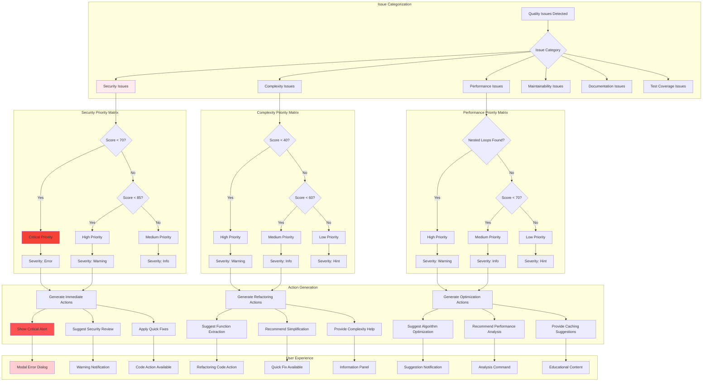
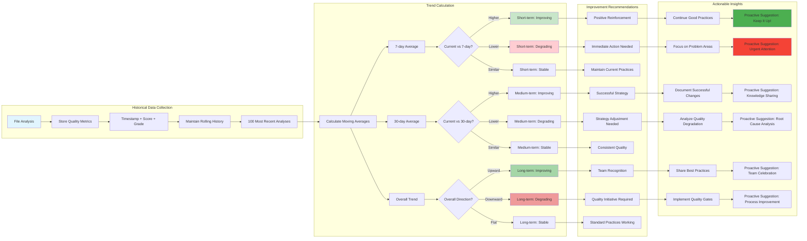

# Quality Analysis System Diagrams

## Six-Dimensional Quality Analysis Framework

```mermaid
mindmap
  root((Quality Analysis))
    Complexity
      Cyclomatic Complexity
        Control Structures
        Nested Logic
        Decision Points
      Function Length
        Lines of Code
        Parameter Count
        Return Points
      Refactoring Suggestions
        Extract Functions
        Simplify Logic
        Reduce Nesting
    
    Maintainability  
      Code Smells
        Long Lines
        Magic Numbers
        TODO Comments
      Duplicate Code
        Similar Blocks
        Copy-Paste Detection
        DRY Violations
      Naming Quality
        Variable Names
        Function Names
        Consistency
    
    Performance
      Algorithm Efficiency
        Nested Loops
        O(n²) Patterns
        Inefficient Searches
      Memory Usage
        Large Objects
        Memory Leaks
        Resource Management
      Optimization Opportunities
        Caching
        Lazy Loading
        Batching
    
    Security
      Vulnerability Scanning
        eval() Usage
        innerHTML Risks
        XSS Vectors
      Secrets Management
        Hardcoded Credentials
        Logging Sensitive Data
        Environment Variables
      Input Validation
        SQL Injection
        Command Injection
        Data Sanitization
    
    Test Coverage
      File Coverage
        Test File Existence
        Coverage Estimation
        Test-to-Source Ratio
      Quality Metrics
        Test Completeness
        Edge Cases
        Error Scenarios
      Testing Strategy
        Unit Tests
        Integration Tests
        End-to-End Tests
    
    Documentation
      API Documentation
        JSDoc Comments
        Function Documentation
        Parameter Descriptions
      Code Comments
        Inline Comments
        Complex Logic Explanation
        Intent Documentation
      External Documentation
        README Files
        Architecture Docs
        User Guides
```

## Quality Scoring & Grading Algorithm

```mermaid
flowchart TD
    A[File Content Analysis] --> B[Initialize Base Scores]
    B --> B1[Complexity: 100]
    B --> B2[Maintainability: 100] 
    B --> B3[Performance: 100]
    B --> B4[Security: 100]
    B --> B5[Test Coverage: 0]
    B --> B6[Documentation: 100]
    
    subgraph "Complexity Scoring"
        B1 --> C1[Count Control Structures]
        C1 --> C2[Calculate Cyclomatic Complexity]
        C2 --> C3[Apply Penalty: Score - (Complexity * 5)]
        C3 --> C4[Check Function Length]
        C4 --> C5[Apply Length Penalty if >25 lines]
        C5 --> C6[Final Complexity Score]
    end
    
    subgraph "Maintainability Scoring"
        B2 --> D1[Scan for Long Lines >120 chars]
        D1 --> D2[Penalty: -2 per line]
        D2 --> D3[Find TODO Comments] 
        D3 --> D4[Penalty: -1 per TODO]
        D4 --> D5[Detect Magic Numbers]
        D5 --> D6[Penalty: -3 per magic number]
        D6 --> D7[Find Duplicate Code Blocks]
        D7 --> D8[Penalty: -5 per duplicate]
        D8 --> D9[Final Maintainability Score]
    end
    
    subgraph "Performance Scoring"
        B3 --> E1[Check for Nested Loops]
        E1 --> E2[Penalty: -10 per nested loop]
        E2 --> E3[Find Inefficient Array Operations]
        E3 --> E4[Penalty: -5 per inefficiency]
        E4 --> E5[Check Large Object Literals]
        E5 --> E6[Penalty: -3 per large object]
        E6 --> E7[Final Performance Score]
    end
    
    subgraph "Security Scoring"
        B4 --> F1[Scan for Secrets Logging]
        F1 --> F2[Critical: -20 per occurrence]
        F2 --> F3[Check for eval() Usage]
        F3 --> F4[Critical: -25 per eval()]
        F4 --> F5[Find innerHTML Usage]
        F5 --> F6[Penalty: -15 per innerHTML]
        F6 --> F7[Check Hardcoded Credentials]
        F7 --> F8[Critical: -30 per credential]
        F8 --> F9[Final Security Score]
    end
    
    subgraph "Test Coverage Scoring"
        B5 --> G1[Search for Test Files]
        G1 --> G2{Test File Found?}
        G2 -->|No| G3[Score remains 0]
        G2 -->|Yes| G4[Calculate Line Ratios]
        G4 --> G5[Heuristic: (TestLines/SourceLines) * 70]
        G5 --> G6[Cap at 90% max]
        G6 --> G7[Final Test Coverage Score]
        G3 --> G7
    end
    
    subgraph "Documentation Scoring"
        B6 --> H1[Count All Functions]
        H1 --> H2[Count Documented Functions]
        H2 --> H3[Calculate Ratio]
        H3 --> H4[Score = (Documented/Total) * 100]
        H4 --> H5[Check for Export/Public Functions]
        H5 --> H6[Apply Extra Weight to Public APIs]
        H6 --> H7[Final Documentation Score]
    end
    
    subgraph "Grade Assignment"
        C6 --> I[Collect All Scores]
        D9 --> I
        E7 --> I
        F9 --> I
        G7 --> I
        H7 --> I
        
        I --> J[Apply Score to Grade Mapping]
        J --> J1{Score >= 90?}
        J1 -->|Yes| J2[Grade: A]
        J1 -->|No| J3{Score >= 80?}
        J3 -->|Yes| J4[Grade: B]
        J3 -->|No| J5{Score >= 70?}
        J5 -->|Yes| J6[Grade: C]
        J5 -->|No| J7{Score >= 60?}
        J7 -->|Yes| J8[Grade: D]
        J7 -->|No| J9[Grade: F]
    end
    
    subgraph "Issue Generation"
        I --> K[Generate Quality Issues]
        K --> K1[Severity: Error for Grade F]
        K --> K2[Severity: Warning for Grade D]
        K --> K3[Severity: Info for Grade C and below]
        
        K1 --> L[Create VS Code Diagnostics]
        K2 --> L
        K3 --> L
    end
    
    J2 --> M[Return Quality Metric Detail]
    J4 --> M
    J6 --> M
    J8 --> M  
    J9 --> M
    L --> M
    
    style A fill:#e1f5fe
    style C6 fill:#f1f8e9
    style D9 fill:#f1f8e9
    style E7 fill:#f1f8e9  
    style F9 fill:#ffebee
    style G7 fill:#f1f8e9
    style H7 fill:#f1f8e9
    style M fill:#e8f5e8
```

## Quality Issue Priority & Severity Matrix



## Quality Trend Analysis & Improvement Tracking



## Project-Wide Quality Analysis & Hotspot Detection

```mermaid
graph TB
    subgraph "Project Scanning"
        A[Find All Source Files] --> B[Filter by Extensions]
        B --> C[.ts, .js, .tsx, .jsx files]
        C --> D[Limit to First 50 Files]
        D --> E[Parallel Analysis]
    end
    
    subgraph "File Quality Assessment"
        E --> F1[Analyze File 1]
        E --> F2[Analyze File 2]
        E --> F3[Analyze File N]
        
        F1 --> G1[6 Quality Dimensions]
        F2 --> G2[6 Quality Dimensions]
        F3 --> G3[6 Quality Dimensions]
        
        G1 --> H1[Average Score: 78]
        G2 --> H2[Average Score: 45] 
        G3 --> H3[Average Score: 92]
    end
    
    subgraph "Aggregation & Analysis"
        H1 --> I[Collect All Scores]
        H2 --> I
        H3 --> I
        
        I --> J[Calculate Project Average]
        J --> K[Overall Score: 72/100]
        K --> L[Project Grade: C]
        
        I --> M[Identify Score Distribution]
        M --> N[Top Performers: >85]
        M --> O[Average Files: 60-85]
        M --> P[Hotspots: <60]
    end
    
    subgraph "Issue Prioritization"
        P --> Q[Hotspot Analysis]
        Q --> Q1[File A: Score 23 (Security Issues)]
        Q --> Q2[File B: Score 41 (High Complexity)]
        Q --> Q3[File C: Score 55 (No Tests)]
        
        Q1 --> R1[Critical: Security Review]
        Q2 --> R2[High: Refactoring Needed]
        Q3 --> R3[Medium: Add Test Coverage]
    end
    
    subgraph "Trend Detection"
        I --> S[Historical Comparison]
        S --> S1{Compared to Last Week?}
        S1 -->|Better| S2[Trending Up: 3 files]
        S1 -->|Worse| S3[Trending Down: 5 files]
        S1 -->|Same| S4[Stable Quality]
        
        S2 --> T1[Positive Momentum]
        S3 --> T2[Quality Regression Alert]
        S4 --> T3[Consistent Standards]
    end
    
    subgraph "Recommendations Engine"
        R1 --> U[Immediate Actions]
        R2 --> V[Refactoring Plan]
        R3 --> W[Testing Strategy]
        T2 --> X[Process Improvement]
        
        U --> U1[Review Critical Files First]
        U --> U2[Implement Security Gates]
        U --> U3[Schedule Security Audit]
        
        V --> V1[Break Down Large Functions]
        V --> V2[Simplify Complex Logic]
        V --> V3[Extract Common Patterns]
        
        W --> W1[Create Missing Test Files]
        W --> W2[Improve Coverage Metrics]
        W --> W3[Add Edge Case Testing]
        
        X --> X1[Strengthen Review Process]
        X --> X2[Add Quality Checkpoints]
        X --> X3[Team Training Sessions]
    end
    
    subgraph "Reporting & Visualization"
        L --> Y[Project Quality Dashboard]
        P --> Z[Quality Heatmap]
        T1 --> AA[Progress Tracking]
        
        Y --> Y1[Overall Grade: C]
        Y --> Y2[Improvement Areas: Security, Testing]
        Y --> Y3[Next Milestone: Grade B]
        
        Z --> Z1[Red: Immediate Attention (3 files)]
        Z --> Z2[Yellow: Monitor Closely (8 files)]  
        Z --> Z3[Green: Good Quality (39 files)]
        
        AA --> AA1[Weekly Quality Trend]
        AA --> AA2[Team Performance Metrics]
        AA --> AA3[Quality Goals Progress]
    end
    
    style A fill:#e1f5fe
    style L fill:#fff3e0
    style P fill:#ffebee
    style T1 fill:#e8f5e8
    style T2 fill:#ffcdd2
    style Y fill:#f3e5f5
```