# Real-Time Analysis Workflow Diagrams

## Complete Real-Time Development Guidance System


## File System Monitoring & Analysis Flow

```mermaid
sequenceDiagram
    participant User
    participant VSCode as VS Code Editor
    participant FileWatcher as File System Watcher
    participant TextWatcher as Text Document Watcher  
    participant Analyzer as Real-Time Analyzer
    participant QualityEngine as Live Quality Engine
    participant SuggestionEngine as Proactive Suggestions

    User->>VSCode: Opens/Edits File
    VSCode->>FileWatcher: File Change Event
    VSCode->>TextWatcher: Text Document Change
    
    FileWatcher->>Analyzer: handleFileChange()
    TextWatcher->>Analyzer: handleTextDocumentChange()
    
    Analyzer->>Analyzer: Calculate Change Metrics
    Analyzer->>Analyzer: debounceAnalysis(3s delay)
    
    Note over Analyzer: After debounce period
    
    Analyzer->>QualityEngine: analyzeFileQuality()
    
    par Quality Analysis
        QualityEngine->>QualityEngine: Complexity Analysis
        QualityEngine->>QualityEngine: Security Analysis  
        QualityEngine->>QualityEngine: Performance Analysis
        QualityEngine->>QualityEngine: Maintainability Analysis
        QualityEngine->>QualityEngine: Test Coverage Analysis
        QualityEngine->>QualityEngine: Documentation Analysis
    end
    
    QualityEngine->>Analyzer: Quality Metrics + Issues
    
    Analyzer->>Analyzer: findRefactoringOpportunities()
    Analyzer->>Analyzer: analyzeWorkspacePatterns()
    
    Analyzer->>SuggestionEngine: generateProactiveSuggestions()
    
    alt High Priority Issues Found
        SuggestionEngine->>VSCode: showErrorMessage()
        VSCode->>User: 🚨 Critical Alert
    else Medium Priority Issues
        SuggestionEngine->>VSCode: showWarningMessage()  
        VSCode->>User: ⚠️ Warning
    else Low Priority Suggestions
        SuggestionEngine->>VSCode: showInformationMessage()
        VSCode->>User: 💡 Suggestion
    end
    
    User->>VSCode: Click Action Button
    VSCode->>SuggestionEngine: executeSuggestionAction()
    SuggestionEngine->>VSCode: executeCommand()
```



## Live Quality Metrics Engine Analysis Flow

```mermaid

flowchart TD
    A[File Change Detected] --> B{Is Source File?}
    B -->|No| C[Skip Analysis]
    B -->|Yes| D[Load Document Content]
    
    D --> E[Initialize Quality Metrics Array]
    
    E --> F[Complexity Analysis]
    F --> F1[Count Control Structures]
    F1 --> F2[Calculate Cyclomatic Complexity]
    F2 --> F3[Generate Complexity Issues]
    F3 --> F4[Create Complexity Suggestions]
    F4 --> G[Add Complexity Metric]
    
    G --> H[Maintainability Analysis] 
    H --> H1[Check Line Length]
    H1 --> H2[Find TODO Comments]
    H2 --> H3[Detect Magic Numbers]
    H3 --> H4[Find Duplicate Code]
    H4 --> I[Add Maintainability Metric]
    
    I --> J[Performance Analysis]
    J --> J1[Detect Nested Loops]
    J1 --> J2[Check Array Method Chains]
    J2 --> J3[Find Large Objects]
    J3 --> K[Add Performance Metric]
    
    K --> L[Security Analysis]
    L --> L1[Check for Secrets Logging]
    L1 --> L2[Detect eval() Usage]
    L2 --> L3[Find innerHTML Usage]
    L3 --> L4[Check for Hardcoded Credentials]
    L4 --> M[Add Security Metric]
    
    M --> N[Test Coverage Analysis]
    N --> N1[Search for Test Files]
    N1 --> N2{Test File Found?}
    N2 -->|Yes| N3[Calculate Coverage Heuristic]
    N2 -->|No| N4[Set Coverage to 0%]
    N3 --> O[Add Test Coverage Metric]
    N4 --> O
    
    O --> P[Documentation Analysis]
    P --> P1[Count Functions]
    P1 --> P2[Check JSDoc Comments]
    P2 --> P3[Calculate Documentation Ratio]
    P3 --> Q[Add Documentation Metric]
    
    Q --> R[Calculate Overall Grades A-F]
    R --> S[Generate VS Code Diagnostics]
    S --> T[Update Diagnostics Collection]
    T --> U[Cache Metrics for File]
    U --> V[Return Complete Analysis]
    
    style A fill:#e3f2fd color:#000000
    style G fill:#f1f8e9 color:#000000
    style I fill:#f1f8e9 color:#000000  
    style K fill:#f1f8e9 color:#000000
    style M fill:#ffebee color:#000000
    style O fill:#f1f8e9 color:#000000
    style Q fill:#f1f8e9 color:#000000
    style V fill:#e8f5e8 color:#000000

```

## Proactive Suggestions Decision Tree

```mermaid

flowchart TD
    A[Quality Metrics Generated] --> B{Within Cooldown Period?}
    B -->|Yes| C[Skip Suggestions]
    B -->|No| D[Check Active Editor]
    
    D --> E{Is Source File Active?}
    E -->|No| F[Skip Suggestions]
    E -->|Yes| G[Generate Suggestion Candidates]
    
    G --> H[Quality-Based Suggestions]
    G --> I[Refactoring Suggestions]
    G --> J[Pattern-Based Suggestions]  
    G --> K[Test Coverage Suggestions]
    G --> L[Security Suggestions]
    
    H --> M{Complexity < 60?}
    M -->|Yes| M1[High Complexity Alert]
    M -->|No| M2[Skip]
    
    H --> N{Security Score < 80?}
    N -->|Yes| N1{Critical Issues?}
    N1 -->|Yes| N2[Critical Security Alert]
    N1 -->|No| N3[Security Warning]
    N -->|No| N4[Skip]
    
    H --> O{Documentation < 50?}
    O -->|Yes| O1[Documentation Suggestion]
    O -->|No| O2[Skip]
    
    I --> P{Low-Effort Opportunities?}
    P -->|Yes| P1[Quick Refactoring Suggestion]
    P -->|No| P2[Skip]
    
    J --> Q{Pattern Confidence > 70%?}
    Q -->|Yes| Q1[Pattern Guidance]
    Q -->|No| Q2[Skip]
    
    K --> R{No Test File Found?}
    R -->|Yes| R1[Test Creation Suggestion]
    R -->|No| R2{Coverage < 70%?}
    R2 -->|Yes| R3[Coverage Improvement Suggestion]
    R2 -->|No| R4[Skip]
    
    L --> S{Security Issues Present?}
    S -->|Yes| S1[Security Alert]
    S -->|No| S2[Skip]
    
    M1 --> T[Collect All Suggestions]
    N2 --> T
    N3 --> T  
    O1 --> T
    P1 --> T
    Q1 --> T
    R1 --> T
    R3 --> T
    S1 --> T
    
    T --> U[Filter by Priority Threshold]
    U --> V[Sort by Priority (Critical > High > Medium > Low)]
    V --> W[Limit to Max Active Suggestions]
    
    W --> X[Present Suggestions to User]
    
    X --> Y{User Action}
    Y -->|Primary Action| Z[Execute Command]
    Y -->|Secondary Action| AA[Execute Alternative]
    Y -->|Dismiss| BB[Mark as Dismissed]
    
    Z --> CC[Update Suggestion History]
    AA --> CC
    BB --> CC
    
    style A fill:#e1f5fe color:#000000
    style N2 fill:#ffebee color:#000000
    style M1 fill:#fff3e0 color:#000000
    style X fill:#e8f5e8 color:#000000
    style CC fill:#f3e5f5 color:#000000

```

## Code Actions & Quick Fixes Flow

```mermaid

flowchart LR
    subgraph "VS Code Integration"
        A[User Right-Clicks Code] --> B[VS Code Requests Code Actions]
        B --> C[MastroCodeActionProvider.provideCodeActions()]
    end
    
    subgraph "Analysis & Detection"
        C --> D[Get Quality Metrics for Range]
        C --> E[Get Refactoring Opportunities for Range]
        
        D --> F{Issues in Selection?}
        F -->|Yes| G[Create Fix Actions]
        F -->|No| H[Skip Quality Fixes]
        
        E --> I{Opportunities in Selection?}
        I -->|Yes| J[Create Refactoring Actions]
        I -->|No| K[Skip Refactoring Actions]
    end
    
    subgraph "Quick Fix Generation"
        G --> L[Line Length Fix]
        G --> M[Magic Number Fix]
        G --> N[Security Fix]
        G --> O[Eval() Fix]
        G --> P[innerHTML Fix]
        
        L --> L1[Auto-break at Logical Points]
        M --> M1[Extract to Named Constant]
        N --> N1[Replace with [REDACTED]]
        O --> O1[Add TODO Comment]
        P --> P1[Replace with textContent]
    end
    
    subgraph "Refactoring Actions"
        J --> Q[Extract Function]
        J --> R[Simplify Conditional]  
        J --> S[Reduce Complexity]
        
        Q --> Q1[Show Guided Help]
        R --> R1[Show Strategies]
        S --> S1[Show Reduction Techniques]
    end
    
    subgraph "General Improvements"
        C --> T[Create General Actions]
        T --> U[Add Documentation]
        T --> V[Create Test]
        T --> W[Analyze Performance]
        
        U --> U1[Generate JSDoc Template]
        V --> V1[Create Test File]
        W --> W1[Show Performance Analysis]
    end
    
    subgraph "Action Execution"
        L1 --> X[Apply Workspace Edit]
        M1 --> X
        N1 --> X
        O1 --> X  
        P1 --> X
        
        Q1 --> Y[Execute VS Code Command]
        R1 --> Y
        S1 --> Y
        U1 --> Y
        V1 --> Y
        W1 --> Y
    end
    
    X --> Z[Changes Applied to File]
    Y --> AA[Helper Dialog/Action Executed]
    
    style A fill:#e3f2fd color:#000000
    style C fill:#f3e5f5 color:#000000
    style X fill:#e8f5e8 color:#000000
    style Y fill:#e8f5e8 color:#000000
    style Z fill:#c8e6c9 color:#000000
    style AA fill:#c8e6c9 color:#000000

```

## Development Pattern Detection Algorithm

```mermaid

flowchart TD
    A[File Changes Collected] --> B[Sort by Timestamp]
    B --> C[Separate Test vs Source Files]
    
    C --> D[TDD Pattern Analysis]
    C --> E[Refactor-First Pattern Analysis]
    C --> F[Spike Pattern Analysis]
    
    subgraph "TDD Detection"
        D --> D1[Find Test File Changes]
        D1 --> D2[Find Corresponding Source Changes]
        D2 --> D3{Test Modified Before Source?}
        D3 -->|Yes| D4[Increment TDD Evidence]
        D3 -->|No| D5[No TDD Evidence]
        D4 --> D6[Calculate TDD Confidence]
    end
    
    subgraph "Refactor-First Detection"  
        E --> E1[Analyze Change Ratios]
        E1 --> E2{Similar Adds/Deletes?}
        E2 -->|Yes| E3[Increment Refactor Evidence]
        E2 -->|No| E4[No Refactor Evidence]
        E3 --> E5[Calculate Refactor Confidence]
    end
    
    subgraph "Spike Detection"
        F --> F1[Filter Recent Changes (30min)]
        F1 --> F2[Count Unique Files]
        F2 --> F3[Calculate Changes Per File]
        F3 --> F4{High Change Frequency?}
        F4 -->|Yes| F5[High Spike Confidence]
        F4 -->|No| F6[Low Spike Confidence]
    end
    
    D6 --> G{Confidence > 60%?}
    E5 --> H{Confidence > 50%?}
    F5 --> I{Confidence > 40%?}
    F6 --> I
    
    G -->|Yes| G1[Generate TDD Pattern]
    G -->|No| G2[Skip TDD Pattern]
    
    H -->|Yes| H1[Generate Refactor Pattern]
    H -->|No| H2[Skip Refactor Pattern]
    
    I -->|Yes| I1[Generate Spike Pattern]
    I -->|No| I2[Skip Spike Pattern]
    
    G1 --> J[Combine All Patterns]
    H1 --> J
    I1 --> J
    
    J --> K[Generate Recommendations]
    K --> L[Determine Next Best Actions]
    L --> M[Return Pattern Insights]
    
    style A fill:#e1f5fe color:#000000
    style D fill:#e8f5e8 color:#000000
    style E fill:#fff3e0 color:#000000  
    style F fill:#f3e5f5 color:#000000
    style M fill:#c8e6c9 color:#000000

```

## Configuration & Settings Management

