# Mastro Review Command - Technical Flow

> **Detailed technical flow for session-based code review - the main star feature of Phase 3 with comprehensive analysis pipeline**

## Complete Session-Based Review Flow

```mermaid
graph TB
    %% User Input Layer
    User[👤 User] --> CLI["`**mastro review --persona=security**
    oclif Command Parser
    Multiple flag options processing`"]
    
    %% Command Processing
    CLI --> ReviewCmd["`**Review.ts**
    BaseCommand Extension
    
    **Key Flags:**
    - stream: boolean (real-time)
    - persona: string
    - strictness: level
    - actionable-only: boolean
    - priority: filter level
    - format: output type`"]
    
    ReviewCmd --> Init["`**Component Initialization**
    - SessionTracker (session management)
    - ReviewEngine (core review logic)
    - WorkflowAnalyzer (pattern detection)
    - StreamingRenderer (real-time UI)
    - ReviewFormatter (output formatting)`"]
    
    %% Git & Session Analysis
    Init --> GitCheck{"`**Git Repository Check**
    ensureGitRepository()
    Validate .git directory exists`"}
    
    GitCheck -->|No| Error1["`❌ **Error**
    'Not in a git repository'`"]
    GitCheck -->|Yes| SessionGet["`**Get Current Session**
    sessionTracker.getCurrentSession()
    
    **Session Initialization:**
    - Generate unique session ID
    - Determine base commit/branch
    - Track session start time
    - Initialize session state`"]
    
    SessionGet --> SessionAnalysis["`**Session State Analysis**
    
    **Core Components:**
    1. Working Changes Analysis
    2. Staged Changes Analysis  
    3. Risk Assessment Calculation
    4. Development Pattern Detection
    5. Cumulative Statistics Tracking`"]
    
    %% Session Building Process
    SessionAnalysis --> WorkingChanges["`**Working Changes Analysis**
    gitAnalyzer.getWorkingChanges()
    
    **Process:**
    - git diff HEAD (working tree)
    - Parse diff hunks & lines
    - Classify change types
    - Calculate file-level metrics`"]
    
    WorkingChanges --> StagedChanges["`**Staged Changes Analysis**
    gitAnalyzer.getStagedChanges()
    
    **Process:**
    - git diff --cached
    - Parse staged modifications
    - Merge with working changes
    - Build comprehensive change set`"]
    
    StagedChanges --> SessionStats["`**Session Statistics Calculation**
    Calculate cumulative metrics:
    
    - totalFiles: working + staged
    - totalInsertions: sum of additions
    - totalDeletions: sum of removals
    - changedLines: total modifications
    - duration: minutes since session start
    - complexity: risk-based classification`"]
    
    SessionStats --> RiskAssessment["`**Risk Assessment Engine**
    calculateRiskAssessment(session)
    
    **Risk Factors:**
    - Large file count (>15 files = high risk)
    - Massive line changes (>1000 lines)
    - Critical file modifications
    - Mixed change concerns
    - Breaking change indicators`"]
    
    RiskAssessment --> PatternDetection["`**Workflow Pattern Detection**
    workflowAnalyzer.analyzeWorkflowPatterns()
    
    **Detected Patterns:**
    - TDD (test-driven development)
    - Feature Flag Implementation
    - Microcommit Pattern
    - Refactoring Sprint
    - Documentation-Driven
    - Hotfix Pattern`"]
    
    PatternDetection --> SessionComplete["`**Session Object Complete**
    DevelopmentSession fully populated
    with all analysis components`"]
    
    %% Persona & Configuration
    SessionComplete --> PersonaSetup["`**Review Persona Setup**
    Configure review focus & strictness
    
    **Persona Types:**
    - Security Engineer (security focus)
    - Performance Engineer (optimization)
    - Senior Engineer (maintainability)
    - Testing Engineer (coverage/quality)`"]
    
    PersonaSetup --> PersonaConfig["`**Persona Configuration**
    ReviewPersona object:
    
    - name: string (persona identity)
    - focus: areas of expertise
    - strictness: lenient|moderate|strict
    - customRules: additional criteria`"]
    
    %% Streaming vs Standard Processing
    PersonaConfig --> StreamingCheck{"`**Streaming Mode?**
    flags.stream === true`"}
    
    StreamingCheck -->|Yes| StreamingSetup["`**Streaming Setup**
    streamingRenderer.renderStreamingReview()
    
    **Features:**
    - Real-time progress indicators
    - Phase-based progress tracking
    - Animated spinners (ora)
    - Live status updates`"]
    
    StreamingCheck -->|No| StandardSetup["`**Standard Setup**
    Standard synchronous processing
    with progress spinners`"]
    
    %% Core Review Engine Processing
    StreamingSetup --> ReviewEngine["`**Review Engine Processing**
    reviewEngine.reviewSession(session, persona)`"]
    StandardSetup --> ReviewEngine
    
    ReviewEngine --> MultiAnalysis["`**Multi-Layer Analysis Pipeline**
    Parallel analysis components:
    
    1. **Semantic Analysis** (code patterns)
    2. **Impact Analysis** (business/technical)
    3. **Complexity Analysis** (maintainability)
    4. **Security Analysis** (vulnerability scan)
    5. **Performance Analysis** (optimization)
    6. **Testing Analysis** (coverage gaps)`"]
    
    MultiAnalysis --> SemanticAnalyzer["`**Semantic Analyzer**
    semanticAnalyzer.analyzeChanges()
    
    **Analysis Areas:**
    - Code structure patterns
    - Function/class complexity
    - Import/export analysis
    - Framework-specific patterns
    - Design pattern recognition`"]
    
    SemanticAnalyzer --> ImpactAnalyzer["`**Impact Analyzer**
    impactAnalyzer.assessImpact()
    
    **Impact Dimensions:**
    - Business impact assessment
    - Technical debt implications
    - User experience effects
    - Performance implications
    - Security considerations
    - Maintenance burden`"]
    
    ImpactAnalyzer --> AIReviewCall["`**AI Review Generation**
    aiClient.reviewCode(context, persona)
    
    **AI Processing:**
    - Principal Engineer persona prompt
    - Persona-specific focus areas
    - Strictness-adjusted criteria
    - Context-optimized analysis`"]
    
    %% AI Processing Pipeline
    AIReviewCall --> AIPersonaPrompt["`**AI Persona Configuration**
    Dynamic system prompt generation:
    
    'You are a Principal Software Engineer 
    acting as a ${persona.name} conducting 
    a ${persona.strictness} code review.
    
    Focus areas: ${persona.focus.join(', ')}
    Custom rules: ${persona.customRules}'`"]
    
    AIPersonaPrompt --> AIAnalysis["`**AI Code Analysis**
    OpenAI GPT-4 processing:
    
    **Analysis Components:**
    - Overall quality assessment
    - Specific improvement suggestions  
    - Security/performance issues
    - Best practice compliance
    - Blocking issues identification`"]
    
    AIAnalysis --> AIResponse{"`**AI Response Processing**
    Parse and validate JSON response`"}
    
    AIResponse -->|Success| ReviewParsing["`**Review Response Parsing**
    Extract CodeReview object:
    
    - overall: ReviewSummary
    - suggestions: ReviewSuggestion[]
    - compliments: string[]
    - blockers: ReviewSuggestion[]`"]
    
    AIResponse -->|Error| AIError["`❌ **AI Processing Error**
    Handle API failures gracefully`"]
    
    %% Post-Processing & Enhancement
    ReviewParsing --> ActionableGeneration["`**Actionable Items Generation**
    generateActionableItems(review)
    
    **Process:**
    - Convert suggestions to actionable items
    - Add effort estimates (quick|medium|substantial)
    - Assign priority levels (critical|high|medium|low)
    - Generate specific improvement tasks
    - Include file/line references`"]
    
    ActionableGeneration --> WorkflowSuggestions["`**Workflow Suggestions**
    workflowAnalyzer.generateWorkflowSuggestions()
    
    **Suggestion Types:**
    - Commit strategy optimization
    - Testing approach improvements
    - Documentation needs
    - Refactoring opportunities
    - Code organization suggestions`"]
    
    WorkflowSuggestions --> PriorityFiltering["`**Priority-Based Filtering**
    Apply flag-based filtering:
    
    **Filters:**
    - actionable-only: show only ActionableItems
    - priority: filter by importance level
    - persona focus: emphasize relevant areas
    - strictness: adjust severity thresholds`"]
    
    %% Output Processing
    PriorityFiltering --> FormatSelection{"`**Output Format Selection**
    flags.format: terminal|json|markdown|html`"}
    
    FormatSelection -->|terminal| TerminalFormat["`**Terminal Formatting**
    reviewFormatter.formatSessionReview()
    
    **Features:**
    - Colored output (chalk)
    - Icon indicators
    - Priority-based highlighting
    - Confidence indicators
    - Effort badges`"]
    
    FormatSelection -->|markdown| MarkdownFormat["`**Markdown Formatting**
    Professional documentation format:
    
    **Sections:**
    - Overall Assessment
    - Actionable Items by priority
    - Code Suggestions with context
    - Workflow Recommendations
    - Learning Points`"]
    
    FormatSelection -->|json| JSONFormat["`**JSON Formatting**
    Machine-readable output:
    
    **Structure:**
    - Complete SessionReview object
    - Metadata preservation
    - API-friendly format
    - CI/CD integration ready`"]
    
    FormatSelection -->|html| HTMLFormat["`**HTML Formatting**
    Web-friendly report:
    
    **Features:**
    - Professional styling
    - Interactive elements
    - Collapsible sections
    - Print-friendly layout`"]
    
    %% Interactive Features
    TerminalFormat --> InteractiveCheck{"`**Interactive Mode?**
    flags.interactive === true`"}
    MarkdownFormat --> Display
    JSONFormat --> Display
    HTMLFormat --> Display
    
    InteractiveCheck -->|Yes| InteractiveMenu["`**Interactive Session Menu**
    sessionUI.showInteractiveSessionMenu()
    
    **Options:**
    1. 📊 View detailed statistics
    2. 🔍 Run focused review
    3. 📝 Create PR
    4. 🎯 Show actionable items
    5. 💡 Get workflow suggestions
    6. 🔄 Reset session
    7. ❌ Exit`"]
    
    InteractiveCheck -->|No| Display["`📊 **Display Review Results**
    Formatted output to console`"]
    
    InteractiveMenu --> MenuChoice{"`**User Menu Choice**
    Process selected option`"]
    
    MenuChoice -->|1-6| ProcessChoice["`**Process Menu Option**
    Execute selected functionality
    Return to menu after completion`"]
    MenuChoice -->|7| Complete
    
    ProcessChoice --> InteractiveMenu
    
    %% Completion & Cleanup
    Display --> Complete["`✅ **Review Complete**
    Session review finished successfully`"]
    
    Complete --> Cleanup["`**Cleanup & Resource Management**
    - streamingRenderer.cleanup()
    - Release resources
    - Clear temporary data
    - Reset state`"]
    
    Cleanup --> Exit["`🔚 **Exit**
    Process termination
    Return to command line`"]
    
    %% Error Handling
    Error1 --> ErrorHandler["`**Comprehensive Error Handler**
    handleError(error, operation)
    
    **Error Categories:**
    - Git repository errors
    - Session initialization failures
    - AI processing errors
    - Configuration issues
    - Resource allocation errors`"]
    
    AIError --> ErrorHandler
    ErrorHandler --> ErrorExit["`🔚 **Error Exit**
    Graceful error termination
    Error code: 1`"]
    
    %% Styling
    classDef userClass fill:#e1f5fe,color:#000000
    classDef commandClass fill:#fff3e0,color:#000000
    classDef sessionClass fill:#f3e5f5,color:#000000
    classDef analysisClass fill:#e8f5e8,color:#000000
    classDef aiClass fill:#fff9c4,color:#000000
    classDef outputClass fill:#f1f8e9,color:#000000
    classDef errorClass fill:#ffebee,color:#000000
    classDef successClass fill:#e8f5e8,color:#000000
    
    class User,CLI userClass
    class ReviewCmd,Init commandClass
    class SessionGet,SessionAnalysis,WorkingChanges,StagedChanges,SessionStats sessionClass
    class MultiAnalysis,SemanticAnalyzer,ImpactAnalyzer,PatternDetection,RiskAssessment analysisClass
    class AIReviewCall,AIPersonaPrompt,AIAnalysis,ReviewParsing aiClass
    class FormatSelection,TerminalFormat,MarkdownFormat,JSONFormat,HTMLFormat outputClass
    class Error1,AIError,ErrorHandler errorClass
    class Complete,Cleanup successClass

```

## Session Tracking Architecture

### 1. Session Lifecycle Management

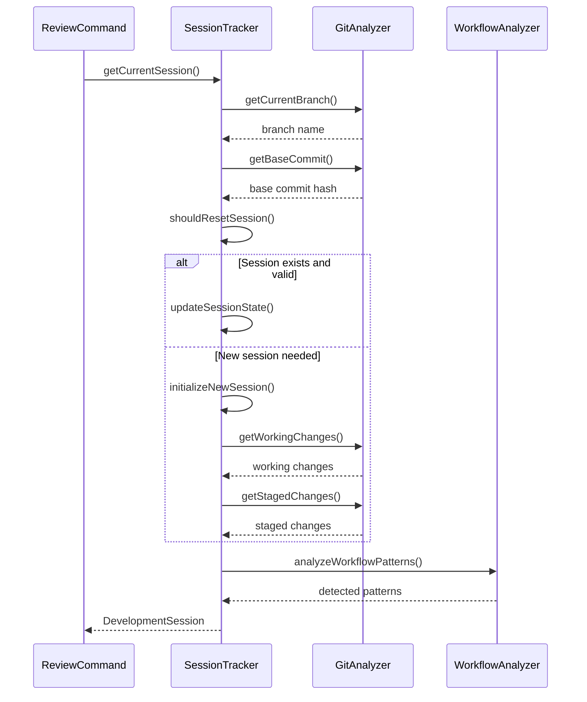

### 2. Multi-Layer Analysis Pipeline

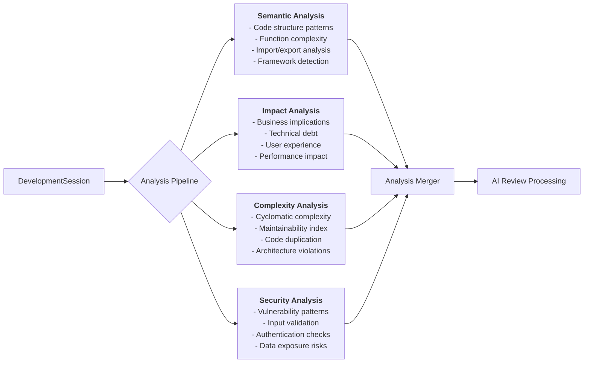

### 3. Risk Assessment Algorithm

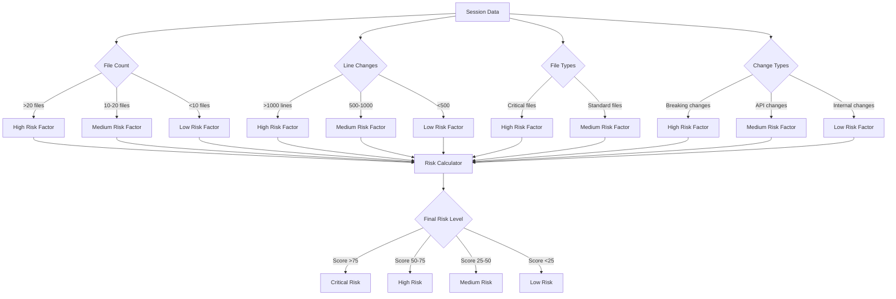

## Persona-Based Review System

### 1. Persona Configuration Matrix

| Persona | Focus Areas | Strictness | Custom Rules |
|---------|-------------|------------|--------------|
| **Security Engineer** | security, maintainability | strict | Input validation, auth checks, data exposure |
| **Performance Engineer** | performance, scalability | moderate | Optimization opportunities, resource usage |
| **Senior Engineer** | maintainability, testing | moderate | Code quality, best practices, documentation |
| **Testing Engineer** | testing, quality | strict | Coverage requirements, test patterns, edge cases |

### 2. Dynamic Prompt Generation

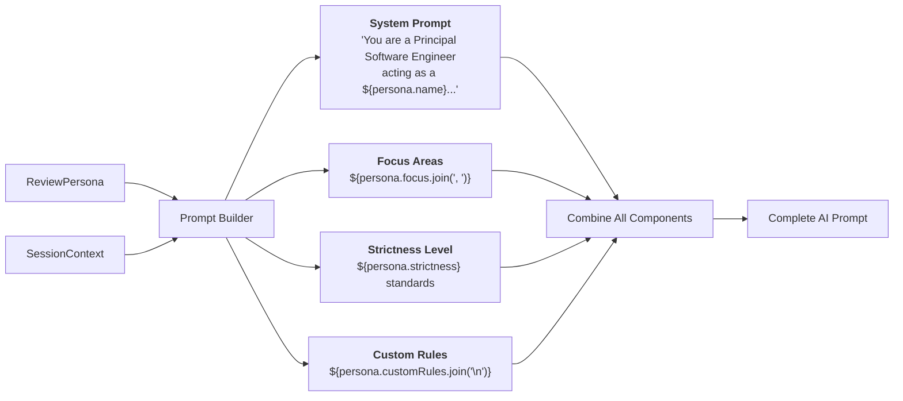

### 3. Review Output Processing

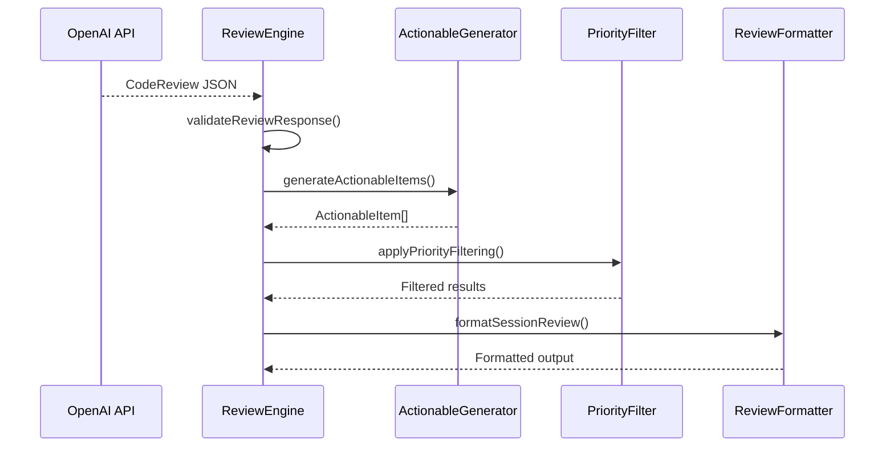

## Streaming Architecture

### 1. Real-Time Progress System

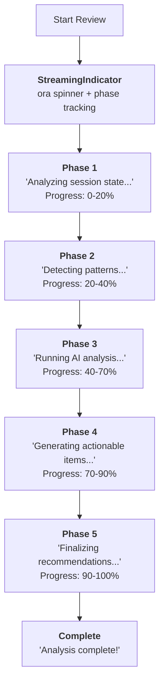

### 2. Progressive Result Display

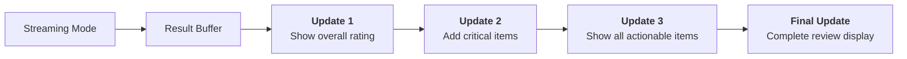

## Actionable Item Generation

### 1. AI Suggestion to Actionable Item Conversion

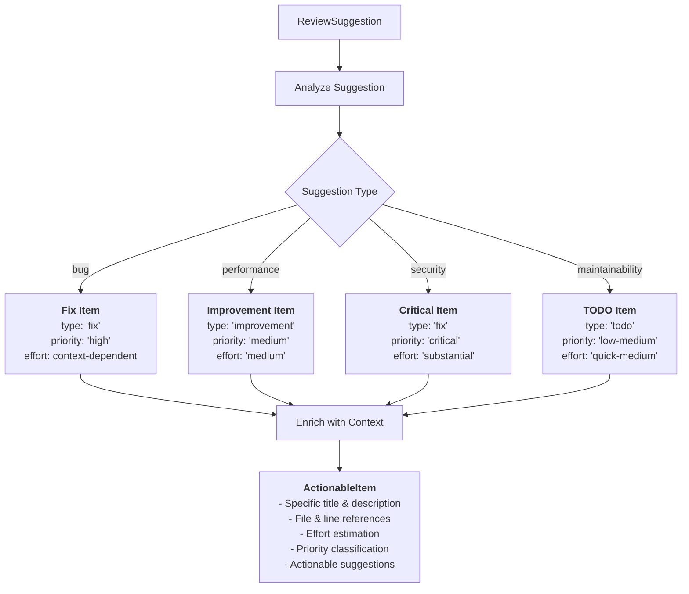

### 2. Priority Classification System

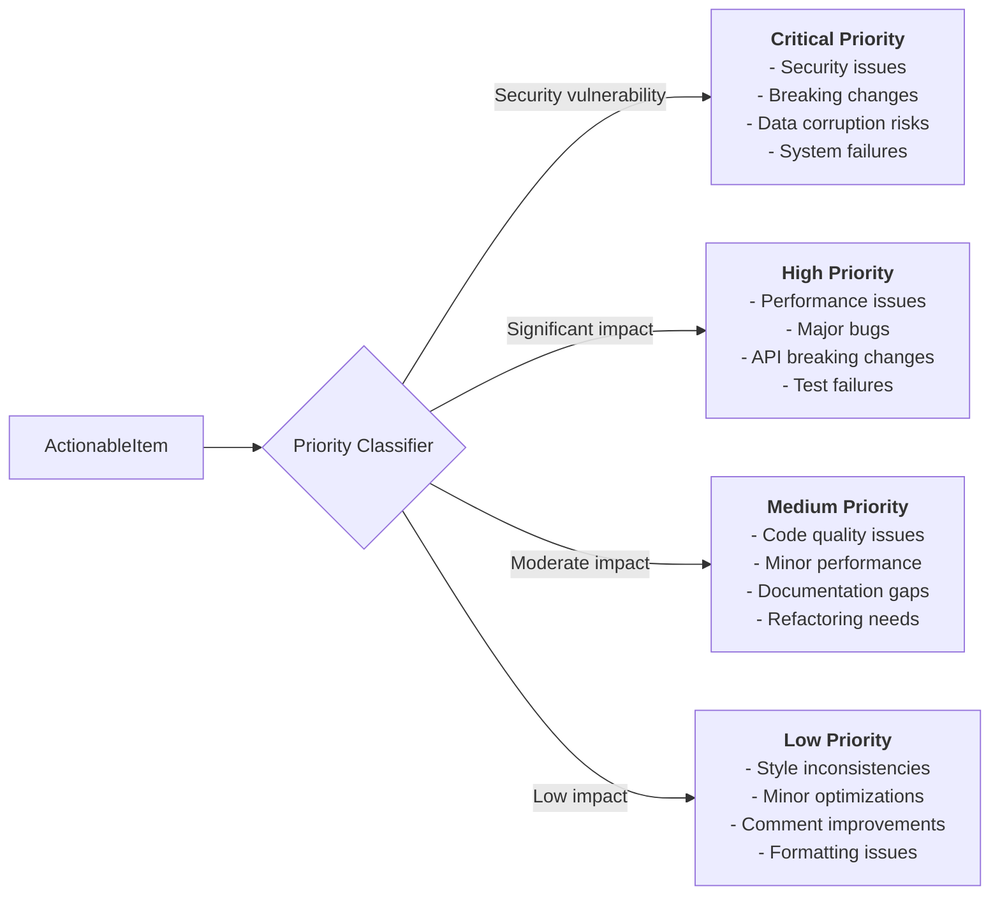

## Interactive Features

### 1. Interactive Menu System

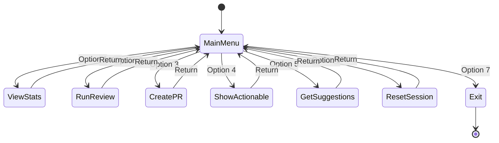

### 2. Session Comparison View

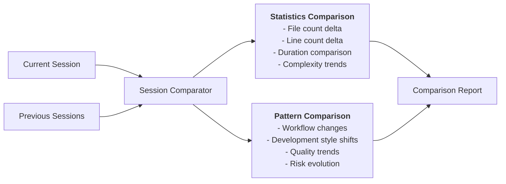

## Performance Optimizations

### 1. Parallel Analysis Processing

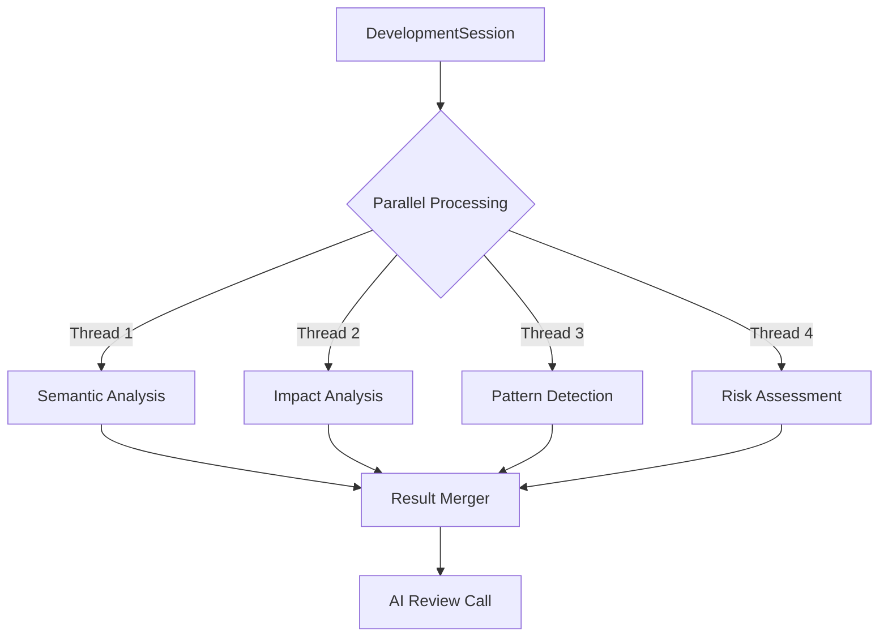

### 2. Incremental Session Updates

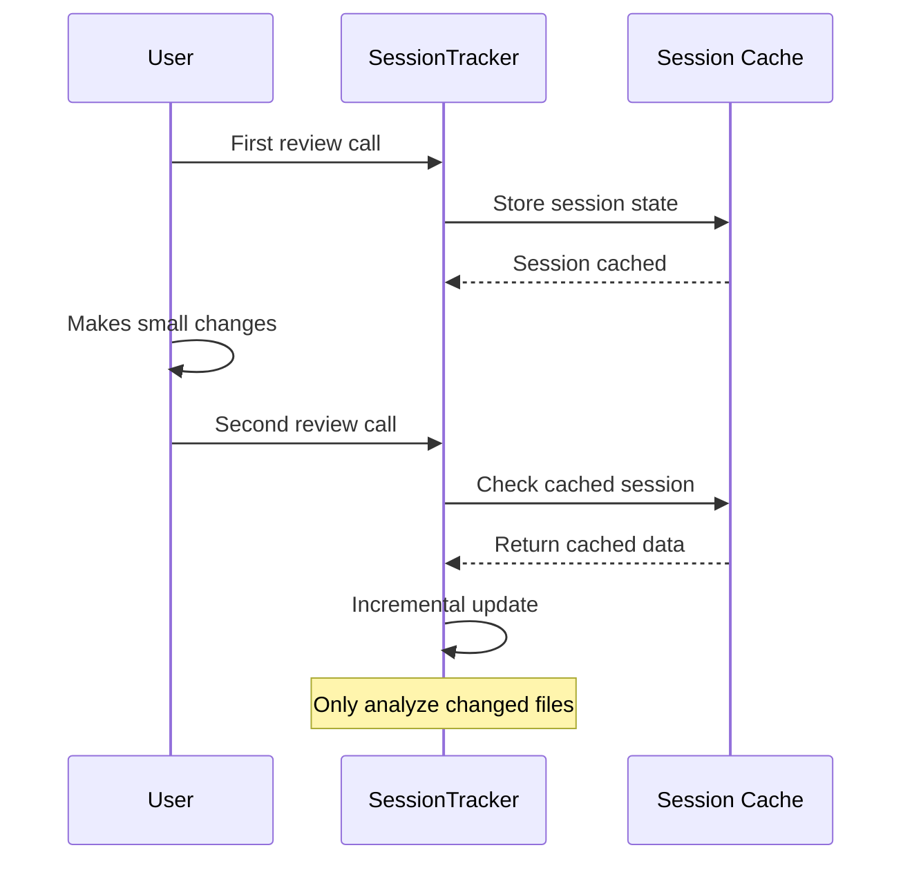

This comprehensive review system provides intelligent, persona-based code analysis with real-time feedback, actionable improvements, and workflow optimization - making it the centerpiece of mastro's developer quality-of-life mission.