# Mastro Split Flow - Smart Commit Splitting & Auto-Staging

This diagram illustrates the technical workflow for `mastro split` command, showing the AI-powered commit boundary detection process.

## Complete Split Workflow

```mermaid

graph TD
    A["`**Working Directory Changes**
    Multiple files modified
    Mixed concerns detected`"] --> B["`**Change Detection**
    Git status analysis
    File diff extraction
    Unstaged changes only`"]
    
    B --> C["`**Semantic Analysis**
    🧠 File relationship detection
    Import/export analysis
    Function dependencies
    Code similarity scoring`"]
    
    B --> D["`**Impact Analysis** 
    📊 Business impact scoring
    Technical risk assessment
    Change magnitude evaluation
    Breaking change detection`"]
    
    C --> E["`**Relationship Graph**
    File-to-file connections
    Dependency mapping
    Shared interfaces
    Test-code pairings`"]
    
    D --> F["`**Impact Groups**
    High-impact changes
    Medium-impact changes  
    Low-impact changes
    No-impact changes`"]
    
    E --> G["`**ML Clustering Algorithm**
    🤖 K-means clustering
    Cosine similarity analysis
    Dependency graph traversal
    Thematic grouping`"]
    
    F --> G
    
    G --> H["`**Boundary Detection**
    Logical commit boundaries
    Priority scoring (high/med/low)
    Complexity estimation
    Risk assessment`"]
    
    H --> I["`**Staging Strategy**
    Progressive/Parallel/Sequential
    Commit message suggestions
    Rationale explanations
    Warning identifications`"]
    
    I --> J{"`**User Interaction**
    Accept suggested strategy?`"}
    
    J -->|Yes| K["`**Auto-Staging**
    Stage files by boundary
    Generate commit messages
    Apply rationale context`"]
    
    J -->|Customize| L["`**Interactive Customization**
    Merge boundaries
    Split boundaries  
    Reorder priorities
    Edit commit messages`"]
    
    J -->|No| M["`**Display Analysis**
    Show boundaries
    Explain rationale
    Provide recommendations`"]
    
    L --> K
    K --> N["`**Progressive Commits**
    Commit 1: High priority
    Commit 2: Medium priority
    Commit 3: Low priority
    Clean commit history`"]
    
    M --> O["`**Manual Staging**
    User stages manually
    Analysis available as reference
    Improved commit hygiene`"]

    style A fill:#e1f5fe color:#000000
    style G fill:#fff3e0 color:#000000
    style I fill:#f3e5f5 color:#000000
    style N fill:#e8f5e8 color:#000000
    style O fill:#fff9c4 color:#000000

```

## Detailed Component Breakdown

### 1. Semantic Analysis Engine

```mermaid

graph LR
    SA["`**Semantic Analysis**`"] --> FR["`**File Relationships**
    • Import declarations
    • Function calls
    • Class inheritance
    • Interface usage`"]
    
    SA --> CC["`**Code Connections**
    • Shared functions
    • Common interfaces
    • Type dependencies
    • Module coupling`"]
    
    SA --> TP["`**Test Pairing**
    • test/*.spec.ts ↔ src/*.ts
    • __tests__ folder mapping
    • Test utility connections
    • Mock dependencies`"]
    
    SA --> CS["`**Code Similarity**
    • Change pattern analysis
    • Similar modifications
    • Refactoring patterns
    • Style consistency`"]

    style SA fill:#e3f2fd color:#000000
    style FR fill:#f1f8e9 color:#000000
    style CC fill:#fce4ec color:#000000
    style TP fill:#fff8e1 color:#000000
    style CS fill:#f3e5f5 color:#000000

```

### 2. Impact Analysis Engine

```mermaid

graph LR
    IA["`**Impact Analysis**`"] --> BI["`**Business Impact**
    • User-facing changes
    • API modifications
    • Breaking changes
    • Feature additions`"]
    
    IA --> TI["`**Technical Impact**
    • Performance implications
    • Security considerations
    • Maintainability effects
    • Testing requirements`"]
    
    IA --> RI["`**Risk Assessment**
    • Change complexity
    • Blast radius
    • Rollback difficulty
    • Dependencies affected`"]
    
    IA --> SI["`**Scope Impact**
    • Module boundaries
    • Package changes
    • Configuration updates
    • Documentation needs`"]

    style IA fill:#e8eaf6 color:#000000
    style BI fill:#e0f2f1 color:#000000
    style TI fill:#fff3e0 color:#000000
    style RI fill:#ffebee color:#000000
    style SI fill:#f9fbe7 color:#000000

```

### 3. Commit Boundary Detection

## Command Options & Flags

### Basic Usage Flow

## Success Metrics & Benefits

### Quality Improvements

```mermaid

graph LR
    QB["`**Quality Benefits**`"] --> CC["`**Clean Commits**
    • 40% reduction in mixed concerns
    • Better commit message quality
    • Improved code review experience`"]
    
    QB --> VH["`**Version History**
    • Logical progression
    • Easier rollbacks
    • Better bisect results`"]
    
    QB --> TR["`**Team Readability**
    • Clear change intentions
    • Easier code archaeology
    • Improved onboarding`"]
    
    QB --> CD["`**Code Documentation**
    • Self-documenting changes
    • Contextual commit messages
    • Development story tracking`"]

    style QB fill:#e8eaf6 color:#000000
    style CC fill:#e8f5e8 color:#000000
    style VH fill:#fff3e0 color:#000000
    style TR fill:#f3e5f5 color:#000000
    style CD fill:#f9fbe7 color:#000000

```

## Integration Points

### AI Model Integration

---

**Key Features:**
- **AI-Powered Analysis**: Semantic understanding of code relationships
- **Multiple Strategies**: Progressive, parallel, and sequential commit approaches  
- **Interactive Customization**: User control over boundary decisions
- **Quality Metrics**: Complexity scoring and risk assessment
- **Team Learning**: Adapts to project patterns and conventions

**Technical Implementation:**
- TypeScript with strict typing
- ML clustering algorithms for boundary detection
- Git analysis with simple-git library
- Interactive CLI with oclif framework
- Caching for performance optimization